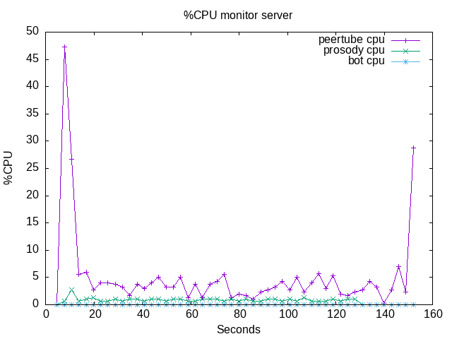

# 02-lots-of-talking

This test suite generates a lot of talking during several minutes.

## Runs

### 2023-12-13

Here is a [first run of the tests](./results/2023-12-13T16:14:23.925Z/).

```bash
 npm run start -- run --test '02-lots-of-talking' --server 'server1' --comments 'First run, just to test.'

> livechat-perf-test@0.0.1 start
> npx ts-node ./src/index.ts run --test 02-lots-of-talking --server server1 --comments First run, just to test.

Loading server...
Server server1 loaded.
Loading test suite 02-lots-of-talking...
Starting test suite...
TestSuite: Preparing results directory and data for run 2023-12-13T16:14:23.925Z
TestSuite: Results will be in: /home/john/dev/peertube_stuff/livechat-perf-test/tests/02-lots-of-talking/results/2023-12-13T16:14:23.925Z
TestSuite: Starting tasks...
Task create_live: Creating a new video on channel: 1939
Task create_live: The test video is: https://videos.john-livingston.fr/videos/watch/8a9ee1e9-6c4b-4a0f-bb80-319163798878
Task create_live: Updating the video privacy, and enabling chat
Task T2: Waiting for 1000ms.
Task monitor_server: Found following pids on the server: {"peertube":"3773909","prosody":"3773947","bot":"3773949"}
Task T4: Waiting for 1000ms.
Task talking_bot_browser_01: Loading url https://videos.john-livingston.fr/plugins/livechat/router/webchat/room/8a9ee1e9-6c4b-4a0f-bb80-319163798878 using puppeteer...
Task talking_bot_browser_01: Will close this chromium instance in 120000ms.
Task talking_bot_browser_02: Loading url https://videos.john-livingston.fr/plugins/livechat/router/webchat/room/8a9ee1e9-6c4b-4a0f-bb80-319163798878 using puppeteer...
Task talking_bot_browser_02: Will close this chromium instance in 120000ms.
Task talking_bot_browser_03: Loading url https://videos.john-livingston.fr/plugins/livechat/router/webchat/room/8a9ee1e9-6c4b-4a0f-bb80-319163798878 using puppeteer...
Task talking_bot_browser_03: Will close this chromium instance in 120000ms.
Task waiting_for_tests: Waiting for 160000ms.
Task talking_bot_browser_02: Closing the browser.
Task talking_bot_browser_03: Closing the browser.
Task monitor_server: Top closed.
Task talking_bot_browser_01: Closing the browser.
Task delete_current_live: Deleting the video 8a9ee1e9-6c4b-4a0f-bb80-319163798878
TestSuite: Waiting all tasks to terminate.
TestSuite: Writing results...
Tests finished.
```

At the time of the run, i haven't access to a proper test infrastructure.
So I just run the test suite on [my preproduction server](https://videos.john-livingston.fr).
These results are not valid for further analysis, it is just a first demo of this repository.

Here is the CPU load on the server:



Here is a chromium trace file for one of the browser used in the test: [trace file](./results//2023-12-13T16:14:23.925Z/talking_bot_browser_01.trace.json.zip).
You can open it on [www.speedscope.app](https://www.speedscope.app/) for example (after unziping it), or loading it in a Chromium browser (open `chrome://tracing/`, and load the zip file).
