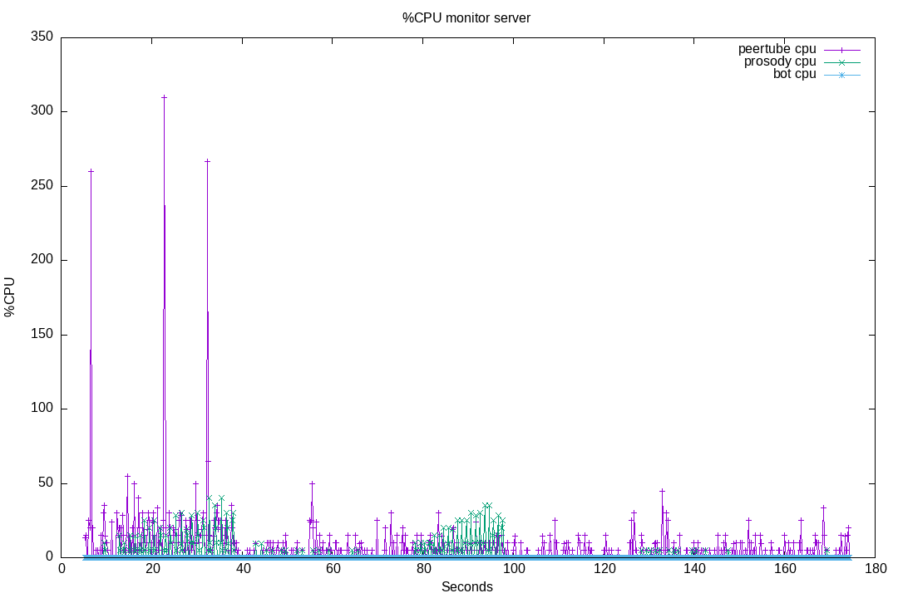
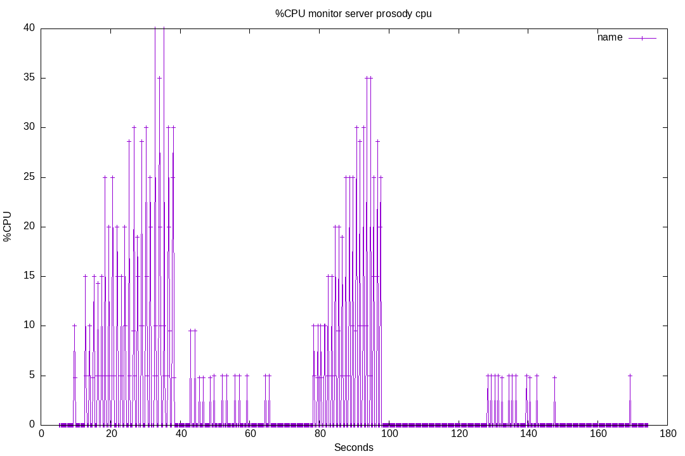

# 05-test-bot-emulation

These test are to validate that bots emulation feature are working, and that server load is similar between bots and browsers.

## Run 01

Opening 20 browsers, then closing.
Then, opening 20 websockets bots.

Result for running this test suite [on livechat v8.0.4](./results/01/).

Plugin version: v8.0.4

See [Run output](./01.output.md).

Server CPU:

Prosody CPU usage:

### Run 01 conclusion

As we can see, we have very similar results.
Please notice the linear growth of the Prosody CPU usage.

So we can validate the emulation process: we have results very similar between the bots and ConverseJS.

Note: for now, the emulation does not handle ping requests. To be complete, we should also emulate this.
