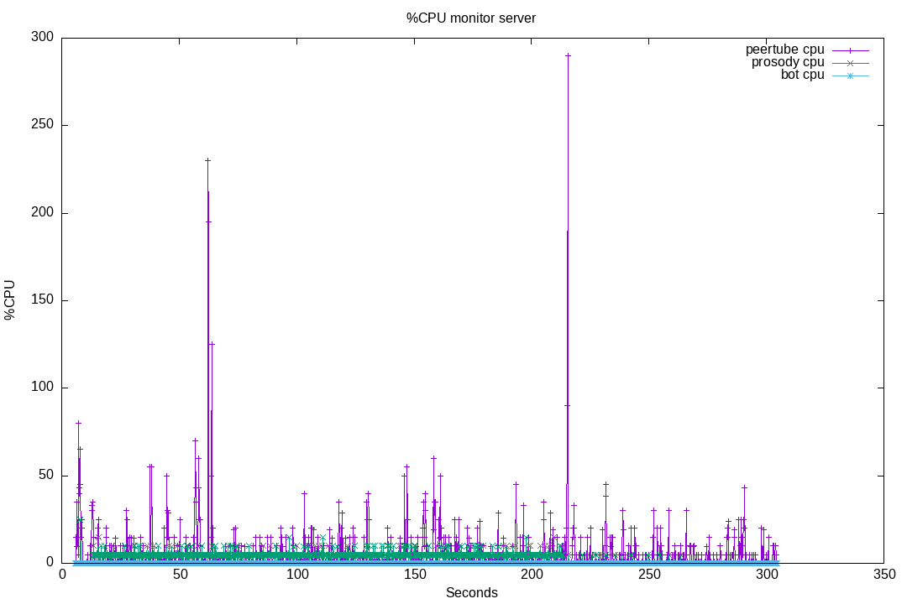
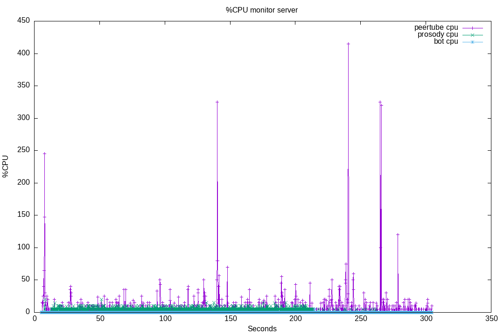

# 10-browser-vs-flooding-bot

In this suite test, we generate a lot of messages using XMPP Bots, and we monitor one browser.

We will also generate some server monitoring, but as the talking bots are using direct XMPP connections, server CPU usage is not very relevant.

## Runs

### 2023-12-18

Here is a [first run of the tests](./results/2023-12-18T17:52:44.194Z/).

The run has:

* one browser
* 1 bot emitting messages every 100ms
* 1 bot emitting messages every 150ms

Plugin version: v8.0.3

```bash
npm run start -- run --test '10-browser-vs-flooding-bot' --server 'server1' --comments 'Runned on server1.'

> livechat-perf-test@0.0.1 start
> npx ts-node ./src/index.ts run --test 10-browser-vs-flooding-bot --server server1 --comments Runned on server1.

Loading server...
Server server1 loaded.
Loading test suite 10-browser-vs-flooding-bot...
Starting test suite...
TestSuite: Preparing results directory and data for run 2023-12-18T17:52:44.194Z
TestSuite (0.000s): Results will be in: /home/john/dev/peertube_stuff/livechat-perf-test/tests/10-browser-vs-flooding-bot/results/2023-12-18T17:52:44.194Z
TestSuite (0.002s): Starting tasks...
Task create_live (0.481s): Creating a new video on channel: 1939
Task create_live (2.308s): The test video is: https://videos.john-livingston.fr/videos/watch/b0fa62a8-3eae-484d-abed-b0f7914e2637
Task create_live (2.308s): Updating the video privacy, and enabling chat
Task T2 (2.514s): Waiting for 1000ms.
Task monitor_server (4.278s): Found following pids on the server: {"peertube":"528586","prosody":"540974","bot":"540976"}
Task T5 (4.293s): Waiting for 1000ms.
Task browser_01 (5.296s): Loading url https://videos.john-livingston.fr/plugins/livechat/router/webchat/room/b0fa62a8-3eae-484d-abed-b0f7914e2637 using puppeteer...
Task browser_01 (5.583s): Browser started with PID 98969
Task browser_01 (7.408s): Will close this chromium instance in 260000ms.
Task T7 (7.408s): Waiting for 5000ms.
Task external_component_bot_1 (12.409s): Openning SSH Tunnel for component port forwarding.
Task external_component_bot_1 (12.411s): Waiting for the tunnel...
Task external_component_bot_1 (13.110s): Tunnel has writtend on stdout, assuming it is started
Task external_component_bot_2 (13.167s): SSH Tunnel for component port forwarding already openned.
Task waiting_for_tests (13.233s): Waiting for 320000ms.
Task external_component_bot_1 (213.167s): Disconnecting the bot...
Task external_component_bot_1 (213.197s): Bot disconnected, closing the ssh tunneling
Task external_component_bot_1 (213.198s): Decrementing SSH Tunnel for component port count.
Task external_component_bot_2 (213.232s): Disconnecting the bot...
Task external_component_bot_2 (213.329s): Bot disconnected, closing the ssh tunneling
Task external_component_bot_2 (213.329s): Decrementing SSH Tunnel for component port count.
Task external_component_bot_2 (213.329s): Killing the SSH Tunnel
Task browser_01 (267.409s): Closing the browser.
Task monitor_server (304.292s): Top closed.
Task delete_current_live (333.266s): Deleting the video b0fa62a8-3eae-484d-abed-b0f7914e2637
TestSuite (333.557s): Waiting all tasks to terminate.
TestSuite (333.560s): Writing results...
Tests finished.
```

Chromium CPU:


Server CPU:


#### 2023-12-18 Conclusion

This tests proves that the lack of message pruning in plugin v8.0.3 cause a bottleneck in the browser: the CPU raise quickly to 100%.

The CPU usage stays at 100% after the bots stop talking (bots stops at 213s, but the CPU continue to work a few seconds).
This can explain [issue #142](https://github.com/JohnXLivingston/peertube-plugin-livechat/issues/142).

### 2023-12-19

[Run result](./results/2023-12-19T14:45:10.797Z/).

The run has:

* one browser
* 1 bot emitting messages every 100ms
* 1 bot emitting messages every 150ms
* 1 bot emitting messages every 1000ms, but who will continue to speak longer

Plugin version: v8.0.3

```bash
npm run start -- run --test '10-browser-vs-flooding-bot' --server 'server1' --comments 'Runned on server1.'

> livechat-perf-test@0.0.1 start
> npx ts-node ./src/index.ts run --test 10-browser-vs-flooding-bot --server server1 --comments Runned on server1.

Loading server...
Server server1 loaded.
Loading test suite 10-browser-vs-flooding-bot...
Starting test suite...
TestSuite: Preparing results directory and data for run 2023-12-19T14:45:10.797Z
TestSuite (0.000s): Results will be in: /home/john/dev/peertube_stuff/livechat-perf-test/tests/10-browser-vs-flooding-bot/results/2023-12-19T14:45:10.797Z
TestSuite (0.001s): Starting tasks...
Task create_live (0.485s): Creating a new video on channel: 1939
Task create_live (1.831s): The test video is: https://videos.john-livingston.fr/videos/watch/04f29ed3-c509-4113-a541-be08fb8b92b9
Task create_live (1.832s): Updating the video privacy, and enabling chat
Task T2 (2.056s): Waiting for 1000ms.
Task monitor_server (3.809s): Found following pids on the server: {"peertube":"528586","prosody":"667304","bot":"667306"}
Task T5 (3.812s): Waiting for 1000ms.
Task browser_01 (4.814s): Loading url https://videos.john-livingston.fr/plugins/livechat/router/webchat/room/04f29ed3-c509-4113-a541-be08fb8b92b9 using puppeteer...
Task browser_01 (5.564s): Browser started with PID 21862
Task browser_01 (7.103s): Will close this chromium instance in 260000ms.
Task T7 (7.103s): Waiting for 5000ms.
Task external_component_bot_1 (12.105s): Openning SSH Tunnel for component port forwarding.
Task external_component_bot_1 (12.108s): Waiting for the tunnel...
Task external_component_bot_1 (12.795s): Tunnel has writtend on stdout, assuming it is started
Task external_component_bot_2 (12.845s): SSH Tunnel for component port forwarding already openned.
Task external_component_bot_3 (12.910s): SSH Tunnel for component port forwarding already openned.
Task waiting_for_tests (12.931s): Waiting for 320000ms.
Task external_component_bot_1 (212.846s): Disconnecting the bot...
Task external_component_bot_1 (212.903s): Bot disconnected, closing the ssh tunneling
Task external_component_bot_1 (212.903s): Decrementing SSH Tunnel for component port count.
Task external_component_bot_2 (212.909s): Disconnecting the bot...
Task external_component_bot_2 (212.927s): Bot disconnected, closing the ssh tunneling
Task external_component_bot_2 (212.927s): Decrementing SSH Tunnel for component port count.
Task external_component_bot_3 (262.930s): Disconnecting the bot...
Task external_component_bot_3 (262.947s): Bot disconnected, closing the ssh tunneling
Task external_component_bot_3 (262.947s): Decrementing SSH Tunnel for component port count.
Task external_component_bot_3 (262.947s): Killing the SSH Tunnel
Task browser_01 (267.104s): Closing the browser.
Task monitor_server (303.813s): Top closed.
Task delete_current_live (332.960s): Deleting the video 04f29ed3-c509-4113-a541-be08fb8b92b9
TestSuite (333.570s): Waiting all tasks to terminate.
TestSuite (333.571s): Writing results...
Tests finished.
```

Chromium CPU:


Server CPU:


#### 2023-12-19 Conclusion

This test proves that when there are a lot of messages, each single new message can cause a huge CPU load (see the CPU usage when only the third bot speaks once a second).

### 03-prune-message-above-100

[Run result](./results/03-prune-message-above-100/).

The run has:

* one browser
* 1 bot emitting messages every 100ms
* 1 bot emitting messages every 150ms
* 1 bot emitting messages every 1000ms, but who will continue to speak longer

Plugin version: v8.0.3 + following modifications:

* ConverseJS prune_messages_above parameter to 100 (only keep last 100 messages).

```bash
npm run start -- run --test '10-browser-vs-flooding-bot' --server 'server1' --comments 'Runned on server1.' --run-name '03-prune-message-above-100'

> livechat-perf-test@0.0.1 start
> npx ts-node ./src/index.ts run --test 10-browser-vs-flooding-bot --server server1 --comments Runned on server1. --run-name 03-prune-message-above-100

Loading server...
Server server1 loaded.
Loading test suite 10-browser-vs-flooding-bot...
Starting test suite...
TestSuite: Preparing results directory and data for run 03-prune-message-above-100
TestSuite (0.000s): Results will be in: /home/john/dev/peertube_stuff/livechat-perf-test/tests/10-browser-vs-flooding-bot/results/03-prune-message-above-100
TestSuite (0.001s): Starting tasks...
Task create_live (0.672s): Creating a new video on channel: 1939
Task create_live (2.611s): The test video is: https://videos.john-livingston.fr/videos/watch/aafaabf8-63f5-41e5-8b7e-0f951c654d9e
Task create_live (2.612s): Updating the video privacy, and enabling chat
Task T2 (2.834s): Waiting for 1000ms.
Task monitor_server (4.727s): Found following pids on the server: {"peertube":"528586","prosody":"934255","bot":"934258"}
Task T5 (4.730s): Waiting for 1000ms.
Task browser_01 (5.730s): Loading url https://videos.john-livingston.fr/plugins/livechat/router/webchat/room/aafaabf8-63f5-41e5-8b7e-0f951c654d9e using puppeteer...
Task browser_01 (5.943s): Browser started with PID 172380
Task browser_01 (7.564s): Will close this chromium instance in 260000ms.
Task T7 (7.565s): Waiting for 5000ms.
Task external_component_bot_1 (12.566s): Openning SSH Tunnel for component port forwarding.
Task external_component_bot_1 (12.571s): Waiting for the tunnel...
Task external_component_bot_1 (13.274s): Tunnel has written on stdout, assuming it is started
Task external_component_bot_2 (13.300s): SSH Tunnel for component port forwarding already openned.
Task external_component_bot_3 (13.370s): SSH Tunnel for component port forwarding already openned.
Task waiting_for_tests (13.391s): Waiting for 320000ms.
Task external_component_bot_1 (213.300s): Disconnecting the bot...
Task external_component_bot_1 (213.355s): Bot disconnected, closing the ssh tunneling
Task external_component_bot_1 (213.355s): Decrementing SSH Tunnel for component port count.
Task external_component_bot_2 (213.370s): Disconnecting the bot...
Task external_component_bot_2 (213.388s): Bot disconnected, closing the ssh tunneling
Task external_component_bot_2 (213.388s): Decrementing SSH Tunnel for component port count.
Task external_component_bot_3 (263.400s): Disconnecting the bot...
Task external_component_bot_3 (263.429s): Bot disconnected, closing the ssh tunneling
Task external_component_bot_3 (263.430s): Decrementing SSH Tunnel for component port count.
Task external_component_bot_3 (263.430s): Killing the SSH Tunnel
Task browser_01 (267.566s): Closing the browser.
Task monitor_server (304.731s): Top closed.
Task delete_current_live (333.423s): Deleting the video aafaabf8-63f5-41e5-8b7e-0f951c654d9e
TestSuite (333.707s): Waiting all tasks to terminate.
TestSuite (333.708s): Writing results...
Tests finished.
```

Chromium CPU:


Server CPU:



#### 03-prune-message-above-100 Conclusion

The expected results is not here, there is no performance improvements.
This is due to the way ConverseJS prunes the history: it uses the following code:

```javascript
import debounce from 'lodash-es/debounce.js';
// [...]
export const debouncedPruneHistory = debounce(pruneHistory, 500)
```

In other words: it won't prune any message as long as there are new messages in the coming 500ms.
So we need to patch ConverseJS to have a valid test. See the next run.

### 04-prune-message-above-100-converse-patched

[Run result](./results/04-prune-message-above-100-converse-patched/).

The run has:

* one browser
* 1 bot emitting messages every 100ms
* 1 bot emitting messages every 150ms
* 1 bot emitting messages every 1000ms, but who will continue to speak longer

Plugin version: v8.0.3 + following modifications:

* ConverseJS prune_messages_above parameter to 100 (only keep last 100 messages).
* Adding the option `maxWait` to the prune debounce, to force some pruning every 2s:

```javascript
export const debouncedPruneHistory = debounce(pruneHistory, 500, {
    maxWait: 2000
});
```

**Important Note**: this patch is not meant to be included in the livechat plugin.
It is only here to have a way to test the message pruning performances.
In a real life scenario, we can legitimately assume that they will be many 500ms gap between messages, so that the browser will prune.
The aim of using prune_messages_above is to fix hanging browsers for chat that last very long, not for flooding (in such case, moderators can kick flooders, or set the slow mode when it will be available).

```bash
npm run start -- run --test '10-browser-vs-flooding-bot' --server 'server1' --comments 'Runned on server1.' --run-name '04-prune-message-above-100-converse-patched'

> livechat-perf-test@0.0.1 start
> npx ts-node ./src/index.ts run --test 10-browser-vs-flooding-bot --server server1 --comments Runned on server1. --run-name 04-prune-message-above-100-converse-patched

Loading server...
Server server1 loaded.
Loading test suite 10-browser-vs-flooding-bot...
Starting test suite...
TestSuite: Preparing results directory and data for run 04-prune-message-above-100-converse-patched
TestSuite (0.001s): Results will be in: /home/john/dev/peertube_stuff/livechat-perf-test/tests/10-browser-vs-flooding-bot/results/04-prune-message-above-100-converse-patched
TestSuite (0.001s): Starting tasks...
Task create_live (0.470s): Creating a new video on channel: 1939
Task create_live (2.652s): The test video is: https://videos.john-livingston.fr/videos/watch/9d8cc9df-2295-421a-a7b1-fa460ba6de75
Task create_live (2.652s): Updating the video privacy, and enabling chat
Task T2 (2.828s): Waiting for 1000ms.
Task monitor_server (4.694s): Found following pids on the server: {"peertube":"528586","prosody":"936787","bot":"936789"}
Task T5 (4.715s): Waiting for 1000ms.
Task browser_01 (5.715s): Loading url https://videos.john-livingston.fr/plugins/livechat/router/webchat/room/9d8cc9df-2295-421a-a7b1-fa460ba6de75 using puppeteer...
Task browser_01 (5.978s): Browser started with PID 189212
Task browser_01 (7.649s): Will close this chromium instance in 260000ms.
Task T7 (7.650s): Waiting for 5000ms.
Task external_component_bot_1 (12.651s): Openning SSH Tunnel for component port forwarding.
Task external_component_bot_1 (12.653s): Waiting for the tunnel...
Task external_component_bot_1 (13.337s): Tunnel has written on stdout, assuming it is started
Task external_component_bot_2 (13.359s): SSH Tunnel for component port forwarding already openned.
Task external_component_bot_3 (13.421s): SSH Tunnel for component port forwarding already openned.
Task waiting_for_tests (13.443s): Waiting for 320000ms.
Task external_component_bot_1 (213.360s): Disconnecting the bot...
Task external_component_bot_1 (213.379s): Bot disconnected, closing the ssh tunneling
Task external_component_bot_1 (213.379s): Decrementing SSH Tunnel for component port count.
Task external_component_bot_2 (213.421s): Disconnecting the bot...
Task external_component_bot_2 (213.523s): Bot disconnected, closing the ssh tunneling
Task external_component_bot_2 (213.523s): Decrementing SSH Tunnel for component port count.
Task external_component_bot_3 (263.443s): Disconnecting the bot...
Task external_component_bot_3 (263.461s): Bot disconnected, closing the ssh tunneling
Task external_component_bot_3 (263.461s): Decrementing SSH Tunnel for component port count.
Task external_component_bot_3 (263.461s): Killing the SSH Tunnel
Task browser_01 (267.650s): Closing the browser.
Task monitor_server (304.713s): Top closed.
Task delete_current_live (333.476s): Deleting the video 9d8cc9df-2295-421a-a7b1-fa460ba6de75
TestSuite (333.845s): Waiting all tasks to terminate.
TestSuite (333.849s): Writing results...
Tests finished.
```

Chromium CPU:


Server CPU:



#### 04-prune-message-above-100-converse-patched Conclusion

Here we can see that pruning message prevents the browser to reach 100% CPU usage.
So the fix is valid.
