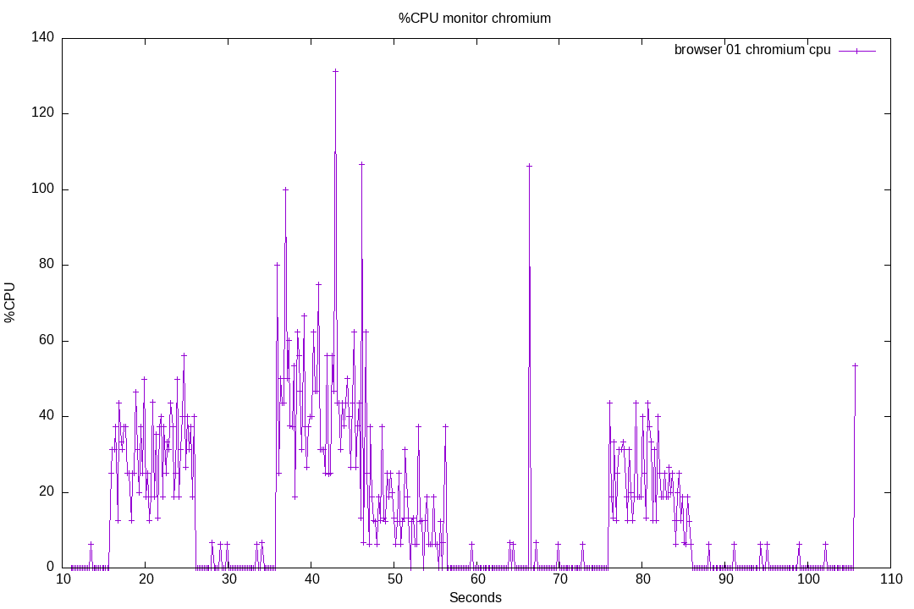
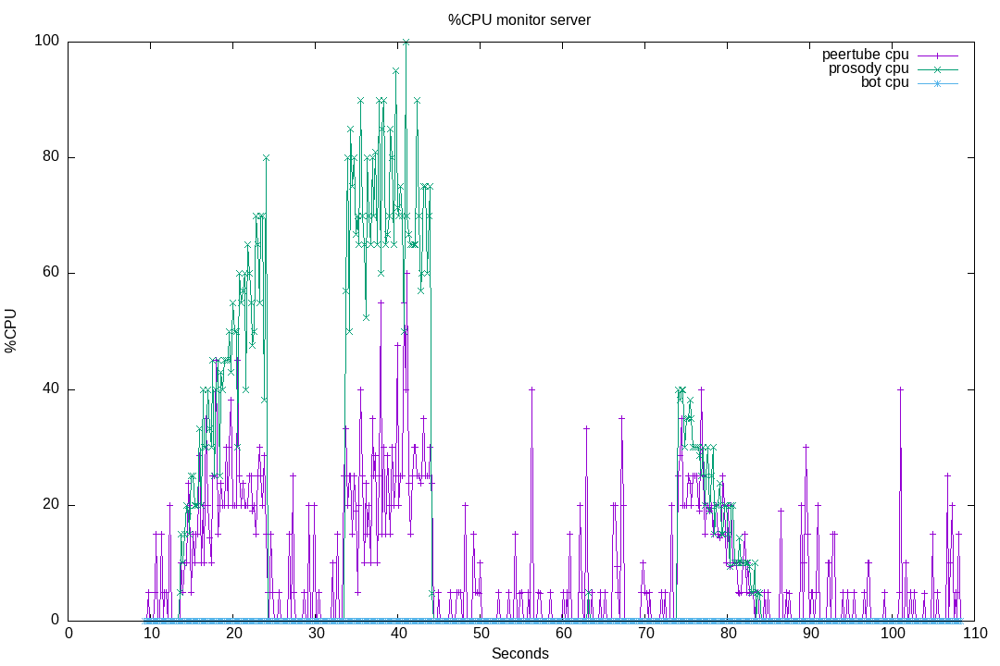
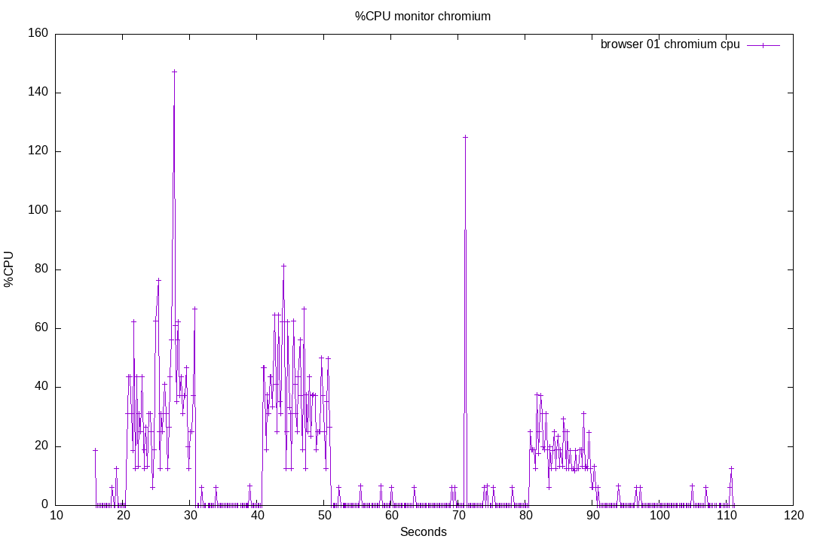
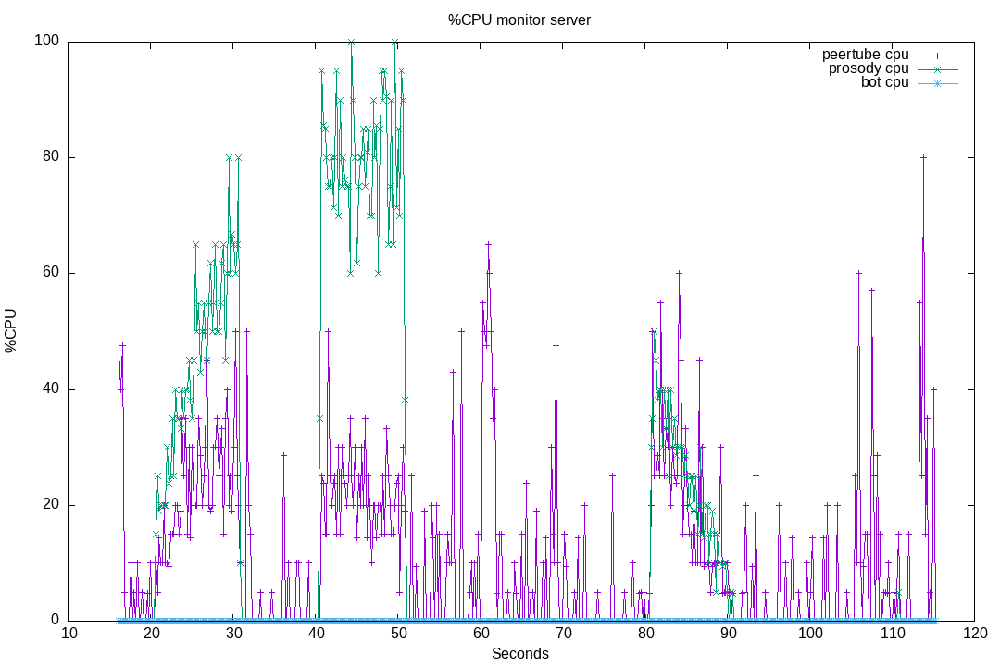
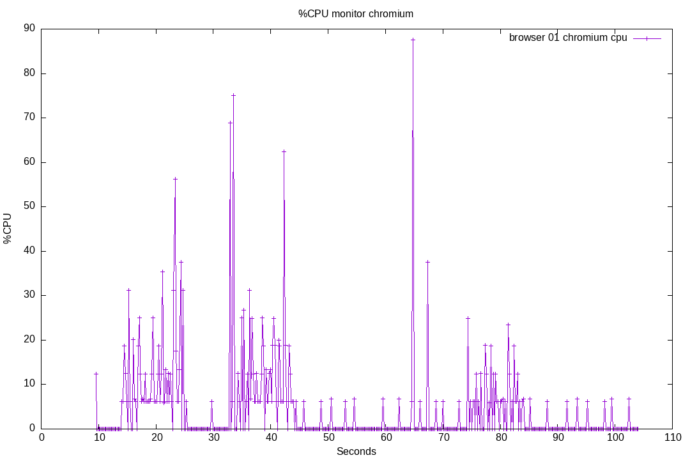

# 20-massive-nickname-changes

When anonymous users join the Peertube chat, they first get connected using a "Anonymous 12345" nickname.
Before being able to speak, they must change their nickname.

Under certain circumstances (numerous users joining at the same time, when the live begins), this can be the cause of some performance issues in browsers, as ConverseJS will render multiple time per second the user list.

It can also have some cost on the server side.

This test suite will evaluate the proposed fix for issue [#138](https://github.com/JohnXLivingston/peertube-plugin-livechat/issues/138) (hidding some nickname changes, when previous nickname was "Anonymous XXX").

We will also use this test suite to evaluate performance when implementing [#136](https://github.com/JohnXLivingston/peertube-plugin-livechat/issues/136):
grouping anonymous users on a single line for non-moderator users (to avoid having a long anonymous user list).

This test suite will also evaluate the cost when users are joining, and leaving.

This test suite will do:

* create a live
* start a chromium, connected as user_01
* wait a little
* start monitoring the server and chromium
* wait a little
* join the chat with 100 anonymous bots (nickname "Anonymous 1", and so on), at a rate of ~10 bots per second
* after 20 seconds, each bot will change his nickname (for "bot 1", and so on)
* after 50 seconds, bots will leave
* finally we close the chromium, and delete the live

So we should observe some high CPU usage on Chromium, and on the server, at 3 key moments:

* when bots are joining
* when bots are changing nicknames
* when bots are leaving

## 01

Result for running this test suite [on livechat v8.0.4](./results/01/).

Plugin version: v8.0.4

```bash
npm run start -- run --test '20-massive-nickname-changes' -s server1 --comments 'Runned on server1.' --run-name '01'
> livechat-perf-test@0.0.1 start
> npx ts-node ./src/index.ts run --test 20-massive-nickname-changes -s server1 --comments Runned on server1. --run-name 01b

Loading server...
Server server1 loaded.
Loading test suite 20-massive-nickname-changes...
Starting test suite...
TestSuite: Preparing results directory and data for run 01b
TestSuite (0.000s): Results will be in: /home/john/dev/peertube_stuff/livechat-perf-test/tests/20-massive-nickname-changes/results/01b
TestSuite (0.000s): Starting tasks...
Task create_live (0.439s): Creating a new video on channel: 1939
Task create_live (3.531s): The test video is: https://videos.john-livingston.fr/videos/watch/3cce5795-7b8c-44db-97ba-d344babcad92
Task create_live (3.533s): Updating the video privacy, and enabling chat
Task browser_01 (3.761s): Loading url https://videos.john-livingston.fr/plugins/livechat/router/webchat/room/3cce5795-7b8c-44db-97ba-d344babcad92 using puppeteer...
Task browser_01 (4.088s): Browser started with PID 1419595
Task browser_01 (5.674s): Will close this chromium instance in 100000ms.
Task T3 (5.674s): Waiting for 4000ms.
Task monitor_server (10.532s): Found following pids on the server: {"peertube":"733512","prosody":"1812346","bot":"1812393"}
Task T6 (10.552s): Waiting for 5000ms.
Task websocket_anonymous_bot (15.677s): Bot Anonymous 1 joins the room 3cce5795-7b8c-44db-97ba-d344babcad92
Task websocket_anonymous_bot (15.753s): Bot Anonymous 2 joins the room 3cce5795-7b8c-44db-97ba-d344babcad92
Task websocket_anonymous_bot (15.857s): Bot Anonymous 3 joins the room 3cce5795-7b8c-44db-97ba-d344babcad92
Task websocket_anonymous_bot (15.963s): Bot Anonymous 4 joins the room 3cce5795-7b8c-44db-97ba-d344babcad92
Task websocket_anonymous_bot (16.066s): Bot Anonymous 5 joins the room 3cce5795-7b8c-44db-97ba-d344babcad92
Task websocket_anonymous_bot (16.162s): Bot Anonymous 6 joins the room 3cce5795-7b8c-44db-97ba-d344babcad92
Task websocket_anonymous_bot (16.280s): Bot Anonymous 7 joins the room 3cce5795-7b8c-44db-97ba-d344babcad92
Task websocket_anonymous_bot (16.365s): Bot Anonymous 8 joins the room 3cce5795-7b8c-44db-97ba-d344babcad92
Task websocket_anonymous_bot (16.474s): Bot Anonymous 9 joins the room 3cce5795-7b8c-44db-97ba-d344babcad92
Task websocket_anonymous_bot (16.573s): Bot Anonymous 10 joins the room 3cce5795-7b8c-44db-97ba-d344babcad92
Task websocket_anonymous_bot (16.677s): Bot Anonymous 11 joins the room 3cce5795-7b8c-44db-97ba-d344babcad92
Task websocket_anonymous_bot (16.785s): Bot Anonymous 12 joins the room 3cce5795-7b8c-44db-97ba-d344babcad92
Task websocket_anonymous_bot (16.915s): Bot Anonymous 13 joins the room 3cce5795-7b8c-44db-97ba-d344babcad92
Task websocket_anonymous_bot (17.002s): Bot Anonymous 14 joins the room 3cce5795-7b8c-44db-97ba-d344babcad92
Task websocket_anonymous_bot (17.096s): Bot Anonymous 15 joins the room 3cce5795-7b8c-44db-97ba-d344babcad92
Task websocket_anonymous_bot (17.195s): Bot Anonymous 16 joins the room 3cce5795-7b8c-44db-97ba-d344babcad92
Task websocket_anonymous_bot (17.296s): Bot Anonymous 17 joins the room 3cce5795-7b8c-44db-97ba-d344babcad92
Task websocket_anonymous_bot (17.402s): Bot Anonymous 18 joins the room 3cce5795-7b8c-44db-97ba-d344babcad92
Task websocket_anonymous_bot (17.499s): Bot Anonymous 19 joins the room 3cce5795-7b8c-44db-97ba-d344babcad92
Task websocket_anonymous_bot (17.611s): Bot Anonymous 20 joins the room 3cce5795-7b8c-44db-97ba-d344babcad92
Task websocket_anonymous_bot (17.712s): Bot Anonymous 21 joins the room 3cce5795-7b8c-44db-97ba-d344babcad92
Task websocket_anonymous_bot (17.816s): Bot Anonymous 22 joins the room 3cce5795-7b8c-44db-97ba-d344babcad92
Task websocket_anonymous_bot (17.909s): Bot Anonymous 23 joins the room 3cce5795-7b8c-44db-97ba-d344babcad92
Task websocket_anonymous_bot (18.064s): Bot Anonymous 24 joins the room 3cce5795-7b8c-44db-97ba-d344babcad92
Task websocket_anonymous_bot (18.136s): Bot Anonymous 25 joins the room 3cce5795-7b8c-44db-97ba-d344babcad92
Task websocket_anonymous_bot (18.223s): Bot Anonymous 26 joins the room 3cce5795-7b8c-44db-97ba-d344babcad92
Task websocket_anonymous_bot (18.322s): Bot Anonymous 27 joins the room 3cce5795-7b8c-44db-97ba-d344babcad92
Task websocket_anonymous_bot (18.432s): Bot Anonymous 28 joins the room 3cce5795-7b8c-44db-97ba-d344babcad92
Task websocket_anonymous_bot (18.533s): Bot Anonymous 29 joins the room 3cce5795-7b8c-44db-97ba-d344babcad92
Task websocket_anonymous_bot (18.628s): Bot Anonymous 30 joins the room 3cce5795-7b8c-44db-97ba-d344babcad92
Task websocket_anonymous_bot (18.749s): Bot Anonymous 31 joins the room 3cce5795-7b8c-44db-97ba-d344babcad92
Task websocket_anonymous_bot (18.855s): Bot Anonymous 32 joins the room 3cce5795-7b8c-44db-97ba-d344babcad92
Task websocket_anonymous_bot (18.938s): Bot Anonymous 33 joins the room 3cce5795-7b8c-44db-97ba-d344babcad92
Task websocket_anonymous_bot (19.032s): Bot Anonymous 34 joins the room 3cce5795-7b8c-44db-97ba-d344babcad92
Task websocket_anonymous_bot (19.136s): Bot Anonymous 35 joins the room 3cce5795-7b8c-44db-97ba-d344babcad92
Task websocket_anonymous_bot (19.234s): Bot Anonymous 36 joins the room 3cce5795-7b8c-44db-97ba-d344babcad92
Task websocket_anonymous_bot (19.338s): Bot Anonymous 37 joins the room 3cce5795-7b8c-44db-97ba-d344babcad92
Task websocket_anonymous_bot (19.455s): Bot Anonymous 38 joins the room 3cce5795-7b8c-44db-97ba-d344babcad92
Task websocket_anonymous_bot (19.541s): Bot Anonymous 39 joins the room 3cce5795-7b8c-44db-97ba-d344babcad92
Task websocket_anonymous_bot (19.640s): Bot Anonymous 40 joins the room 3cce5795-7b8c-44db-97ba-d344babcad92
Task websocket_anonymous_bot (19.777s): Bot Anonymous 41 joins the room 3cce5795-7b8c-44db-97ba-d344babcad92
Task websocket_anonymous_bot (19.878s): Bot Anonymous 42 joins the room 3cce5795-7b8c-44db-97ba-d344babcad92
Task websocket_anonymous_bot (19.961s): Bot Anonymous 43 joins the room 3cce5795-7b8c-44db-97ba-d344babcad92
Task websocket_anonymous_bot (20.073s): Bot Anonymous 44 joins the room 3cce5795-7b8c-44db-97ba-d344babcad92
Task websocket_anonymous_bot (20.158s): Bot Anonymous 45 joins the room 3cce5795-7b8c-44db-97ba-d344babcad92
Task websocket_anonymous_bot (20.251s): Bot Anonymous 46 joins the room 3cce5795-7b8c-44db-97ba-d344babcad92
Task websocket_anonymous_bot (20.357s): Bot Anonymous 47 joins the room 3cce5795-7b8c-44db-97ba-d344babcad92
Task websocket_anonymous_bot (20.454s): Bot Anonymous 48 joins the room 3cce5795-7b8c-44db-97ba-d344babcad92
Task websocket_anonymous_bot (20.555s): Bot Anonymous 49 joins the room 3cce5795-7b8c-44db-97ba-d344babcad92
Task websocket_anonymous_bot (20.659s): Bot Anonymous 50 joins the room 3cce5795-7b8c-44db-97ba-d344babcad92
Task websocket_anonymous_bot (20.762s): Bot Anonymous 51 joins the room 3cce5795-7b8c-44db-97ba-d344babcad92
Task websocket_anonymous_bot (20.883s): Bot Anonymous 52 joins the room 3cce5795-7b8c-44db-97ba-d344babcad92
Task websocket_anonymous_bot (20.979s): Bot Anonymous 53 joins the room 3cce5795-7b8c-44db-97ba-d344babcad92
Task websocket_anonymous_bot (21.070s): Bot Anonymous 54 joins the room 3cce5795-7b8c-44db-97ba-d344babcad92
Task websocket_anonymous_bot (21.172s): Bot Anonymous 55 joins the room 3cce5795-7b8c-44db-97ba-d344babcad92
Task websocket_anonymous_bot (21.262s): Bot Anonymous 56 joins the room 3cce5795-7b8c-44db-97ba-d344babcad92
Task websocket_anonymous_bot (21.371s): Bot Anonymous 57 joins the room 3cce5795-7b8c-44db-97ba-d344babcad92
Task websocket_anonymous_bot (21.465s): Bot Anonymous 58 joins the room 3cce5795-7b8c-44db-97ba-d344babcad92
Task websocket_anonymous_bot (21.572s): Bot Anonymous 59 joins the room 3cce5795-7b8c-44db-97ba-d344babcad92
Task websocket_anonymous_bot (21.680s): Bot Anonymous 60 joins the room 3cce5795-7b8c-44db-97ba-d344babcad92
Task websocket_anonymous_bot (21.778s): Bot Anonymous 61 joins the room 3cce5795-7b8c-44db-97ba-d344babcad92
Task websocket_anonymous_bot (21.891s): Bot Anonymous 62 joins the room 3cce5795-7b8c-44db-97ba-d344babcad92
Task websocket_anonymous_bot (21.979s): Bot Anonymous 63 joins the room 3cce5795-7b8c-44db-97ba-d344babcad92
Task websocket_anonymous_bot (22.099s): Bot Anonymous 64 joins the room 3cce5795-7b8c-44db-97ba-d344babcad92
Task websocket_anonymous_bot (22.189s): Bot Anonymous 65 joins the room 3cce5795-7b8c-44db-97ba-d344babcad92
Task websocket_anonymous_bot (22.301s): Bot Anonymous 66 joins the room 3cce5795-7b8c-44db-97ba-d344babcad92
Task websocket_anonymous_bot (22.417s): Bot Anonymous 67 joins the room 3cce5795-7b8c-44db-97ba-d344babcad92
Task websocket_anonymous_bot (22.510s): Bot Anonymous 68 joins the room 3cce5795-7b8c-44db-97ba-d344babcad92
Task websocket_anonymous_bot (22.614s): Bot Anonymous 69 joins the room 3cce5795-7b8c-44db-97ba-d344babcad92
Task websocket_anonymous_bot (22.719s): Bot Anonymous 70 joins the room 3cce5795-7b8c-44db-97ba-d344babcad92
Task websocket_anonymous_bot (22.808s): Bot Anonymous 71 joins the room 3cce5795-7b8c-44db-97ba-d344babcad92
Task websocket_anonymous_bot (22.908s): Bot Anonymous 72 joins the room 3cce5795-7b8c-44db-97ba-d344babcad92
Task websocket_anonymous_bot (23.011s): Bot Anonymous 73 joins the room 3cce5795-7b8c-44db-97ba-d344babcad92
Task websocket_anonymous_bot (23.116s): Bot Anonymous 74 joins the room 3cce5795-7b8c-44db-97ba-d344babcad92
Task websocket_anonymous_bot (23.210s): Bot Anonymous 75 joins the room 3cce5795-7b8c-44db-97ba-d344babcad92
Task websocket_anonymous_bot (23.301s): Bot Anonymous 76 joins the room 3cce5795-7b8c-44db-97ba-d344babcad92
Task websocket_anonymous_bot (23.452s): Bot Anonymous 77 joins the room 3cce5795-7b8c-44db-97ba-d344babcad92
Task websocket_anonymous_bot (23.552s): Bot Anonymous 78 joins the room 3cce5795-7b8c-44db-97ba-d344babcad92
Task websocket_anonymous_bot (23.675s): Bot Anonymous 79 joins the room 3cce5795-7b8c-44db-97ba-d344babcad92
Task websocket_anonymous_bot (23.781s): Bot Anonymous 80 joins the room 3cce5795-7b8c-44db-97ba-d344babcad92
Task websocket_anonymous_bot (23.870s): Bot Anonymous 81 joins the room 3cce5795-7b8c-44db-97ba-d344babcad92
Task websocket_anonymous_bot (23.982s): Bot Anonymous 82 joins the room 3cce5795-7b8c-44db-97ba-d344babcad92
Task websocket_anonymous_bot (24.076s): Bot Anonymous 83 joins the room 3cce5795-7b8c-44db-97ba-d344babcad92
Task websocket_anonymous_bot (24.188s): Bot Anonymous 84 joins the room 3cce5795-7b8c-44db-97ba-d344babcad92
Task websocket_anonymous_bot (24.290s): Bot Anonymous 85 joins the room 3cce5795-7b8c-44db-97ba-d344babcad92
Task websocket_anonymous_bot (24.383s): Bot Anonymous 86 joins the room 3cce5795-7b8c-44db-97ba-d344babcad92
Task websocket_anonymous_bot (24.500s): Bot Anonymous 87 joins the room 3cce5795-7b8c-44db-97ba-d344babcad92
Task websocket_anonymous_bot (24.580s): Bot Anonymous 88 joins the room 3cce5795-7b8c-44db-97ba-d344babcad92
Task websocket_anonymous_bot (24.715s): Bot Anonymous 89 joins the room 3cce5795-7b8c-44db-97ba-d344babcad92
Task websocket_anonymous_bot (24.804s): Bot Anonymous 90 joins the room 3cce5795-7b8c-44db-97ba-d344babcad92
Task websocket_anonymous_bot (24.905s): Bot Anonymous 91 joins the room 3cce5795-7b8c-44db-97ba-d344babcad92
Task websocket_anonymous_bot (25.000s): Bot Anonymous 92 joins the room 3cce5795-7b8c-44db-97ba-d344babcad92
Task websocket_anonymous_bot (25.088s): Bot Anonymous 93 joins the room 3cce5795-7b8c-44db-97ba-d344babcad92
Task websocket_anonymous_bot (25.181s): Bot Anonymous 94 joins the room 3cce5795-7b8c-44db-97ba-d344babcad92
Task websocket_anonymous_bot (25.283s): Bot Anonymous 95 joins the room 3cce5795-7b8c-44db-97ba-d344babcad92
Task websocket_anonymous_bot (25.392s): Bot Anonymous 96 joins the room 3cce5795-7b8c-44db-97ba-d344babcad92
Task websocket_anonymous_bot (25.510s): Bot Anonymous 97 joins the room 3cce5795-7b8c-44db-97ba-d344babcad92
Task websocket_anonymous_bot (25.634s): Bot Anonymous 98 joins the room 3cce5795-7b8c-44db-97ba-d344babcad92
Task websocket_anonymous_bot (25.783s): Bot Anonymous 99 joins the room 3cce5795-7b8c-44db-97ba-d344babcad92
Task waiting_for_tests (25.816s): Waiting for 100000ms.
Task websocket_anonymous_bot (25.891s): Bot Anonymous 100 joins the room 3cce5795-7b8c-44db-97ba-d344babcad92
Task websocket_anonymous_bot (35.678s): Bot Anonymous 1 changes nickname for Bot 1
Task websocket_anonymous_bot (35.753s): Bot Anonymous 2 changes nickname for Bot 2
Task websocket_anonymous_bot (35.857s): Bot Anonymous 3 changes nickname for Bot 3
Task websocket_anonymous_bot (35.963s): Bot Anonymous 4 changes nickname for Bot 4
Task websocket_anonymous_bot (36.067s): Bot Anonymous 5 changes nickname for Bot 5
Task websocket_anonymous_bot (36.162s): Bot Anonymous 6 changes nickname for Bot 6
Task websocket_anonymous_bot (36.307s): Bot Anonymous 7 changes nickname for Bot 7
Task websocket_anonymous_bot (36.366s): Bot Anonymous 8 changes nickname for Bot 8
Task websocket_anonymous_bot (36.474s): Bot Anonymous 9 changes nickname for Bot 9
Task websocket_anonymous_bot (36.573s): Bot Anonymous 10 changes nickname for Bot 10
Task websocket_anonymous_bot (36.678s): Bot Anonymous 11 changes nickname for Bot 11
Task websocket_anonymous_bot (36.786s): Bot Anonymous 12 changes nickname for Bot 12
Task websocket_anonymous_bot (36.916s): Bot Anonymous 13 changes nickname for Bot 13
Task websocket_anonymous_bot (37.003s): Bot Anonymous 14 changes nickname for Bot 14
Task websocket_anonymous_bot (37.096s): Bot Anonymous 15 changes nickname for Bot 15
Task websocket_anonymous_bot (37.201s): Bot Anonymous 16 changes nickname for Bot 16
Task websocket_anonymous_bot (37.298s): Bot Anonymous 17 changes nickname for Bot 17
Task websocket_anonymous_bot (37.403s): Bot Anonymous 18 changes nickname for Bot 18
Task websocket_anonymous_bot (37.499s): Bot Anonymous 19 changes nickname for Bot 19
Task websocket_anonymous_bot (37.612s): Bot Anonymous 20 changes nickname for Bot 20
Task websocket_anonymous_bot (37.713s): Bot Anonymous 21 changes nickname for Bot 21
Task websocket_anonymous_bot (37.816s): Bot Anonymous 22 changes nickname for Bot 22
Task websocket_anonymous_bot (37.910s): Bot Anonymous 23 changes nickname for Bot 23
Task websocket_anonymous_bot (38.065s): Bot Anonymous 24 changes nickname for Bot 24
Task websocket_anonymous_bot (38.137s): Bot Anonymous 25 changes nickname for Bot 25
Task websocket_anonymous_bot (38.224s): Bot Anonymous 26 changes nickname for Bot 26
Task websocket_anonymous_bot (38.322s): Bot Anonymous 27 changes nickname for Bot 27
Task websocket_anonymous_bot (38.433s): Bot Anonymous 28 changes nickname for Bot 28
Task websocket_anonymous_bot (38.533s): Bot Anonymous 29 changes nickname for Bot 29
Task websocket_anonymous_bot (38.629s): Bot Anonymous 30 changes nickname for Bot 30
Task websocket_anonymous_bot (38.749s): Bot Anonymous 31 changes nickname for Bot 31
Task websocket_anonymous_bot (38.855s): Bot Anonymous 32 changes nickname for Bot 32
Task websocket_anonymous_bot (38.938s): Bot Anonymous 33 changes nickname for Bot 33
Task websocket_anonymous_bot (39.032s): Bot Anonymous 34 changes nickname for Bot 34
Task websocket_anonymous_bot (39.137s): Bot Anonymous 35 changes nickname for Bot 35
Task websocket_anonymous_bot (39.234s): Bot Anonymous 36 changes nickname for Bot 36
Task websocket_anonymous_bot (39.340s): Bot Anonymous 37 changes nickname for Bot 37
Task websocket_anonymous_bot (39.455s): Bot Anonymous 38 changes nickname for Bot 38
Task websocket_anonymous_bot (39.541s): Bot Anonymous 39 changes nickname for Bot 39
Task websocket_anonymous_bot (39.640s): Bot Anonymous 40 changes nickname for Bot 40
Task websocket_anonymous_bot (39.778s): Bot Anonymous 41 changes nickname for Bot 41
Task websocket_anonymous_bot (39.902s): Bot Anonymous 42 changes nickname for Bot 42
Task websocket_anonymous_bot (39.962s): Bot Anonymous 43 changes nickname for Bot 43
Task websocket_anonymous_bot (40.074s): Bot Anonymous 44 changes nickname for Bot 44
Task websocket_anonymous_bot (40.158s): Bot Anonymous 45 changes nickname for Bot 45
Task websocket_anonymous_bot (40.252s): Bot Anonymous 46 changes nickname for Bot 46
Task websocket_anonymous_bot (40.359s): Bot Anonymous 47 changes nickname for Bot 47
Task websocket_anonymous_bot (40.463s): Bot Anonymous 48 changes nickname for Bot 48
Task websocket_anonymous_bot (40.556s): Bot Anonymous 49 changes nickname for Bot 49
Task websocket_anonymous_bot (40.671s): Bot Anonymous 50 changes nickname for Bot 50
Task websocket_anonymous_bot (40.763s): Bot Anonymous 51 changes nickname for Bot 51
Task websocket_anonymous_bot (40.884s): Bot Anonymous 52 changes nickname for Bot 52
Task websocket_anonymous_bot (40.983s): Bot Anonymous 53 changes nickname for Bot 53
Task websocket_anonymous_bot (41.070s): Bot Anonymous 54 changes nickname for Bot 54
Task websocket_anonymous_bot (41.172s): Bot Anonymous 55 changes nickname for Bot 55
Task websocket_anonymous_bot (41.261s): Bot Anonymous 56 changes nickname for Bot 56
Task websocket_anonymous_bot (41.371s): Bot Anonymous 57 changes nickname for Bot 57
Task websocket_anonymous_bot (41.465s): Bot Anonymous 58 changes nickname for Bot 58
Task websocket_anonymous_bot (41.573s): Bot Anonymous 59 changes nickname for Bot 59
Task websocket_anonymous_bot (41.683s): Bot Anonymous 60 changes nickname for Bot 60
Task websocket_anonymous_bot (41.779s): Bot Anonymous 61 changes nickname for Bot 61
Task websocket_anonymous_bot (41.901s): Bot Anonymous 62 changes nickname for Bot 62
Task websocket_anonymous_bot (41.980s): Bot Anonymous 63 changes nickname for Bot 63
Task websocket_anonymous_bot (42.100s): Bot Anonymous 64 changes nickname for Bot 64
Task websocket_anonymous_bot (42.189s): Bot Anonymous 65 changes nickname for Bot 65
Task websocket_anonymous_bot (42.300s): Bot Anonymous 66 changes nickname for Bot 66
Task websocket_anonymous_bot (42.417s): Bot Anonymous 67 changes nickname for Bot 67
Task websocket_anonymous_bot (42.553s): Bot Anonymous 68 changes nickname for Bot 68
Task websocket_anonymous_bot (42.615s): Bot Anonymous 69 changes nickname for Bot 69
Task websocket_anonymous_bot (42.726s): Bot Anonymous 70 changes nickname for Bot 70
Task websocket_anonymous_bot (42.809s): Bot Anonymous 71 changes nickname for Bot 71
Task websocket_anonymous_bot (42.909s): Bot Anonymous 72 changes nickname for Bot 72
Task websocket_anonymous_bot (43.012s): Bot Anonymous 73 changes nickname for Bot 73
Task websocket_anonymous_bot (43.116s): Bot Anonymous 74 changes nickname for Bot 74
Task websocket_anonymous_bot (43.209s): Bot Anonymous 75 changes nickname for Bot 75
Task websocket_anonymous_bot (43.302s): Bot Anonymous 76 changes nickname for Bot 76
Task websocket_anonymous_bot (43.453s): Bot Anonymous 77 changes nickname for Bot 77
Task websocket_anonymous_bot (43.551s): Bot Anonymous 78 changes nickname for Bot 78
Task websocket_anonymous_bot (43.675s): Bot Anonymous 79 changes nickname for Bot 79
Task websocket_anonymous_bot (43.782s): Bot Anonymous 80 changes nickname for Bot 80
Task websocket_anonymous_bot (43.871s): Bot Anonymous 81 changes nickname for Bot 81
Task websocket_anonymous_bot (43.982s): Bot Anonymous 82 changes nickname for Bot 82
Task websocket_anonymous_bot (44.078s): Bot Anonymous 83 changes nickname for Bot 83
Task websocket_anonymous_bot (44.188s): Bot Anonymous 84 changes nickname for Bot 84
Task websocket_anonymous_bot (44.291s): Bot Anonymous 85 changes nickname for Bot 85
Task websocket_anonymous_bot (44.382s): Bot Anonymous 86 changes nickname for Bot 86
Task websocket_anonymous_bot (44.500s): Bot Anonymous 87 changes nickname for Bot 87
Task websocket_anonymous_bot (44.580s): Bot Anonymous 88 changes nickname for Bot 88
Task websocket_anonymous_bot (44.714s): Bot Anonymous 89 changes nickname for Bot 89
Task websocket_anonymous_bot (44.804s): Bot Anonymous 90 changes nickname for Bot 90
Task websocket_anonymous_bot (44.905s): Bot Anonymous 91 changes nickname for Bot 91
Task websocket_anonymous_bot (45.000s): Bot Anonymous 92 changes nickname for Bot 92
Task websocket_anonymous_bot (45.088s): Bot Anonymous 93 changes nickname for Bot 93
Task websocket_anonymous_bot (45.182s): Bot Anonymous 94 changes nickname for Bot 94
Task websocket_anonymous_bot (45.283s): Bot Anonymous 95 changes nickname for Bot 95
Task websocket_anonymous_bot (45.392s): Bot Anonymous 96 changes nickname for Bot 96
Task websocket_anonymous_bot (45.511s): Bot Anonymous 97 changes nickname for Bot 97
Task websocket_anonymous_bot (45.634s): Bot Anonymous 98 changes nickname for Bot 98
Task websocket_anonymous_bot (45.784s): Bot Anonymous 99 changes nickname for Bot 99
Task websocket_anonymous_bot (45.891s): Bot Anonymous 100 changes nickname for Bot 100
Task websocket_anonymous_bot (75.816s): Disconnecting the bot(s)...
Task websocket_anonymous_bot (75.816s): Disconnecting bot websocket_anonymous_bot_1
Task websocket_anonymous_bot (75.916s): Disconnecting bot websocket_anonymous_bot_2
Task websocket_anonymous_bot (76.016s): Disconnecting bot websocket_anonymous_bot_3
Task websocket_anonymous_bot (76.117s): Disconnecting bot websocket_anonymous_bot_4
Task websocket_anonymous_bot (76.217s): Disconnecting bot websocket_anonymous_bot_5
Task websocket_anonymous_bot (76.318s): Disconnecting bot websocket_anonymous_bot_6
Task websocket_anonymous_bot (76.418s): Disconnecting bot websocket_anonymous_bot_7
Task websocket_anonymous_bot (76.518s): Disconnecting bot websocket_anonymous_bot_8
Task websocket_anonymous_bot (76.619s): Disconnecting bot websocket_anonymous_bot_9
Task websocket_anonymous_bot (76.719s): Disconnecting bot websocket_anonymous_bot_10
Task websocket_anonymous_bot (76.820s): Disconnecting bot websocket_anonymous_bot_11
Task websocket_anonymous_bot (76.920s): Disconnecting bot websocket_anonymous_bot_12
Task websocket_anonymous_bot (77.019s): Disconnecting bot websocket_anonymous_bot_13
Task websocket_anonymous_bot (77.120s): Disconnecting bot websocket_anonymous_bot_14
Task websocket_anonymous_bot (77.221s): Disconnecting bot websocket_anonymous_bot_15
Task websocket_anonymous_bot (77.321s): Disconnecting bot websocket_anonymous_bot_16
Task websocket_anonymous_bot (77.425s): Disconnecting bot websocket_anonymous_bot_17
Task websocket_anonymous_bot (77.524s): Disconnecting bot websocket_anonymous_bot_18
Task websocket_anonymous_bot (77.625s): Disconnecting bot websocket_anonymous_bot_19
Task websocket_anonymous_bot (77.725s): Disconnecting bot websocket_anonymous_bot_20
Task websocket_anonymous_bot (77.825s): Disconnecting bot websocket_anonymous_bot_21
Task websocket_anonymous_bot (77.926s): Disconnecting bot websocket_anonymous_bot_22
Task websocket_anonymous_bot (78.026s): Disconnecting bot websocket_anonymous_bot_23
Task websocket_anonymous_bot (78.126s): Disconnecting bot websocket_anonymous_bot_24
Task websocket_anonymous_bot (78.227s): Disconnecting bot websocket_anonymous_bot_25
Task websocket_anonymous_bot (78.327s): Disconnecting bot websocket_anonymous_bot_26
Task websocket_anonymous_bot (78.427s): Disconnecting bot websocket_anonymous_bot_27
Task websocket_anonymous_bot (78.528s): Disconnecting bot websocket_anonymous_bot_28
Task websocket_anonymous_bot (78.629s): Disconnecting bot websocket_anonymous_bot_29
Task websocket_anonymous_bot (78.730s): Disconnecting bot websocket_anonymous_bot_30
Task websocket_anonymous_bot (78.830s): Disconnecting bot websocket_anonymous_bot_31
Task websocket_anonymous_bot (78.931s): Disconnecting bot websocket_anonymous_bot_32
Task websocket_anonymous_bot (79.030s): Disconnecting bot websocket_anonymous_bot_33
Task websocket_anonymous_bot (79.130s): Disconnecting bot websocket_anonymous_bot_34
Task websocket_anonymous_bot (79.231s): Disconnecting bot websocket_anonymous_bot_35
Task websocket_anonymous_bot (79.332s): Disconnecting bot websocket_anonymous_bot_36
Task websocket_anonymous_bot (79.432s): Disconnecting bot websocket_anonymous_bot_37
Task websocket_anonymous_bot (79.533s): Disconnecting bot websocket_anonymous_bot_38
Task websocket_anonymous_bot (79.634s): Disconnecting bot websocket_anonymous_bot_39
Task websocket_anonymous_bot (79.734s): Disconnecting bot websocket_anonymous_bot_40
Task websocket_anonymous_bot (79.835s): Disconnecting bot websocket_anonymous_bot_41
Task websocket_anonymous_bot (79.936s): Disconnecting bot websocket_anonymous_bot_42
Task websocket_anonymous_bot (80.037s): Disconnecting bot websocket_anonymous_bot_43
Task websocket_anonymous_bot (80.138s): Disconnecting bot websocket_anonymous_bot_44
Task websocket_anonymous_bot (80.238s): Disconnecting bot websocket_anonymous_bot_45
Task websocket_anonymous_bot (80.338s): Disconnecting bot websocket_anonymous_bot_46
Task websocket_anonymous_bot (80.437s): Disconnecting bot websocket_anonymous_bot_47
Task websocket_anonymous_bot (80.537s): Disconnecting bot websocket_anonymous_bot_48
Task websocket_anonymous_bot (80.638s): Disconnecting bot websocket_anonymous_bot_49
Task websocket_anonymous_bot (80.738s): Disconnecting bot websocket_anonymous_bot_50
Task websocket_anonymous_bot (80.838s): Disconnecting bot websocket_anonymous_bot_51
Task websocket_anonymous_bot (80.938s): Disconnecting bot websocket_anonymous_bot_52
Task websocket_anonymous_bot (81.039s): Disconnecting bot websocket_anonymous_bot_53
Task websocket_anonymous_bot (81.142s): Disconnecting bot websocket_anonymous_bot_54
Task websocket_anonymous_bot (81.242s): Disconnecting bot websocket_anonymous_bot_55
Task websocket_anonymous_bot (81.343s): Disconnecting bot websocket_anonymous_bot_56
Task websocket_anonymous_bot (81.443s): Disconnecting bot websocket_anonymous_bot_57
Task websocket_anonymous_bot (81.544s): Disconnecting bot websocket_anonymous_bot_58
Task websocket_anonymous_bot (81.643s): Disconnecting bot websocket_anonymous_bot_59
Task websocket_anonymous_bot (81.743s): Disconnecting bot websocket_anonymous_bot_60
Task websocket_anonymous_bot (81.844s): Disconnecting bot websocket_anonymous_bot_61
Task websocket_anonymous_bot (81.944s): Disconnecting bot websocket_anonymous_bot_62
Task websocket_anonymous_bot (82.045s): Disconnecting bot websocket_anonymous_bot_63
Task websocket_anonymous_bot (82.145s): Disconnecting bot websocket_anonymous_bot_64
Task websocket_anonymous_bot (82.246s): Disconnecting bot websocket_anonymous_bot_65
Task websocket_anonymous_bot (82.347s): Disconnecting bot websocket_anonymous_bot_66
Task websocket_anonymous_bot (82.447s): Disconnecting bot websocket_anonymous_bot_67
Task websocket_anonymous_bot (82.548s): Disconnecting bot websocket_anonymous_bot_68
Task websocket_anonymous_bot (82.649s): Disconnecting bot websocket_anonymous_bot_69
Task websocket_anonymous_bot (82.750s): Disconnecting bot websocket_anonymous_bot_70
Task websocket_anonymous_bot (82.850s): Disconnecting bot websocket_anonymous_bot_71
Task websocket_anonymous_bot (82.951s): Disconnecting bot websocket_anonymous_bot_72
Task websocket_anonymous_bot (83.052s): Disconnecting bot websocket_anonymous_bot_73
Task websocket_anonymous_bot (83.152s): Disconnecting bot websocket_anonymous_bot_74
Task websocket_anonymous_bot (83.252s): Disconnecting bot websocket_anonymous_bot_75
Task websocket_anonymous_bot (83.352s): Disconnecting bot websocket_anonymous_bot_76
Task websocket_anonymous_bot (83.452s): Disconnecting bot websocket_anonymous_bot_77
Task websocket_anonymous_bot (83.553s): Disconnecting bot websocket_anonymous_bot_78
Task websocket_anonymous_bot (83.653s): Disconnecting bot websocket_anonymous_bot_79
Task websocket_anonymous_bot (83.753s): Disconnecting bot websocket_anonymous_bot_80
Task websocket_anonymous_bot (83.854s): Disconnecting bot websocket_anonymous_bot_81
Task websocket_anonymous_bot (83.955s): Disconnecting bot websocket_anonymous_bot_82
Task websocket_anonymous_bot (84.054s): Disconnecting bot websocket_anonymous_bot_83
Task websocket_anonymous_bot (84.155s): Disconnecting bot websocket_anonymous_bot_84
Task websocket_anonymous_bot (84.254s): Disconnecting bot websocket_anonymous_bot_85
Task websocket_anonymous_bot (84.355s): Disconnecting bot websocket_anonymous_bot_86
Task websocket_anonymous_bot (84.454s): Disconnecting bot websocket_anonymous_bot_87
Task websocket_anonymous_bot (84.554s): Disconnecting bot websocket_anonymous_bot_88
Task websocket_anonymous_bot (84.655s): Disconnecting bot websocket_anonymous_bot_89
Task websocket_anonymous_bot (84.755s): Disconnecting bot websocket_anonymous_bot_90
Task websocket_anonymous_bot (84.855s): Disconnecting bot websocket_anonymous_bot_91
Task websocket_anonymous_bot (84.956s): Disconnecting bot websocket_anonymous_bot_92
Task websocket_anonymous_bot (85.055s): Disconnecting bot websocket_anonymous_bot_93
Task websocket_anonymous_bot (85.156s): Disconnecting bot websocket_anonymous_bot_94
Task websocket_anonymous_bot (85.256s): Disconnecting bot websocket_anonymous_bot_95
Task websocket_anonymous_bot (85.356s): Disconnecting bot websocket_anonymous_bot_96
Task websocket_anonymous_bot (85.457s): Disconnecting bot websocket_anonymous_bot_97
Task websocket_anonymous_bot (85.558s): Disconnecting bot websocket_anonymous_bot_98
Task websocket_anonymous_bot (85.657s): Disconnecting bot websocket_anonymous_bot_99
Task websocket_anonymous_bot (85.758s): Disconnecting bot websocket_anonymous_bot_100
Task browser_01 (105.673s): Closing the browser.
Task monitor_server (110.552s): Top closed.
Task delete_current_live (125.835s): Deleting the video 3cce5795-7b8c-44db-97ba-d344babcad92
TestSuite (126.224s): Waiting all tasks to terminate.
TestSuite (126.227s): Writing results...
Tests finished.
```

Chromium CPU:



Server CPU:



### 01 Conclusion

As expected, we can see 3 key moments, where CPU load increase a lot.
Both on the server and on Chromium.

## 02

Trying an implementation of [#138](https://github.com/JohnXLivingston/peertube-plugin-livechat/issues/138): hidding nickname changes messages when previous nickname was an anonymous one.

Results: [results files](./results/02/).

Plugin version: v8.0.4 + some minor changes (not related) + commit [ee48b01ae720e01b4ff628975697b7b3d11cc93e](https://github.com/JohnXLivingston/peertube-plugin-livechat/commit/ee48b01ae720e01b4ff628975697b7b3d11cc93e).

```bash
npm run start -- run --test '20-massive-nickname-changes' -s server1 --comments 'Runned on server1.' --run-name '02'

> livechat-perf-test@0.0.1 start
> npx ts-node ./src/index.ts run --test 20-massive-nickname-changes -s server1 --comments Runned on server1. --run-name 02

Loading server...
Server server1 loaded.
Loading test suite 20-massive-nickname-changes...
Starting test suite...
TestSuite: Preparing results directory and data for run 02
TestSuite (0.000s): Results will be in: /home/john/dev/peertube_stuff/livechat-perf-test/tests/20-massive-nickname-changes/results/02
TestSuite (0.000s): Starting tasks...
Task create_live (0.448s): Creating a new video on channel: 1939
Task create_live (7.717s): The test video is: https://videos.john-livingston.fr/videos/watch/d7257f33-8c6b-4b57-912c-b62ed4425f0c
Task create_live (7.719s): Updating the video privacy, and enabling chat
Task browser_01 (7.960s): Loading url https://videos.john-livingston.fr/plugins/livechat/router/webchat/room/d7257f33-8c6b-4b57-912c-b62ed4425f0c using puppeteer...
Task browser_01 (8.873s): Browser started with PID 1415624
Task browser_01 (10.552s): Will close this chromium instance in 100000ms.
Task T3 (10.552s): Waiting for 4000ms.
Task monitor_server (15.393s): Found following pids on the server: {"peertube":"733512","prosody":"1811212","bot":"1811214"}
Task T6 (15.397s): Waiting for 5000ms.
Task websocket_anonymous_bot (20.504s): Bot Anonymous 1 joins the room d7257f33-8c6b-4b57-912c-b62ed4425f0c
Task websocket_anonymous_bot (20.576s): Bot Anonymous 2 joins the room d7257f33-8c6b-4b57-912c-b62ed4425f0c
Task websocket_anonymous_bot (20.671s): Bot Anonymous 3 joins the room d7257f33-8c6b-4b57-912c-b62ed4425f0c
Task websocket_anonymous_bot (20.795s): Bot Anonymous 4 joins the room d7257f33-8c6b-4b57-912c-b62ed4425f0c
Task websocket_anonymous_bot (20.905s): Bot Anonymous 5 joins the room d7257f33-8c6b-4b57-912c-b62ed4425f0c
Task websocket_anonymous_bot (21.002s): Bot Anonymous 6 joins the room d7257f33-8c6b-4b57-912c-b62ed4425f0c
Task websocket_anonymous_bot (21.101s): Bot Anonymous 7 joins the room d7257f33-8c6b-4b57-912c-b62ed4425f0c
Task websocket_anonymous_bot (21.206s): Bot Anonymous 8 joins the room d7257f33-8c6b-4b57-912c-b62ed4425f0c
Task websocket_anonymous_bot (21.318s): Bot Anonymous 9 joins the room d7257f33-8c6b-4b57-912c-b62ed4425f0c
Task websocket_anonymous_bot (21.424s): Bot Anonymous 10 joins the room d7257f33-8c6b-4b57-912c-b62ed4425f0c
Task websocket_anonymous_bot (21.528s): Bot Anonymous 11 joins the room d7257f33-8c6b-4b57-912c-b62ed4425f0c
Task websocket_anonymous_bot (21.628s): Bot Anonymous 12 joins the room d7257f33-8c6b-4b57-912c-b62ed4425f0c
Task websocket_anonymous_bot (21.729s): Bot Anonymous 13 joins the room d7257f33-8c6b-4b57-912c-b62ed4425f0c
Task websocket_anonymous_bot (21.833s): Bot Anonymous 14 joins the room d7257f33-8c6b-4b57-912c-b62ed4425f0c
Task websocket_anonymous_bot (21.923s): Bot Anonymous 15 joins the room d7257f33-8c6b-4b57-912c-b62ed4425f0c
Task websocket_anonymous_bot (22.037s): Bot Anonymous 16 joins the room d7257f33-8c6b-4b57-912c-b62ed4425f0c
Task websocket_anonymous_bot (22.134s): Bot Anonymous 17 joins the room d7257f33-8c6b-4b57-912c-b62ed4425f0c
Task websocket_anonymous_bot (22.237s): Bot Anonymous 18 joins the room d7257f33-8c6b-4b57-912c-b62ed4425f0c
Task websocket_anonymous_bot (22.337s): Bot Anonymous 19 joins the room d7257f33-8c6b-4b57-912c-b62ed4425f0c
Task websocket_anonymous_bot (22.441s): Bot Anonymous 20 joins the room d7257f33-8c6b-4b57-912c-b62ed4425f0c
Task websocket_anonymous_bot (22.539s): Bot Anonymous 21 joins the room d7257f33-8c6b-4b57-912c-b62ed4425f0c
Task websocket_anonymous_bot (22.644s): Bot Anonymous 22 joins the room d7257f33-8c6b-4b57-912c-b62ed4425f0c
Task websocket_anonymous_bot (22.739s): Bot Anonymous 23 joins the room d7257f33-8c6b-4b57-912c-b62ed4425f0c
Task websocket_anonymous_bot (22.872s): Bot Anonymous 24 joins the room d7257f33-8c6b-4b57-912c-b62ed4425f0c
Task websocket_anonymous_bot (22.948s): Bot Anonymous 25 joins the room d7257f33-8c6b-4b57-912c-b62ed4425f0c
Task websocket_anonymous_bot (23.048s): Bot Anonymous 26 joins the room d7257f33-8c6b-4b57-912c-b62ed4425f0c
Task websocket_anonymous_bot (23.153s): Bot Anonymous 27 joins the room d7257f33-8c6b-4b57-912c-b62ed4425f0c
Task websocket_anonymous_bot (23.264s): Bot Anonymous 28 joins the room d7257f33-8c6b-4b57-912c-b62ed4425f0c
Task websocket_anonymous_bot (23.360s): Bot Anonymous 29 joins the room d7257f33-8c6b-4b57-912c-b62ed4425f0c
Task websocket_anonymous_bot (23.457s): Bot Anonymous 30 joins the room d7257f33-8c6b-4b57-912c-b62ed4425f0c
Task websocket_anonymous_bot (23.563s): Bot Anonymous 31 joins the room d7257f33-8c6b-4b57-912c-b62ed4425f0c
Task websocket_anonymous_bot (23.693s): Bot Anonymous 32 joins the room d7257f33-8c6b-4b57-912c-b62ed4425f0c
Task websocket_anonymous_bot (23.768s): Bot Anonymous 33 joins the room d7257f33-8c6b-4b57-912c-b62ed4425f0c
Task websocket_anonymous_bot (23.862s): Bot Anonymous 34 joins the room d7257f33-8c6b-4b57-912c-b62ed4425f0c
Task websocket_anonymous_bot (23.960s): Bot Anonymous 35 joins the room d7257f33-8c6b-4b57-912c-b62ed4425f0c
Task websocket_anonymous_bot (24.150s): Bot Anonymous 36 joins the room d7257f33-8c6b-4b57-912c-b62ed4425f0c
Task websocket_anonymous_bot (24.210s): Bot Anonymous 37 joins the room d7257f33-8c6b-4b57-912c-b62ed4425f0c
Task websocket_anonymous_bot (24.285s): Bot Anonymous 38 joins the room d7257f33-8c6b-4b57-912c-b62ed4425f0c
Task websocket_anonymous_bot (24.377s): Bot Anonymous 39 joins the room d7257f33-8c6b-4b57-912c-b62ed4425f0c
Task websocket_anonymous_bot (24.482s): Bot Anonymous 40 joins the room d7257f33-8c6b-4b57-912c-b62ed4425f0c
Task websocket_anonymous_bot (24.581s): Bot Anonymous 41 joins the room d7257f33-8c6b-4b57-912c-b62ed4425f0c
Task websocket_anonymous_bot (24.685s): Bot Anonymous 42 joins the room d7257f33-8c6b-4b57-912c-b62ed4425f0c
Task websocket_anonymous_bot (24.782s): Bot Anonymous 43 joins the room d7257f33-8c6b-4b57-912c-b62ed4425f0c
Task websocket_anonymous_bot (24.931s): Bot Anonymous 44 joins the room d7257f33-8c6b-4b57-912c-b62ed4425f0c
Task websocket_anonymous_bot (25.053s): Bot Anonymous 45 joins the room d7257f33-8c6b-4b57-912c-b62ed4425f0c
Task websocket_anonymous_bot (25.157s): Bot Anonymous 46 joins the room d7257f33-8c6b-4b57-912c-b62ed4425f0c
Task websocket_anonymous_bot (25.253s): Bot Anonymous 47 joins the room d7257f33-8c6b-4b57-912c-b62ed4425f0c
Task websocket_anonymous_bot (25.340s): Bot Anonymous 48 joins the room d7257f33-8c6b-4b57-912c-b62ed4425f0c
Task websocket_anonymous_bot (25.443s): Bot Anonymous 49 joins the room d7257f33-8c6b-4b57-912c-b62ed4425f0c
Task websocket_anonymous_bot (25.533s): Bot Anonymous 50 joins the room d7257f33-8c6b-4b57-912c-b62ed4425f0c
Task websocket_anonymous_bot (25.629s): Bot Anonymous 51 joins the room d7257f33-8c6b-4b57-912c-b62ed4425f0c
Task websocket_anonymous_bot (25.737s): Bot Anonymous 52 joins the room d7257f33-8c6b-4b57-912c-b62ed4425f0c
Task websocket_anonymous_bot (25.830s): Bot Anonymous 53 joins the room d7257f33-8c6b-4b57-912c-b62ed4425f0c
Task websocket_anonymous_bot (25.918s): Bot Anonymous 54 joins the room d7257f33-8c6b-4b57-912c-b62ed4425f0c
Task websocket_anonymous_bot (26.039s): Bot Anonymous 55 joins the room d7257f33-8c6b-4b57-912c-b62ed4425f0c
Task websocket_anonymous_bot (26.128s): Bot Anonymous 56 joins the room d7257f33-8c6b-4b57-912c-b62ed4425f0c
Task websocket_anonymous_bot (26.234s): Bot Anonymous 57 joins the room d7257f33-8c6b-4b57-912c-b62ed4425f0c
Task websocket_anonymous_bot (26.326s): Bot Anonymous 58 joins the room d7257f33-8c6b-4b57-912c-b62ed4425f0c
Task websocket_anonymous_bot (26.422s): Bot Anonymous 59 joins the room d7257f33-8c6b-4b57-912c-b62ed4425f0c
Task websocket_anonymous_bot (26.537s): Bot Anonymous 60 joins the room d7257f33-8c6b-4b57-912c-b62ed4425f0c
Task websocket_anonymous_bot (26.641s): Bot Anonymous 61 joins the room d7257f33-8c6b-4b57-912c-b62ed4425f0c
Task websocket_anonymous_bot (26.781s): Bot Anonymous 62 joins the room d7257f33-8c6b-4b57-912c-b62ed4425f0c
Task websocket_anonymous_bot (26.875s): Bot Anonymous 63 joins the room d7257f33-8c6b-4b57-912c-b62ed4425f0c
Task websocket_anonymous_bot (26.981s): Bot Anonymous 64 joins the room d7257f33-8c6b-4b57-912c-b62ed4425f0c
Task websocket_anonymous_bot (27.099s): Bot Anonymous 65 joins the room d7257f33-8c6b-4b57-912c-b62ed4425f0c
Task websocket_anonymous_bot (27.202s): Bot Anonymous 66 joins the room d7257f33-8c6b-4b57-912c-b62ed4425f0c
Task websocket_anonymous_bot (27.302s): Bot Anonymous 67 joins the room d7257f33-8c6b-4b57-912c-b62ed4425f0c
Task websocket_anonymous_bot (27.392s): Bot Anonymous 68 joins the room d7257f33-8c6b-4b57-912c-b62ed4425f0c
Task websocket_anonymous_bot (27.520s): Bot Anonymous 69 joins the room d7257f33-8c6b-4b57-912c-b62ed4425f0c
Task websocket_anonymous_bot (27.635s): Bot Anonymous 70 joins the room d7257f33-8c6b-4b57-912c-b62ed4425f0c
Task websocket_anonymous_bot (27.744s): Bot Anonymous 71 joins the room d7257f33-8c6b-4b57-912c-b62ed4425f0c
Task websocket_anonymous_bot (27.819s): Bot Anonymous 72 joins the room d7257f33-8c6b-4b57-912c-b62ed4425f0c
Task websocket_anonymous_bot (27.905s): Bot Anonymous 73 joins the room d7257f33-8c6b-4b57-912c-b62ed4425f0c
Task websocket_anonymous_bot (28.027s): Bot Anonymous 74 joins the room d7257f33-8c6b-4b57-912c-b62ed4425f0c
Task websocket_anonymous_bot (28.124s): Bot Anonymous 75 joins the room d7257f33-8c6b-4b57-912c-b62ed4425f0c
Task websocket_anonymous_bot (28.249s): Bot Anonymous 76 joins the room d7257f33-8c6b-4b57-912c-b62ed4425f0c
Task websocket_anonymous_bot (28.348s): Bot Anonymous 77 joins the room d7257f33-8c6b-4b57-912c-b62ed4425f0c
Task websocket_anonymous_bot (28.408s): Bot Anonymous 78 joins the room d7257f33-8c6b-4b57-912c-b62ed4425f0c
Task websocket_anonymous_bot (28.494s): Bot Anonymous 79 joins the room d7257f33-8c6b-4b57-912c-b62ed4425f0c
Task websocket_anonymous_bot (28.594s): Bot Anonymous 80 joins the room d7257f33-8c6b-4b57-912c-b62ed4425f0c
Task websocket_anonymous_bot (28.731s): Bot Anonymous 81 joins the room d7257f33-8c6b-4b57-912c-b62ed4425f0c
Task websocket_anonymous_bot (28.839s): Bot Anonymous 82 joins the room d7257f33-8c6b-4b57-912c-b62ed4425f0c
Task websocket_anonymous_bot (28.957s): Bot Anonymous 83 joins the room d7257f33-8c6b-4b57-912c-b62ed4425f0c
Task websocket_anonymous_bot (29.068s): Bot Anonymous 84 joins the room d7257f33-8c6b-4b57-912c-b62ed4425f0c
Task websocket_anonymous_bot (29.153s): Bot Anonymous 85 joins the room d7257f33-8c6b-4b57-912c-b62ed4425f0c
Task websocket_anonymous_bot (29.284s): Bot Anonymous 86 joins the room d7257f33-8c6b-4b57-912c-b62ed4425f0c
Task websocket_anonymous_bot (29.399s): Bot Anonymous 87 joins the room d7257f33-8c6b-4b57-912c-b62ed4425f0c
Task websocket_anonymous_bot (29.453s): Bot Anonymous 88 joins the room d7257f33-8c6b-4b57-912c-b62ed4425f0c
Task websocket_anonymous_bot (29.560s): Bot Anonymous 89 joins the room d7257f33-8c6b-4b57-912c-b62ed4425f0c
Task websocket_anonymous_bot (29.666s): Bot Anonymous 90 joins the room d7257f33-8c6b-4b57-912c-b62ed4425f0c
Task websocket_anonymous_bot (29.760s): Bot Anonymous 91 joins the room d7257f33-8c6b-4b57-912c-b62ed4425f0c
Task websocket_anonymous_bot (29.865s): Bot Anonymous 92 joins the room d7257f33-8c6b-4b57-912c-b62ed4425f0c
Task websocket_anonymous_bot (29.964s): Bot Anonymous 93 joins the room d7257f33-8c6b-4b57-912c-b62ed4425f0c
Task websocket_anonymous_bot (30.062s): Bot Anonymous 94 joins the room d7257f33-8c6b-4b57-912c-b62ed4425f0c
Task websocket_anonymous_bot (30.208s): Bot Anonymous 95 joins the room d7257f33-8c6b-4b57-912c-b62ed4425f0c
Task websocket_anonymous_bot (30.296s): Bot Anonymous 96 joins the room d7257f33-8c6b-4b57-912c-b62ed4425f0c
Task websocket_anonymous_bot (30.384s): Bot Anonymous 97 joins the room d7257f33-8c6b-4b57-912c-b62ed4425f0c
Task websocket_anonymous_bot (30.487s): Bot Anonymous 98 joins the room d7257f33-8c6b-4b57-912c-b62ed4425f0c
Task websocket_anonymous_bot (30.566s): Bot Anonymous 99 joins the room d7257f33-8c6b-4b57-912c-b62ed4425f0c
Task waiting_for_tests (30.643s): Waiting for 100000ms.
Task websocket_anonymous_bot (30.657s): Bot Anonymous 100 joins the room d7257f33-8c6b-4b57-912c-b62ed4425f0c
Task websocket_anonymous_bot (40.505s): Bot Anonymous 1 changes nickname for Bot 1
Task websocket_anonymous_bot (40.577s): Bot Anonymous 2 changes nickname for Bot 2
Task websocket_anonymous_bot (40.672s): Bot Anonymous 3 changes nickname for Bot 3
Task websocket_anonymous_bot (40.796s): Bot Anonymous 4 changes nickname for Bot 4
Task websocket_anonymous_bot (40.905s): Bot Anonymous 5 changes nickname for Bot 5
Task websocket_anonymous_bot (41.002s): Bot Anonymous 6 changes nickname for Bot 6
Task websocket_anonymous_bot (41.112s): Bot Anonymous 7 changes nickname for Bot 7
Task websocket_anonymous_bot (41.206s): Bot Anonymous 8 changes nickname for Bot 8
Task websocket_anonymous_bot (41.318s): Bot Anonymous 9 changes nickname for Bot 9
Task websocket_anonymous_bot (41.424s): Bot Anonymous 10 changes nickname for Bot 10
Task websocket_anonymous_bot (41.530s): Bot Anonymous 11 changes nickname for Bot 11
Task websocket_anonymous_bot (41.628s): Bot Anonymous 12 changes nickname for Bot 12
Task websocket_anonymous_bot (41.729s): Bot Anonymous 13 changes nickname for Bot 13
Task websocket_anonymous_bot (41.836s): Bot Anonymous 14 changes nickname for Bot 14
Task websocket_anonymous_bot (41.923s): Bot Anonymous 15 changes nickname for Bot 15
Task websocket_anonymous_bot (42.040s): Bot Anonymous 16 changes nickname for Bot 16
Task websocket_anonymous_bot (42.134s): Bot Anonymous 17 changes nickname for Bot 17
Task websocket_anonymous_bot (42.237s): Bot Anonymous 18 changes nickname for Bot 18
Task websocket_anonymous_bot (42.338s): Bot Anonymous 19 changes nickname for Bot 19
Task websocket_anonymous_bot (42.441s): Bot Anonymous 20 changes nickname for Bot 20
Task websocket_anonymous_bot (42.543s): Bot Anonymous 21 changes nickname for Bot 21
Task websocket_anonymous_bot (42.645s): Bot Anonymous 22 changes nickname for Bot 22
Task websocket_anonymous_bot (42.740s): Bot Anonymous 23 changes nickname for Bot 23
Task websocket_anonymous_bot (42.874s): Bot Anonymous 24 changes nickname for Bot 24
Task websocket_anonymous_bot (42.949s): Bot Anonymous 25 changes nickname for Bot 25
Task websocket_anonymous_bot (43.048s): Bot Anonymous 26 changes nickname for Bot 26
Task websocket_anonymous_bot (43.156s): Bot Anonymous 27 changes nickname for Bot 27
Task websocket_anonymous_bot (43.264s): Bot Anonymous 28 changes nickname for Bot 28
Task websocket_anonymous_bot (43.361s): Bot Anonymous 29 changes nickname for Bot 29
Task websocket_anonymous_bot (43.458s): Bot Anonymous 30 changes nickname for Bot 30
Task websocket_anonymous_bot (43.563s): Bot Anonymous 31 changes nickname for Bot 31
Task websocket_anonymous_bot (43.698s): Bot Anonymous 32 changes nickname for Bot 32
Task websocket_anonymous_bot (43.768s): Bot Anonymous 33 changes nickname for Bot 33
Task websocket_anonymous_bot (43.863s): Bot Anonymous 34 changes nickname for Bot 34
Task websocket_anonymous_bot (43.989s): Bot Anonymous 35 changes nickname for Bot 35
Task websocket_anonymous_bot (44.151s): Bot Anonymous 36 changes nickname for Bot 36
Task websocket_anonymous_bot (44.211s): Bot Anonymous 37 changes nickname for Bot 37
Task websocket_anonymous_bot (44.286s): Bot Anonymous 38 changes nickname for Bot 38
Task websocket_anonymous_bot (44.378s): Bot Anonymous 39 changes nickname for Bot 39
Task websocket_anonymous_bot (44.484s): Bot Anonymous 40 changes nickname for Bot 40
Task websocket_anonymous_bot (44.581s): Bot Anonymous 41 changes nickname for Bot 41
Task websocket_anonymous_bot (44.687s): Bot Anonymous 42 changes nickname for Bot 42
Task websocket_anonymous_bot (44.782s): Bot Anonymous 43 changes nickname for Bot 43
Task websocket_anonymous_bot (44.932s): Bot Anonymous 44 changes nickname for Bot 44
Task websocket_anonymous_bot (45.053s): Bot Anonymous 45 changes nickname for Bot 45
Task websocket_anonymous_bot (45.158s): Bot Anonymous 46 changes nickname for Bot 46
Task websocket_anonymous_bot (45.261s): Bot Anonymous 47 changes nickname for Bot 47
Task websocket_anonymous_bot (45.357s): Bot Anonymous 48 changes nickname for Bot 48
Task websocket_anonymous_bot (45.468s): Bot Anonymous 49 changes nickname for Bot 49
Task websocket_anonymous_bot (45.534s): Bot Anonymous 50 changes nickname for Bot 50
Task websocket_anonymous_bot (45.630s): Bot Anonymous 51 changes nickname for Bot 51
Task websocket_anonymous_bot (45.737s): Bot Anonymous 52 changes nickname for Bot 52
Task websocket_anonymous_bot (45.831s): Bot Anonymous 53 changes nickname for Bot 53
Task websocket_anonymous_bot (45.918s): Bot Anonymous 54 changes nickname for Bot 54
Task websocket_anonymous_bot (46.040s): Bot Anonymous 55 changes nickname for Bot 55
Task websocket_anonymous_bot (46.128s): Bot Anonymous 56 changes nickname for Bot 56
Task websocket_anonymous_bot (46.234s): Bot Anonymous 57 changes nickname for Bot 57
Task websocket_anonymous_bot (46.326s): Bot Anonymous 58 changes nickname for Bot 58
Task websocket_anonymous_bot (46.422s): Bot Anonymous 59 changes nickname for Bot 59
Task websocket_anonymous_bot (46.537s): Bot Anonymous 60 changes nickname for Bot 60
Task websocket_anonymous_bot (46.641s): Bot Anonymous 61 changes nickname for Bot 61
Task websocket_anonymous_bot (46.782s): Bot Anonymous 62 changes nickname for Bot 62
Task websocket_anonymous_bot (46.875s): Bot Anonymous 63 changes nickname for Bot 63
Task websocket_anonymous_bot (46.986s): Bot Anonymous 64 changes nickname for Bot 64
Task websocket_anonymous_bot (47.100s): Bot Anonymous 65 changes nickname for Bot 65
Task websocket_anonymous_bot (47.202s): Bot Anonymous 66 changes nickname for Bot 66
Task websocket_anonymous_bot (47.302s): Bot Anonymous 67 changes nickname for Bot 67
Task websocket_anonymous_bot (47.393s): Bot Anonymous 68 changes nickname for Bot 68
Task websocket_anonymous_bot (47.521s): Bot Anonymous 69 changes nickname for Bot 69
Task websocket_anonymous_bot (47.637s): Bot Anonymous 70 changes nickname for Bot 70
Task websocket_anonymous_bot (47.747s): Bot Anonymous 71 changes nickname for Bot 71
Task websocket_anonymous_bot (47.819s): Bot Anonymous 72 changes nickname for Bot 72
Task websocket_anonymous_bot (47.908s): Bot Anonymous 73 changes nickname for Bot 73
Task websocket_anonymous_bot (48.027s): Bot Anonymous 74 changes nickname for Bot 74
Task websocket_anonymous_bot (48.124s): Bot Anonymous 75 changes nickname for Bot 75
Task websocket_anonymous_bot (48.250s): Bot Anonymous 76 changes nickname for Bot 76
Task websocket_anonymous_bot (48.349s): Bot Anonymous 77 changes nickname for Bot 77
Task websocket_anonymous_bot (48.409s): Bot Anonymous 78 changes nickname for Bot 78
Task websocket_anonymous_bot (48.495s): Bot Anonymous 79 changes nickname for Bot 79
Task websocket_anonymous_bot (48.595s): Bot Anonymous 80 changes nickname for Bot 80
Task websocket_anonymous_bot (48.732s): Bot Anonymous 81 changes nickname for Bot 81
Task websocket_anonymous_bot (48.839s): Bot Anonymous 82 changes nickname for Bot 82
Task websocket_anonymous_bot (48.957s): Bot Anonymous 83 changes nickname for Bot 83
Task websocket_anonymous_bot (49.069s): Bot Anonymous 84 changes nickname for Bot 84
Task websocket_anonymous_bot (49.153s): Bot Anonymous 85 changes nickname for Bot 85
Task websocket_anonymous_bot (49.284s): Bot Anonymous 86 changes nickname for Bot 86
Task websocket_anonymous_bot (49.400s): Bot Anonymous 87 changes nickname for Bot 87
Task websocket_anonymous_bot (49.456s): Bot Anonymous 88 changes nickname for Bot 88
Task websocket_anonymous_bot (49.561s): Bot Anonymous 89 changes nickname for Bot 89
Task websocket_anonymous_bot (49.666s): Bot Anonymous 90 changes nickname for Bot 90
Task websocket_anonymous_bot (49.761s): Bot Anonymous 91 changes nickname for Bot 91
Task websocket_anonymous_bot (49.866s): Bot Anonymous 92 changes nickname for Bot 92
Task websocket_anonymous_bot (49.964s): Bot Anonymous 93 changes nickname for Bot 93
Task websocket_anonymous_bot (50.063s): Bot Anonymous 94 changes nickname for Bot 94
Task websocket_anonymous_bot (50.209s): Bot Anonymous 95 changes nickname for Bot 95
Task websocket_anonymous_bot (50.297s): Bot Anonymous 96 changes nickname for Bot 96
Task websocket_anonymous_bot (50.385s): Bot Anonymous 97 changes nickname for Bot 97
Task websocket_anonymous_bot (50.490s): Bot Anonymous 98 changes nickname for Bot 98
Task websocket_anonymous_bot (50.566s): Bot Anonymous 99 changes nickname for Bot 99
Task websocket_anonymous_bot (50.657s): Bot Anonymous 100 changes nickname for Bot 100
Task websocket_anonymous_bot (80.643s): Disconnecting the bot(s)...
Task websocket_anonymous_bot (80.643s): Disconnecting bot websocket_anonymous_bot_1
Task websocket_anonymous_bot (80.743s): Disconnecting bot websocket_anonymous_bot_2
Task websocket_anonymous_bot (80.844s): Disconnecting bot websocket_anonymous_bot_3
Task websocket_anonymous_bot (80.945s): Disconnecting bot websocket_anonymous_bot_4
Task websocket_anonymous_bot (81.044s): Disconnecting bot websocket_anonymous_bot_5
Task websocket_anonymous_bot (81.145s): Disconnecting bot websocket_anonymous_bot_6
Task websocket_anonymous_bot (81.245s): Disconnecting bot websocket_anonymous_bot_7
Task websocket_anonymous_bot (81.347s): Disconnecting bot websocket_anonymous_bot_8
Task websocket_anonymous_bot (81.447s): Disconnecting bot websocket_anonymous_bot_9
Task websocket_anonymous_bot (81.547s): Disconnecting bot websocket_anonymous_bot_10
Task websocket_anonymous_bot (81.648s): Disconnecting bot websocket_anonymous_bot_11
Task websocket_anonymous_bot (81.748s): Disconnecting bot websocket_anonymous_bot_12
Task websocket_anonymous_bot (81.849s): Disconnecting bot websocket_anonymous_bot_13
Task websocket_anonymous_bot (81.950s): Disconnecting bot websocket_anonymous_bot_14
Task websocket_anonymous_bot (82.050s): Disconnecting bot websocket_anonymous_bot_15
Task websocket_anonymous_bot (82.151s): Disconnecting bot websocket_anonymous_bot_16
Task websocket_anonymous_bot (82.252s): Disconnecting bot websocket_anonymous_bot_17
Task websocket_anonymous_bot (82.352s): Disconnecting bot websocket_anonymous_bot_18
Task websocket_anonymous_bot (82.453s): Disconnecting bot websocket_anonymous_bot_19
Task websocket_anonymous_bot (82.554s): Disconnecting bot websocket_anonymous_bot_20
Task websocket_anonymous_bot (82.658s): Disconnecting bot websocket_anonymous_bot_21
Task websocket_anonymous_bot (82.759s): Disconnecting bot websocket_anonymous_bot_22
Task websocket_anonymous_bot (82.858s): Disconnecting bot websocket_anonymous_bot_23
Task websocket_anonymous_bot (82.958s): Disconnecting bot websocket_anonymous_bot_24
Task websocket_anonymous_bot (83.059s): Disconnecting bot websocket_anonymous_bot_25
Task websocket_anonymous_bot (83.159s): Disconnecting bot websocket_anonymous_bot_26
Task websocket_anonymous_bot (83.261s): Disconnecting bot websocket_anonymous_bot_27
Task websocket_anonymous_bot (83.362s): Disconnecting bot websocket_anonymous_bot_28
Task websocket_anonymous_bot (83.462s): Disconnecting bot websocket_anonymous_bot_29
Task websocket_anonymous_bot (83.563s): Disconnecting bot websocket_anonymous_bot_30
Task websocket_anonymous_bot (83.664s): Disconnecting bot websocket_anonymous_bot_31
Task websocket_anonymous_bot (83.764s): Disconnecting bot websocket_anonymous_bot_32
Task websocket_anonymous_bot (83.864s): Disconnecting bot websocket_anonymous_bot_33
Task websocket_anonymous_bot (83.964s): Disconnecting bot websocket_anonymous_bot_34
Task websocket_anonymous_bot (84.064s): Disconnecting bot websocket_anonymous_bot_35
Task websocket_anonymous_bot (84.165s): Disconnecting bot websocket_anonymous_bot_36
Task websocket_anonymous_bot (84.265s): Disconnecting bot websocket_anonymous_bot_37
Task websocket_anonymous_bot (84.366s): Disconnecting bot websocket_anonymous_bot_38
Task websocket_anonymous_bot (84.467s): Disconnecting bot websocket_anonymous_bot_39
Task websocket_anonymous_bot (84.566s): Disconnecting bot websocket_anonymous_bot_40
Task websocket_anonymous_bot (84.666s): Disconnecting bot websocket_anonymous_bot_41
Task websocket_anonymous_bot (84.766s): Disconnecting bot websocket_anonymous_bot_42
Task websocket_anonymous_bot (84.866s): Disconnecting bot websocket_anonymous_bot_43
Task websocket_anonymous_bot (84.966s): Disconnecting bot websocket_anonymous_bot_44
Task websocket_anonymous_bot (85.066s): Disconnecting bot websocket_anonymous_bot_45
Task websocket_anonymous_bot (85.166s): Disconnecting bot websocket_anonymous_bot_46
Task websocket_anonymous_bot (85.267s): Disconnecting bot websocket_anonymous_bot_47
Task websocket_anonymous_bot (85.375s): Disconnecting bot websocket_anonymous_bot_48
Task websocket_anonymous_bot (85.476s): Disconnecting bot websocket_anonymous_bot_49
Task websocket_anonymous_bot (85.576s): Disconnecting bot websocket_anonymous_bot_50
Task websocket_anonymous_bot (85.677s): Disconnecting bot websocket_anonymous_bot_51
Task websocket_anonymous_bot (85.776s): Disconnecting bot websocket_anonymous_bot_52
Task websocket_anonymous_bot (85.877s): Disconnecting bot websocket_anonymous_bot_53
Task websocket_anonymous_bot (85.977s): Disconnecting bot websocket_anonymous_bot_54
Task websocket_anonymous_bot (86.076s): Disconnecting bot websocket_anonymous_bot_55
Task websocket_anonymous_bot (86.177s): Disconnecting bot websocket_anonymous_bot_56
Task websocket_anonymous_bot (86.278s): Disconnecting bot websocket_anonymous_bot_57
Task websocket_anonymous_bot (86.379s): Disconnecting bot websocket_anonymous_bot_58
Task websocket_anonymous_bot (86.480s): Disconnecting bot websocket_anonymous_bot_59
Task websocket_anonymous_bot (86.581s): Disconnecting bot websocket_anonymous_bot_60
Task websocket_anonymous_bot (86.681s): Disconnecting bot websocket_anonymous_bot_61
Task websocket_anonymous_bot (86.781s): Disconnecting bot websocket_anonymous_bot_62
Task websocket_anonymous_bot (86.882s): Disconnecting bot websocket_anonymous_bot_63
Task websocket_anonymous_bot (86.981s): Disconnecting bot websocket_anonymous_bot_64
Task websocket_anonymous_bot (87.082s): Disconnecting bot websocket_anonymous_bot_65
Task websocket_anonymous_bot (87.183s): Disconnecting bot websocket_anonymous_bot_66
Task websocket_anonymous_bot (87.284s): Disconnecting bot websocket_anonymous_bot_67
Task websocket_anonymous_bot (87.383s): Disconnecting bot websocket_anonymous_bot_68
Task websocket_anonymous_bot (87.483s): Disconnecting bot websocket_anonymous_bot_69
Task websocket_anonymous_bot (87.583s): Disconnecting bot websocket_anonymous_bot_70
Task websocket_anonymous_bot (87.684s): Disconnecting bot websocket_anonymous_bot_71
Task websocket_anonymous_bot (87.785s): Disconnecting bot websocket_anonymous_bot_72
Task websocket_anonymous_bot (87.886s): Disconnecting bot websocket_anonymous_bot_73
Task websocket_anonymous_bot (87.986s): Disconnecting bot websocket_anonymous_bot_74
Task websocket_anonymous_bot (88.086s): Disconnecting bot websocket_anonymous_bot_75
Task websocket_anonymous_bot (88.186s): Disconnecting bot websocket_anonymous_bot_76
Task websocket_anonymous_bot (88.287s): Disconnecting bot websocket_anonymous_bot_77
Task websocket_anonymous_bot (88.386s): Disconnecting bot websocket_anonymous_bot_78
Task websocket_anonymous_bot (88.487s): Disconnecting bot websocket_anonymous_bot_79
Task websocket_anonymous_bot (88.587s): Disconnecting bot websocket_anonymous_bot_80
Task websocket_anonymous_bot (88.687s): Disconnecting bot websocket_anonymous_bot_81
Task websocket_anonymous_bot (88.789s): Disconnecting bot websocket_anonymous_bot_82
Task websocket_anonymous_bot (88.890s): Disconnecting bot websocket_anonymous_bot_83
Task websocket_anonymous_bot (88.991s): Disconnecting bot websocket_anonymous_bot_84
Task websocket_anonymous_bot (89.090s): Disconnecting bot websocket_anonymous_bot_85
Task websocket_anonymous_bot (89.191s): Disconnecting bot websocket_anonymous_bot_86
Task websocket_anonymous_bot (89.290s): Disconnecting bot websocket_anonymous_bot_87
Task websocket_anonymous_bot (89.391s): Disconnecting bot websocket_anonymous_bot_88
Task websocket_anonymous_bot (89.492s): Disconnecting bot websocket_anonymous_bot_89
Task websocket_anonymous_bot (89.593s): Disconnecting bot websocket_anonymous_bot_90
Task websocket_anonymous_bot (89.693s): Disconnecting bot websocket_anonymous_bot_91
Task websocket_anonymous_bot (89.793s): Disconnecting bot websocket_anonymous_bot_92
Task websocket_anonymous_bot (89.894s): Disconnecting bot websocket_anonymous_bot_93
Task websocket_anonymous_bot (89.995s): Disconnecting bot websocket_anonymous_bot_94
Task websocket_anonymous_bot (90.095s): Disconnecting bot websocket_anonymous_bot_95
Task websocket_anonymous_bot (90.195s): Disconnecting bot websocket_anonymous_bot_96
Task websocket_anonymous_bot (90.296s): Disconnecting bot websocket_anonymous_bot_97
Task websocket_anonymous_bot (90.395s): Disconnecting bot websocket_anonymous_bot_98
Task websocket_anonymous_bot (90.496s): Disconnecting bot websocket_anonymous_bot_99
Task websocket_anonymous_bot (90.596s): Disconnecting bot websocket_anonymous_bot_100
Task browser_01 (110.552s): Closing the browser.
Task monitor_server (115.399s): Top closed.
Task delete_current_live (130.656s): Deleting the video d7257f33-8c6b-4b57-912c-b62ed4425f0c
TestSuite (131.043s): Waiting all tasks to terminate.
TestSuite (131.045s): Writing results...
Tests finished.
```

Chromium CPU:



Server CPU:



### 02 Conclusion

Comparing Chromium CPU usage:

|Before|After|
|--|--|
| |  |

There is still heavy load, but we can see that the middle peak lasts less time.
10 seconds instead of 20.
This is probably because there is no notification to remove after a few seconds.

In conclusion, this fix is not enought to fix performances, but it helps.
We will see when implementing [#136](https://github.com/JohnXLivingston/peertube-plugin-livechat/issues/136) (grouping anonymous users in the user list) if there is still performance issues to handle.

## 03

In this test run, we try debouncing the ConverseJS sidebar rendering.
We have manually patched ConverseJS, by adding a lodash debounce in file `conversejs-v10.1.6/src/plugins/muc-views/sidebar.js`:

```javascript
   connectedCallback () {
        super.connectedCallback();
        this.model = _converse.chatboxes.get(this.jid);
        const debouncedRequestUpdate = debounce(() => this.requestUpdate(), 200, {maxWait: 1000})
        this.listenTo(this.model.occupants, 'add', debouncedRequestUpdate);
        this.listenTo(this.model.occupants, 'remove', debouncedRequestUpdate);
        this.listenTo(this.model.occupants, 'change', debouncedRequestUpdate);
        this.listenTo(this.model.occupants, 'vcard:change', debouncedRequestUpdate);
        this.listenTo(this.model.occupants, 'vcard:add', debouncedRequestUpdate);
        this.model.initialized.then(() => this.requestUpdate());
    }
```

Results: [results files](./results/03/).

Plugin version: v8.0.4 + some minor changes (not related) + commit [ee48b01ae720e01b4ff628975697b7b3d11cc93e](https://github.com/JohnXLivingston/peertube-plugin-livechat/commit/ee48b01ae720e01b4ff628975697b7b3d11cc93e).

```bash
npm run start -- run --test '20-massive-nickname-changes' -s server1 --comments 'Runned on server1.' --run-name '03'

> livechat-perf-test@0.0.1 start
> npx ts-node ./src/index.ts run --test 20-massive-nickname-changes -s server1 --comments Runned on server1. --run-name 03

Loading server...
Server server1 loaded.
Loading test suite 20-massive-nickname-changes...
Starting test suite...
TestSuite: Preparing results directory and data for run 03
TestSuite (0.000s): Results will be in: /home/john/dev/peertube_stuff/livechat-perf-test/tests/20-massive-nickname-changes/results/03
TestSuite (0.001s): Starting tasks...
Task create_live (0.515s): Creating a new video on channel: 1939
Task create_live (1.902s): The test video is: https://videos.john-livingston.fr/videos/watch/4dfc862b-8a1e-4af4-b7a3-e6f88f2d64b7
Task create_live (1.902s): Updating the video privacy, and enabling chat
Task browser_01 (2.098s): Loading url https://videos.john-livingston.fr/plugins/livechat/router/webchat/room/4dfc862b-8a1e-4af4-b7a3-e6f88f2d64b7 using puppeteer...
Task browser_01 (2.382s): Browser started with PID 1433512
Task browser_01 (4.111s): Will close this chromium instance in 100000ms.
Task T3 (4.111s): Waiting for 4000ms.
Task monitor_server (8.978s): Found following pids on the server: {"peertube":"733512","prosody":"1820209","bot":"1820211"}
Task T6 (8.981s): Waiting for 5000ms.
Task websocket_anonymous_bot (14.077s): Bot Anonymous 1 joins the room 4dfc862b-8a1e-4af4-b7a3-e6f88f2d64b7
Task websocket_anonymous_bot (14.155s): Bot Anonymous 2 joins the room 4dfc862b-8a1e-4af4-b7a3-e6f88f2d64b7
Task websocket_anonymous_bot (14.256s): Bot Anonymous 3 joins the room 4dfc862b-8a1e-4af4-b7a3-e6f88f2d64b7
Task websocket_anonymous_bot (14.366s): Bot Anonymous 4 joins the room 4dfc862b-8a1e-4af4-b7a3-e6f88f2d64b7
Task websocket_anonymous_bot (14.476s): Bot Anonymous 5 joins the room 4dfc862b-8a1e-4af4-b7a3-e6f88f2d64b7
Task websocket_anonymous_bot (14.584s): Bot Anonymous 6 joins the room 4dfc862b-8a1e-4af4-b7a3-e6f88f2d64b7
Task websocket_anonymous_bot (14.683s): Bot Anonymous 7 joins the room 4dfc862b-8a1e-4af4-b7a3-e6f88f2d64b7
Task websocket_anonymous_bot (14.782s): Bot Anonymous 8 joins the room 4dfc862b-8a1e-4af4-b7a3-e6f88f2d64b7
Task websocket_anonymous_bot (14.890s): Bot Anonymous 9 joins the room 4dfc862b-8a1e-4af4-b7a3-e6f88f2d64b7
Task websocket_anonymous_bot (15.017s): Bot Anonymous 10 joins the room 4dfc862b-8a1e-4af4-b7a3-e6f88f2d64b7
Task websocket_anonymous_bot (15.096s): Bot Anonymous 11 joins the room 4dfc862b-8a1e-4af4-b7a3-e6f88f2d64b7
Task websocket_anonymous_bot (15.188s): Bot Anonymous 12 joins the room 4dfc862b-8a1e-4af4-b7a3-e6f88f2d64b7
Task websocket_anonymous_bot (15.293s): Bot Anonymous 13 joins the room 4dfc862b-8a1e-4af4-b7a3-e6f88f2d64b7
Task websocket_anonymous_bot (15.422s): Bot Anonymous 14 joins the room 4dfc862b-8a1e-4af4-b7a3-e6f88f2d64b7
Task websocket_anonymous_bot (15.498s): Bot Anonymous 15 joins the room 4dfc862b-8a1e-4af4-b7a3-e6f88f2d64b7
Task websocket_anonymous_bot (15.602s): Bot Anonymous 16 joins the room 4dfc862b-8a1e-4af4-b7a3-e6f88f2d64b7
Task websocket_anonymous_bot (15.700s): Bot Anonymous 17 joins the room 4dfc862b-8a1e-4af4-b7a3-e6f88f2d64b7
Task websocket_anonymous_bot (15.800s): Bot Anonymous 18 joins the room 4dfc862b-8a1e-4af4-b7a3-e6f88f2d64b7
Task websocket_anonymous_bot (15.904s): Bot Anonymous 19 joins the room 4dfc862b-8a1e-4af4-b7a3-e6f88f2d64b7
Task websocket_anonymous_bot (16.008s): Bot Anonymous 20 joins the room 4dfc862b-8a1e-4af4-b7a3-e6f88f2d64b7
Task websocket_anonymous_bot (16.107s): Bot Anonymous 21 joins the room 4dfc862b-8a1e-4af4-b7a3-e6f88f2d64b7
Task websocket_anonymous_bot (16.210s): Bot Anonymous 22 joins the room 4dfc862b-8a1e-4af4-b7a3-e6f88f2d64b7
Task websocket_anonymous_bot (16.310s): Bot Anonymous 23 joins the room 4dfc862b-8a1e-4af4-b7a3-e6f88f2d64b7
Task websocket_anonymous_bot (16.451s): Bot Anonymous 24 joins the room 4dfc862b-8a1e-4af4-b7a3-e6f88f2d64b7
Task websocket_anonymous_bot (16.517s): Bot Anonymous 25 joins the room 4dfc862b-8a1e-4af4-b7a3-e6f88f2d64b7
Task websocket_anonymous_bot (16.615s): Bot Anonymous 26 joins the room 4dfc862b-8a1e-4af4-b7a3-e6f88f2d64b7
Task websocket_anonymous_bot (16.714s): Bot Anonymous 27 joins the room 4dfc862b-8a1e-4af4-b7a3-e6f88f2d64b7
Task websocket_anonymous_bot (16.817s): Bot Anonymous 28 joins the room 4dfc862b-8a1e-4af4-b7a3-e6f88f2d64b7
Task websocket_anonymous_bot (16.932s): Bot Anonymous 29 joins the room 4dfc862b-8a1e-4af4-b7a3-e6f88f2d64b7
Task websocket_anonymous_bot (17.032s): Bot Anonymous 30 joins the room 4dfc862b-8a1e-4af4-b7a3-e6f88f2d64b7
Task websocket_anonymous_bot (17.130s): Bot Anonymous 31 joins the room 4dfc862b-8a1e-4af4-b7a3-e6f88f2d64b7
Task websocket_anonymous_bot (17.254s): Bot Anonymous 32 joins the room 4dfc862b-8a1e-4af4-b7a3-e6f88f2d64b7
Task websocket_anonymous_bot (17.332s): Bot Anonymous 33 joins the room 4dfc862b-8a1e-4af4-b7a3-e6f88f2d64b7
Task websocket_anonymous_bot (17.438s): Bot Anonymous 34 joins the room 4dfc862b-8a1e-4af4-b7a3-e6f88f2d64b7
Task websocket_anonymous_bot (17.536s): Bot Anonymous 35 joins the room 4dfc862b-8a1e-4af4-b7a3-e6f88f2d64b7
Task websocket_anonymous_bot (17.640s): Bot Anonymous 36 joins the room 4dfc862b-8a1e-4af4-b7a3-e6f88f2d64b7
Task websocket_anonymous_bot (17.739s): Bot Anonymous 37 joins the room 4dfc862b-8a1e-4af4-b7a3-e6f88f2d64b7
Task websocket_anonymous_bot (17.854s): Bot Anonymous 38 joins the room 4dfc862b-8a1e-4af4-b7a3-e6f88f2d64b7
Task websocket_anonymous_bot (17.945s): Bot Anonymous 39 joins the room 4dfc862b-8a1e-4af4-b7a3-e6f88f2d64b7
Task websocket_anonymous_bot (18.044s): Bot Anonymous 40 joins the room 4dfc862b-8a1e-4af4-b7a3-e6f88f2d64b7
Task websocket_anonymous_bot (18.151s): Bot Anonymous 41 joins the room 4dfc862b-8a1e-4af4-b7a3-e6f88f2d64b7
Task websocket_anonymous_bot (18.266s): Bot Anonymous 42 joins the room 4dfc862b-8a1e-4af4-b7a3-e6f88f2d64b7
Task websocket_anonymous_bot (18.373s): Bot Anonymous 43 joins the room 4dfc862b-8a1e-4af4-b7a3-e6f88f2d64b7
Task websocket_anonymous_bot (18.461s): Bot Anonymous 44 joins the room 4dfc862b-8a1e-4af4-b7a3-e6f88f2d64b7
Task websocket_anonymous_bot (18.553s): Bot Anonymous 45 joins the room 4dfc862b-8a1e-4af4-b7a3-e6f88f2d64b7
Task websocket_anonymous_bot (18.654s): Bot Anonymous 46 joins the room 4dfc862b-8a1e-4af4-b7a3-e6f88f2d64b7
Task websocket_anonymous_bot (18.759s): Bot Anonymous 47 joins the room 4dfc862b-8a1e-4af4-b7a3-e6f88f2d64b7
Task websocket_anonymous_bot (18.857s): Bot Anonymous 48 joins the room 4dfc862b-8a1e-4af4-b7a3-e6f88f2d64b7
Task websocket_anonymous_bot (18.959s): Bot Anonymous 49 joins the room 4dfc862b-8a1e-4af4-b7a3-e6f88f2d64b7
Task websocket_anonymous_bot (19.070s): Bot Anonymous 50 joins the room 4dfc862b-8a1e-4af4-b7a3-e6f88f2d64b7
Task websocket_anonymous_bot (19.168s): Bot Anonymous 51 joins the room 4dfc862b-8a1e-4af4-b7a3-e6f88f2d64b7
Task websocket_anonymous_bot (19.272s): Bot Anonymous 52 joins the room 4dfc862b-8a1e-4af4-b7a3-e6f88f2d64b7
Task websocket_anonymous_bot (19.399s): Bot Anonymous 53 joins the room 4dfc862b-8a1e-4af4-b7a3-e6f88f2d64b7
Task websocket_anonymous_bot (19.496s): Bot Anonymous 54 joins the room 4dfc862b-8a1e-4af4-b7a3-e6f88f2d64b7
Task websocket_anonymous_bot (19.585s): Bot Anonymous 55 joins the room 4dfc862b-8a1e-4af4-b7a3-e6f88f2d64b7
Task websocket_anonymous_bot (19.677s): Bot Anonymous 56 joins the room 4dfc862b-8a1e-4af4-b7a3-e6f88f2d64b7
Task websocket_anonymous_bot (19.792s): Bot Anonymous 57 joins the room 4dfc862b-8a1e-4af4-b7a3-e6f88f2d64b7
Task websocket_anonymous_bot (19.906s): Bot Anonymous 58 joins the room 4dfc862b-8a1e-4af4-b7a3-e6f88f2d64b7
Task websocket_anonymous_bot (19.994s): Bot Anonymous 59 joins the room 4dfc862b-8a1e-4af4-b7a3-e6f88f2d64b7
Task websocket_anonymous_bot (20.113s): Bot Anonymous 60 joins the room 4dfc862b-8a1e-4af4-b7a3-e6f88f2d64b7
Task websocket_anonymous_bot (20.208s): Bot Anonymous 61 joins the room 4dfc862b-8a1e-4af4-b7a3-e6f88f2d64b7
Task websocket_anonymous_bot (20.295s): Bot Anonymous 62 joins the room 4dfc862b-8a1e-4af4-b7a3-e6f88f2d64b7
Task websocket_anonymous_bot (20.385s): Bot Anonymous 63 joins the room 4dfc862b-8a1e-4af4-b7a3-e6f88f2d64b7
Task websocket_anonymous_bot (20.496s): Bot Anonymous 64 joins the room 4dfc862b-8a1e-4af4-b7a3-e6f88f2d64b7
Task websocket_anonymous_bot (20.606s): Bot Anonymous 65 joins the room 4dfc862b-8a1e-4af4-b7a3-e6f88f2d64b7
Task websocket_anonymous_bot (20.705s): Bot Anonymous 66 joins the room 4dfc862b-8a1e-4af4-b7a3-e6f88f2d64b7
Task websocket_anonymous_bot (20.824s): Bot Anonymous 67 joins the room 4dfc862b-8a1e-4af4-b7a3-e6f88f2d64b7
Task websocket_anonymous_bot (20.927s): Bot Anonymous 68 joins the room 4dfc862b-8a1e-4af4-b7a3-e6f88f2d64b7
Task websocket_anonymous_bot (21.053s): Bot Anonymous 69 joins the room 4dfc862b-8a1e-4af4-b7a3-e6f88f2d64b7
Task websocket_anonymous_bot (21.140s): Bot Anonymous 70 joins the room 4dfc862b-8a1e-4af4-b7a3-e6f88f2d64b7
Task websocket_anonymous_bot (21.225s): Bot Anonymous 71 joins the room 4dfc862b-8a1e-4af4-b7a3-e6f88f2d64b7
Task websocket_anonymous_bot (21.314s): Bot Anonymous 72 joins the room 4dfc862b-8a1e-4af4-b7a3-e6f88f2d64b7
Task websocket_anonymous_bot (21.414s): Bot Anonymous 73 joins the room 4dfc862b-8a1e-4af4-b7a3-e6f88f2d64b7
Task websocket_anonymous_bot (21.511s): Bot Anonymous 74 joins the room 4dfc862b-8a1e-4af4-b7a3-e6f88f2d64b7
Task websocket_anonymous_bot (21.629s): Bot Anonymous 75 joins the room 4dfc862b-8a1e-4af4-b7a3-e6f88f2d64b7
Task websocket_anonymous_bot (21.727s): Bot Anonymous 76 joins the room 4dfc862b-8a1e-4af4-b7a3-e6f88f2d64b7
Task websocket_anonymous_bot (21.853s): Bot Anonymous 77 joins the room 4dfc862b-8a1e-4af4-b7a3-e6f88f2d64b7
Task websocket_anonymous_bot (21.962s): Bot Anonymous 78 joins the room 4dfc862b-8a1e-4af4-b7a3-e6f88f2d64b7
Task websocket_anonymous_bot (22.071s): Bot Anonymous 79 joins the room 4dfc862b-8a1e-4af4-b7a3-e6f88f2d64b7
Task websocket_anonymous_bot (22.160s): Bot Anonymous 80 joins the room 4dfc862b-8a1e-4af4-b7a3-e6f88f2d64b7
Task websocket_anonymous_bot (22.270s): Bot Anonymous 81 joins the room 4dfc862b-8a1e-4af4-b7a3-e6f88f2d64b7
Task websocket_anonymous_bot (22.369s): Bot Anonymous 82 joins the room 4dfc862b-8a1e-4af4-b7a3-e6f88f2d64b7
Task websocket_anonymous_bot (22.462s): Bot Anonymous 83 joins the room 4dfc862b-8a1e-4af4-b7a3-e6f88f2d64b7
Task websocket_anonymous_bot (22.547s): Bot Anonymous 84 joins the room 4dfc862b-8a1e-4af4-b7a3-e6f88f2d64b7
Task websocket_anonymous_bot (22.644s): Bot Anonymous 85 joins the room 4dfc862b-8a1e-4af4-b7a3-e6f88f2d64b7
Task websocket_anonymous_bot (22.738s): Bot Anonymous 86 joins the room 4dfc862b-8a1e-4af4-b7a3-e6f88f2d64b7
Task websocket_anonymous_bot (22.833s): Bot Anonymous 87 joins the room 4dfc862b-8a1e-4af4-b7a3-e6f88f2d64b7
Task websocket_anonymous_bot (22.955s): Bot Anonymous 88 joins the room 4dfc862b-8a1e-4af4-b7a3-e6f88f2d64b7
Task websocket_anonymous_bot (23.120s): Bot Anonymous 89 joins the room 4dfc862b-8a1e-4af4-b7a3-e6f88f2d64b7
Task websocket_anonymous_bot (23.241s): Bot Anonymous 90 joins the room 4dfc862b-8a1e-4af4-b7a3-e6f88f2d64b7
Task websocket_anonymous_bot (23.330s): Bot Anonymous 91 joins the room 4dfc862b-8a1e-4af4-b7a3-e6f88f2d64b7
Task websocket_anonymous_bot (23.430s): Bot Anonymous 92 joins the room 4dfc862b-8a1e-4af4-b7a3-e6f88f2d64b7
Task websocket_anonymous_bot (23.515s): Bot Anonymous 93 joins the room 4dfc862b-8a1e-4af4-b7a3-e6f88f2d64b7
Task websocket_anonymous_bot (23.597s): Bot Anonymous 94 joins the room 4dfc862b-8a1e-4af4-b7a3-e6f88f2d64b7
Task websocket_anonymous_bot (23.713s): Bot Anonymous 95 joins the room 4dfc862b-8a1e-4af4-b7a3-e6f88f2d64b7
Task websocket_anonymous_bot (23.823s): Bot Anonymous 96 joins the room 4dfc862b-8a1e-4af4-b7a3-e6f88f2d64b7
Task websocket_anonymous_bot (23.948s): Bot Anonymous 97 joins the room 4dfc862b-8a1e-4af4-b7a3-e6f88f2d64b7
Task websocket_anonymous_bot (24.067s): Bot Anonymous 98 joins the room 4dfc862b-8a1e-4af4-b7a3-e6f88f2d64b7
Task websocket_anonymous_bot (24.158s): Bot Anonymous 99 joins the room 4dfc862b-8a1e-4af4-b7a3-e6f88f2d64b7
Task waiting_for_tests (24.202s): Waiting for 100000ms.
Task websocket_anonymous_bot (24.265s): Bot Anonymous 100 joins the room 4dfc862b-8a1e-4af4-b7a3-e6f88f2d64b7
Task websocket_anonymous_bot (34.078s): Bot Anonymous 1 changes nickname for Bot 1
Task websocket_anonymous_bot (34.155s): Bot Anonymous 2 changes nickname for Bot 2
Task websocket_anonymous_bot (34.260s): Bot Anonymous 3 changes nickname for Bot 3
Task websocket_anonymous_bot (34.366s): Bot Anonymous 4 changes nickname for Bot 4
Task websocket_anonymous_bot (34.478s): Bot Anonymous 5 changes nickname for Bot 5
Task websocket_anonymous_bot (34.585s): Bot Anonymous 6 changes nickname for Bot 6
Task websocket_anonymous_bot (34.683s): Bot Anonymous 7 changes nickname for Bot 7
Task websocket_anonymous_bot (34.782s): Bot Anonymous 8 changes nickname for Bot 8
Task websocket_anonymous_bot (34.891s): Bot Anonymous 9 changes nickname for Bot 9
Task websocket_anonymous_bot (35.017s): Bot Anonymous 10 changes nickname for Bot 10
Task websocket_anonymous_bot (35.096s): Bot Anonymous 11 changes nickname for Bot 11
Task websocket_anonymous_bot (35.188s): Bot Anonymous 12 changes nickname for Bot 12
Task websocket_anonymous_bot (35.293s): Bot Anonymous 13 changes nickname for Bot 13
Task websocket_anonymous_bot (35.422s): Bot Anonymous 14 changes nickname for Bot 14
Task websocket_anonymous_bot (35.499s): Bot Anonymous 15 changes nickname for Bot 15
Task websocket_anonymous_bot (35.603s): Bot Anonymous 16 changes nickname for Bot 16
Task websocket_anonymous_bot (35.700s): Bot Anonymous 17 changes nickname for Bot 17
Task websocket_anonymous_bot (35.800s): Bot Anonymous 18 changes nickname for Bot 18
Task websocket_anonymous_bot (35.905s): Bot Anonymous 19 changes nickname for Bot 19
Task websocket_anonymous_bot (36.009s): Bot Anonymous 20 changes nickname for Bot 20
Task websocket_anonymous_bot (36.108s): Bot Anonymous 21 changes nickname for Bot 21
Task websocket_anonymous_bot (36.211s): Bot Anonymous 22 changes nickname for Bot 22
Task websocket_anonymous_bot (36.310s): Bot Anonymous 23 changes nickname for Bot 23
Task websocket_anonymous_bot (36.451s): Bot Anonymous 24 changes nickname for Bot 24
Task websocket_anonymous_bot (36.518s): Bot Anonymous 25 changes nickname for Bot 25
Task websocket_anonymous_bot (36.616s): Bot Anonymous 26 changes nickname for Bot 26
Task websocket_anonymous_bot (36.715s): Bot Anonymous 27 changes nickname for Bot 27
Task websocket_anonymous_bot (36.817s): Bot Anonymous 28 changes nickname for Bot 28
Task websocket_anonymous_bot (36.933s): Bot Anonymous 29 changes nickname for Bot 29
Task websocket_anonymous_bot (37.033s): Bot Anonymous 30 changes nickname for Bot 30
Task websocket_anonymous_bot (37.130s): Bot Anonymous 31 changes nickname for Bot 31
Task websocket_anonymous_bot (37.256s): Bot Anonymous 32 changes nickname for Bot 32
Task websocket_anonymous_bot (37.332s): Bot Anonymous 33 changes nickname for Bot 33
Task websocket_anonymous_bot (37.439s): Bot Anonymous 34 changes nickname for Bot 34
Task websocket_anonymous_bot (37.537s): Bot Anonymous 35 changes nickname for Bot 35
Task websocket_anonymous_bot (37.643s): Bot Anonymous 36 changes nickname for Bot 36
Task websocket_anonymous_bot (37.739s): Bot Anonymous 37 changes nickname for Bot 37
Task websocket_anonymous_bot (37.856s): Bot Anonymous 38 changes nickname for Bot 38
Task websocket_anonymous_bot (37.948s): Bot Anonymous 39 changes nickname for Bot 39
Task websocket_anonymous_bot (38.044s): Bot Anonymous 40 changes nickname for Bot 40
Task websocket_anonymous_bot (38.152s): Bot Anonymous 41 changes nickname for Bot 41
Task websocket_anonymous_bot (38.267s): Bot Anonymous 42 changes nickname for Bot 42
Task websocket_anonymous_bot (38.373s): Bot Anonymous 43 changes nickname for Bot 43
Task websocket_anonymous_bot (38.485s): Bot Anonymous 44 changes nickname for Bot 44
Task websocket_anonymous_bot (38.553s): Bot Anonymous 45 changes nickname for Bot 45
Task websocket_anonymous_bot (38.658s): Bot Anonymous 46 changes nickname for Bot 46
Task websocket_anonymous_bot (38.761s): Bot Anonymous 47 changes nickname for Bot 47
Task websocket_anonymous_bot (38.862s): Bot Anonymous 48 changes nickname for Bot 48
Task websocket_anonymous_bot (38.960s): Bot Anonymous 49 changes nickname for Bot 49
Task websocket_anonymous_bot (39.071s): Bot Anonymous 50 changes nickname for Bot 50
Task websocket_anonymous_bot (39.168s): Bot Anonymous 51 changes nickname for Bot 51
Task websocket_anonymous_bot (39.274s): Bot Anonymous 52 changes nickname for Bot 52
Task websocket_anonymous_bot (39.401s): Bot Anonymous 53 changes nickname for Bot 53
Task websocket_anonymous_bot (39.496s): Bot Anonymous 54 changes nickname for Bot 54
Task websocket_anonymous_bot (39.587s): Bot Anonymous 55 changes nickname for Bot 55
Task websocket_anonymous_bot (39.677s): Bot Anonymous 56 changes nickname for Bot 56
Task websocket_anonymous_bot (39.793s): Bot Anonymous 57 changes nickname for Bot 57
Task websocket_anonymous_bot (39.915s): Bot Anonymous 58 changes nickname for Bot 58
Task websocket_anonymous_bot (39.994s): Bot Anonymous 59 changes nickname for Bot 59
Task websocket_anonymous_bot (40.114s): Bot Anonymous 60 changes nickname for Bot 60
Task websocket_anonymous_bot (40.208s): Bot Anonymous 61 changes nickname for Bot 61
Task websocket_anonymous_bot (40.297s): Bot Anonymous 62 changes nickname for Bot 62
Task websocket_anonymous_bot (40.386s): Bot Anonymous 63 changes nickname for Bot 63
Task websocket_anonymous_bot (40.510s): Bot Anonymous 64 changes nickname for Bot 64
Task websocket_anonymous_bot (40.607s): Bot Anonymous 65 changes nickname for Bot 65
Task websocket_anonymous_bot (40.709s): Bot Anonymous 66 changes nickname for Bot 66
Task websocket_anonymous_bot (40.824s): Bot Anonymous 67 changes nickname for Bot 67
Task websocket_anonymous_bot (40.927s): Bot Anonymous 68 changes nickname for Bot 68
Task websocket_anonymous_bot (41.054s): Bot Anonymous 69 changes nickname for Bot 69
Task websocket_anonymous_bot (41.140s): Bot Anonymous 70 changes nickname for Bot 70
Task websocket_anonymous_bot (41.225s): Bot Anonymous 71 changes nickname for Bot 71
Task websocket_anonymous_bot (41.314s): Bot Anonymous 72 changes nickname for Bot 72
Task websocket_anonymous_bot (41.414s): Bot Anonymous 73 changes nickname for Bot 73
Task websocket_anonymous_bot (41.514s): Bot Anonymous 74 changes nickname for Bot 74
Task websocket_anonymous_bot (41.631s): Bot Anonymous 75 changes nickname for Bot 75
Task websocket_anonymous_bot (41.727s): Bot Anonymous 76 changes nickname for Bot 76
Task websocket_anonymous_bot (41.853s): Bot Anonymous 77 changes nickname for Bot 77
Task websocket_anonymous_bot (41.964s): Bot Anonymous 78 changes nickname for Bot 78
Task websocket_anonymous_bot (42.071s): Bot Anonymous 79 changes nickname for Bot 79
Task websocket_anonymous_bot (42.161s): Bot Anonymous 80 changes nickname for Bot 80
Task websocket_anonymous_bot (42.271s): Bot Anonymous 81 changes nickname for Bot 81
Task websocket_anonymous_bot (42.371s): Bot Anonymous 82 changes nickname for Bot 82
Task websocket_anonymous_bot (42.472s): Bot Anonymous 83 changes nickname for Bot 83
Task websocket_anonymous_bot (42.547s): Bot Anonymous 84 changes nickname for Bot 84
Task websocket_anonymous_bot (42.644s): Bot Anonymous 85 changes nickname for Bot 85
Task websocket_anonymous_bot (42.738s): Bot Anonymous 86 changes nickname for Bot 86
Task websocket_anonymous_bot (42.833s): Bot Anonymous 87 changes nickname for Bot 87
Task websocket_anonymous_bot (42.956s): Bot Anonymous 88 changes nickname for Bot 88
Task websocket_anonymous_bot (43.122s): Bot Anonymous 89 changes nickname for Bot 89
Task websocket_anonymous_bot (43.242s): Bot Anonymous 90 changes nickname for Bot 90
Task websocket_anonymous_bot (43.330s): Bot Anonymous 91 changes nickname for Bot 91
Task websocket_anonymous_bot (43.431s): Bot Anonymous 92 changes nickname for Bot 92
Task websocket_anonymous_bot (43.515s): Bot Anonymous 93 changes nickname for Bot 93
Task websocket_anonymous_bot (43.599s): Bot Anonymous 94 changes nickname for Bot 94
Task websocket_anonymous_bot (43.728s): Bot Anonymous 95 changes nickname for Bot 95
Task websocket_anonymous_bot (43.824s): Bot Anonymous 96 changes nickname for Bot 96
Task websocket_anonymous_bot (43.948s): Bot Anonymous 97 changes nickname for Bot 97
Task websocket_anonymous_bot (44.068s): Bot Anonymous 98 changes nickname for Bot 98
Task websocket_anonymous_bot (44.158s): Bot Anonymous 99 changes nickname for Bot 99
Task websocket_anonymous_bot (44.265s): Bot Anonymous 100 changes nickname for Bot 100
Task websocket_anonymous_bot (74.202s): Disconnecting the bot(s)...
Task websocket_anonymous_bot (74.202s): Disconnecting bot websocket_anonymous_bot_1
Task websocket_anonymous_bot (74.302s): Disconnecting bot websocket_anonymous_bot_2
Task websocket_anonymous_bot (74.403s): Disconnecting bot websocket_anonymous_bot_3
Task websocket_anonymous_bot (74.504s): Disconnecting bot websocket_anonymous_bot_4
Task websocket_anonymous_bot (74.604s): Disconnecting bot websocket_anonymous_bot_5
Task websocket_anonymous_bot (74.704s): Disconnecting bot websocket_anonymous_bot_6
Task websocket_anonymous_bot (74.804s): Disconnecting bot websocket_anonymous_bot_7
Task websocket_anonymous_bot (74.905s): Disconnecting bot websocket_anonymous_bot_8
Task websocket_anonymous_bot (75.005s): Disconnecting bot websocket_anonymous_bot_9
Task websocket_anonymous_bot (75.106s): Disconnecting bot websocket_anonymous_bot_10
Task websocket_anonymous_bot (75.206s): Disconnecting bot websocket_anonymous_bot_11
Task websocket_anonymous_bot (75.306s): Disconnecting bot websocket_anonymous_bot_12
Task websocket_anonymous_bot (75.407s): Disconnecting bot websocket_anonymous_bot_13
Task websocket_anonymous_bot (75.507s): Disconnecting bot websocket_anonymous_bot_14
Task websocket_anonymous_bot (75.607s): Disconnecting bot websocket_anonymous_bot_15
Task websocket_anonymous_bot (75.706s): Disconnecting bot websocket_anonymous_bot_16
Task websocket_anonymous_bot (75.807s): Disconnecting bot websocket_anonymous_bot_17
Task websocket_anonymous_bot (75.907s): Disconnecting bot websocket_anonymous_bot_18
Task websocket_anonymous_bot (76.007s): Disconnecting bot websocket_anonymous_bot_19
Task websocket_anonymous_bot (76.108s): Disconnecting bot websocket_anonymous_bot_20
Task websocket_anonymous_bot (76.209s): Disconnecting bot websocket_anonymous_bot_21
Task websocket_anonymous_bot (76.311s): Disconnecting bot websocket_anonymous_bot_22
Task websocket_anonymous_bot (76.412s): Disconnecting bot websocket_anonymous_bot_23
Task websocket_anonymous_bot (76.516s): Disconnecting bot websocket_anonymous_bot_24
Task websocket_anonymous_bot (76.617s): Disconnecting bot websocket_anonymous_bot_25
Task websocket_anonymous_bot (76.724s): Disconnecting bot websocket_anonymous_bot_26
Task websocket_anonymous_bot (76.824s): Disconnecting bot websocket_anonymous_bot_27
Task websocket_anonymous_bot (76.925s): Disconnecting bot websocket_anonymous_bot_28
Task websocket_anonymous_bot (77.025s): Disconnecting bot websocket_anonymous_bot_29
Task websocket_anonymous_bot (77.125s): Disconnecting bot websocket_anonymous_bot_30
Task websocket_anonymous_bot (77.226s): Disconnecting bot websocket_anonymous_bot_31
Task websocket_anonymous_bot (77.326s): Disconnecting bot websocket_anonymous_bot_32
Task websocket_anonymous_bot (77.425s): Disconnecting bot websocket_anonymous_bot_33
Task websocket_anonymous_bot (77.526s): Disconnecting bot websocket_anonymous_bot_34
Task websocket_anonymous_bot (77.626s): Disconnecting bot websocket_anonymous_bot_35
Task websocket_anonymous_bot (77.727s): Disconnecting bot websocket_anonymous_bot_36
Task websocket_anonymous_bot (77.827s): Disconnecting bot websocket_anonymous_bot_37
Task websocket_anonymous_bot (77.927s): Disconnecting bot websocket_anonymous_bot_38
Task websocket_anonymous_bot (78.027s): Disconnecting bot websocket_anonymous_bot_39
Task websocket_anonymous_bot (78.128s): Disconnecting bot websocket_anonymous_bot_40
Task websocket_anonymous_bot (78.229s): Disconnecting bot websocket_anonymous_bot_41
Task websocket_anonymous_bot (78.328s): Disconnecting bot websocket_anonymous_bot_42
Task websocket_anonymous_bot (78.428s): Disconnecting bot websocket_anonymous_bot_43
Task websocket_anonymous_bot (78.529s): Disconnecting bot websocket_anonymous_bot_44
Task websocket_anonymous_bot (78.629s): Disconnecting bot websocket_anonymous_bot_45
Task websocket_anonymous_bot (78.730s): Disconnecting bot websocket_anonymous_bot_46
Task websocket_anonymous_bot (78.830s): Disconnecting bot websocket_anonymous_bot_47
Task websocket_anonymous_bot (78.931s): Disconnecting bot websocket_anonymous_bot_48
Task websocket_anonymous_bot (79.030s): Disconnecting bot websocket_anonymous_bot_49
Task websocket_anonymous_bot (79.130s): Disconnecting bot websocket_anonymous_bot_50
Task websocket_anonymous_bot (79.230s): Disconnecting bot websocket_anonymous_bot_51
Task websocket_anonymous_bot (79.330s): Disconnecting bot websocket_anonymous_bot_52
Task websocket_anonymous_bot (79.431s): Disconnecting bot websocket_anonymous_bot_53
Task websocket_anonymous_bot (79.532s): Disconnecting bot websocket_anonymous_bot_54
Task websocket_anonymous_bot (79.632s): Disconnecting bot websocket_anonymous_bot_55
Task websocket_anonymous_bot (79.733s): Disconnecting bot websocket_anonymous_bot_56
Task websocket_anonymous_bot (79.833s): Disconnecting bot websocket_anonymous_bot_57
Task websocket_anonymous_bot (79.934s): Disconnecting bot websocket_anonymous_bot_58
Task websocket_anonymous_bot (80.035s): Disconnecting bot websocket_anonymous_bot_59
Task websocket_anonymous_bot (80.136s): Disconnecting bot websocket_anonymous_bot_60
Task websocket_anonymous_bot (80.237s): Disconnecting bot websocket_anonymous_bot_61
Task websocket_anonymous_bot (80.338s): Disconnecting bot websocket_anonymous_bot_62
Task websocket_anonymous_bot (80.439s): Disconnecting bot websocket_anonymous_bot_63
Task websocket_anonymous_bot (80.540s): Disconnecting bot websocket_anonymous_bot_64
Task websocket_anonymous_bot (80.642s): Disconnecting bot websocket_anonymous_bot_65
Task websocket_anonymous_bot (80.742s): Disconnecting bot websocket_anonymous_bot_66
Task websocket_anonymous_bot (80.843s): Disconnecting bot websocket_anonymous_bot_67
Task websocket_anonymous_bot (80.944s): Disconnecting bot websocket_anonymous_bot_68
Task websocket_anonymous_bot (81.043s): Disconnecting bot websocket_anonymous_bot_69
Task websocket_anonymous_bot (81.144s): Disconnecting bot websocket_anonymous_bot_70
Task websocket_anonymous_bot (81.244s): Disconnecting bot websocket_anonymous_bot_71
Task websocket_anonymous_bot (81.344s): Disconnecting bot websocket_anonymous_bot_72
Task websocket_anonymous_bot (81.445s): Disconnecting bot websocket_anonymous_bot_73
Task websocket_anonymous_bot (81.545s): Disconnecting bot websocket_anonymous_bot_74
Task websocket_anonymous_bot (81.646s): Disconnecting bot websocket_anonymous_bot_75
Task websocket_anonymous_bot (81.747s): Disconnecting bot websocket_anonymous_bot_76
Task websocket_anonymous_bot (81.848s): Disconnecting bot websocket_anonymous_bot_77
Task websocket_anonymous_bot (81.948s): Disconnecting bot websocket_anonymous_bot_78
Task websocket_anonymous_bot (82.048s): Disconnecting bot websocket_anonymous_bot_79
Task websocket_anonymous_bot (82.149s): Disconnecting bot websocket_anonymous_bot_80
Task websocket_anonymous_bot (82.249s): Disconnecting bot websocket_anonymous_bot_81
Task websocket_anonymous_bot (82.350s): Disconnecting bot websocket_anonymous_bot_82
Task websocket_anonymous_bot (82.451s): Disconnecting bot websocket_anonymous_bot_83
Task websocket_anonymous_bot (82.551s): Disconnecting bot websocket_anonymous_bot_84
Task websocket_anonymous_bot (82.651s): Disconnecting bot websocket_anonymous_bot_85
Task websocket_anonymous_bot (82.752s): Disconnecting bot websocket_anonymous_bot_86
Task websocket_anonymous_bot (82.853s): Disconnecting bot websocket_anonymous_bot_87
Task websocket_anonymous_bot (82.952s): Disconnecting bot websocket_anonymous_bot_88
Task websocket_anonymous_bot (83.052s): Disconnecting bot websocket_anonymous_bot_89
Task websocket_anonymous_bot (83.152s): Disconnecting bot websocket_anonymous_bot_90
Task websocket_anonymous_bot (83.253s): Disconnecting bot websocket_anonymous_bot_91
Task websocket_anonymous_bot (83.354s): Disconnecting bot websocket_anonymous_bot_92
Task websocket_anonymous_bot (83.454s): Disconnecting bot websocket_anonymous_bot_93
Task websocket_anonymous_bot (83.554s): Disconnecting bot websocket_anonymous_bot_94
Task websocket_anonymous_bot (83.654s): Disconnecting bot websocket_anonymous_bot_95
Task websocket_anonymous_bot (83.755s): Disconnecting bot websocket_anonymous_bot_96
Task websocket_anonymous_bot (83.856s): Disconnecting bot websocket_anonymous_bot_97
Task websocket_anonymous_bot (83.955s): Disconnecting bot websocket_anonymous_bot_98
Task websocket_anonymous_bot (84.058s): Disconnecting bot websocket_anonymous_bot_99
Task websocket_anonymous_bot (84.157s): Disconnecting bot websocket_anonymous_bot_100
Task browser_01 (104.111s): Closing the browser.
Task monitor_server (108.983s): Top closed.
Task delete_current_live (124.219s): Deleting the video 4dfc862b-8a1e-4af4-b7a3-e6f88f2d64b7
TestSuite (124.719s): Waiting all tasks to terminate.
TestSuite (124.724s): Writing results...
Tests finished.
john@laptop2:~/dev/peertube_stuff/livechat-perf-test$ 
```

### 03 Conclusion

Comparing Chromium CPU usage:

|Plugin v8.0.4|With run 02 patch|With ConverseJS patch|
|--|--|--|
| |  |  |

This patch clearly reduce the browser CPU usage.
Will have to see with ConverseJS if there are ok to merge this upstream.
If not, we will have to find a way to patch ConverseJS in the building process.
