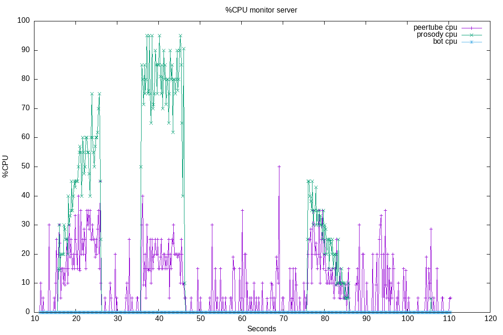

# 20-massive-nickname-changes

When anonymous users join the Peertube chat, they first get connected using a "Anonymous 12345" nickname.
Before being able to speak, they must change their nickname.

Under certain circumstances (numerous users joining at the same time, when the live begins), this can be the cause of some performance issues in browsers, as ConverseJS will render multiple time per second the user list.

It can also have some cost on the server side.

This test suite will evaluate the proposed fix for issue [#138](https://github.com/JohnXLivingston/peertube-plugin-livechat/issues/138) (hidding some nickname changes, when previous nickname was "Anonymous XXX").

We will also use this test suite to evaluate performance when implementing [#136](https://github.com/JohnXLivingston/peertube-plugin-livechat/issues/136):
grouping anonymous users on a single line for non-moderator users (to avoid having a long anonymous user list).

This test suite will also evaluate the cost when users are joining, and leaving.

This test suite will do:

* create a live
* start a chromium, connected as user_01
* wait a little
* start monitoring the server and chromium
* wait a little
* join the chat with 100 anonymous bots (nickname "Anonymous 1", and so on), at a rate of ~10 bots per second
* after 20 seconds, each bot will change his nickname (for "bot 1", and so on)
* after 50 seconds, bots will leave
* finally we close the chromium, and delete the live

So we should observe some high CPU usage on Chromium, and on the server, at 3 key moments:

* when bots are joining
* when bots are changing nicknames
* when bots are leaving

## 01

Result for running this test suite [on livechat v8.0.4](./results/01/).

Plugin version: v8.0.4

See [Run output](./01.output.md).

Chromium CPU:


Server CPU:



### 01 Conclusion

As expected, we can see 3 key moments, where CPU load increase a lot.
Both on the server and on Chromium.

## 02

Trying an implementation of [#138](https://github.com/JohnXLivingston/peertube-plugin-livechat/issues/138): hidding nickname changes messages when previous nickname was an anonymous one.

Results: [results files](./results/02/).

Plugin version: v8.0.4 + some minor changes (not related) + commit [ee48b01ae720e01b4ff628975697b7b3d11cc93e](https://github.com/JohnXLivingston/peertube-plugin-livechat/commit/ee48b01ae720e01b4ff628975697b7b3d11cc93e).

See [Run output](./02.output.md).

Chromium CPU:


Server CPU:


### 02 Conclusion

Comparing Chromium CPU usage:

|Before|After|
|--|--|
| |  |

There is still heavy load, but we can see that the middle peak lasts less time.
10 seconds instead of 20.
This is probably because there is no notification to remove after a few seconds.

In conclusion, this fix is not enought to fix performances, but it helps.
We will see when implementing [#136](https://github.com/JohnXLivingston/peertube-plugin-livechat/issues/136) (grouping anonymous users in the user list) if there is still performance issues to handle.

## 03

In this test run, we try debouncing the ConverseJS sidebar rendering.
We have manually patched ConverseJS, by adding a lodash debounce in file `conversejs-v10.1.6/src/plugins/muc-views/sidebar.js`:

```javascript
   connectedCallback () {
        super.connectedCallback();
        this.model = _converse.chatboxes.get(this.jid);
        const debouncedRequestUpdate = debounce(() => this.requestUpdate(), 200, {maxWait: 1000})
        this.listenTo(this.model.occupants, 'add', debouncedRequestUpdate);
        this.listenTo(this.model.occupants, 'remove', debouncedRequestUpdate);
        this.listenTo(this.model.occupants, 'change', debouncedRequestUpdate);
        this.listenTo(this.model.occupants, 'vcard:change', debouncedRequestUpdate);
        this.listenTo(this.model.occupants, 'vcard:add', debouncedRequestUpdate);
        this.model.initialized.then(() => this.requestUpdate());
    }
```

Results: [results files](./results/03/).

Plugin version: v8.0.4 + some minor changes (not related) + commit [ee48b01ae720e01b4ff628975697b7b3d11cc93e](https://github.com/JohnXLivingston/peertube-plugin-livechat/commit/ee48b01ae720e01b4ff628975697b7b3d11cc93e).

See [Run output](./03.output.md).

### 03 Conclusion

Comparing Chromium CPU usage:

|Plugin v8.0.4|With run 02 patch|With ConverseJS patch|
|--|--|--|
| |  |  |

This patch clearly reduce the browser CPU usage.
Will have to see with ConverseJS if there are ok to merge this upstream.
If not, we will have to find a way to patch ConverseJS in the building process.

## 04

This run is just to confirm previous results, using actual livechat plugin code.

Results: [results files](./results/04/).

Plugin version: commit [21efc8552342732b49ee3473a8690ce7d4c99f14](https://github.com/JohnXLivingston/peertube-plugin-livechat/commit/21efc8552342732b49ee3473a8690ce7d4c99f14).

See [Run output](./04.output.md).

Chromium CPU usage:


### 04 Conclusion

There is no more bottleneck concerning:

* massive joins
* massive anonymous user nick changes
* massive leaves
