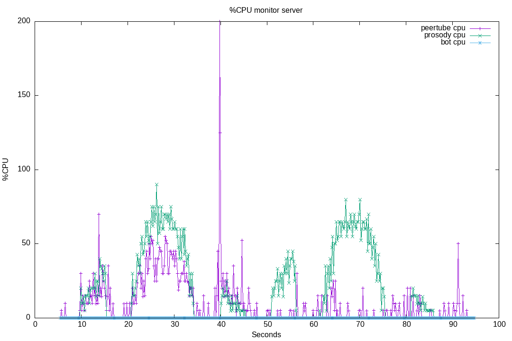

# 30-websocket-vs-c2s

When hundred of users are connected, we can see a huge amount of CPU usage form the Prosody process.
See [issue #178](https://github.com/JohnXLivingston/peertube-plugin-livechat/issues/178) for more information.

I think it is the Websocket and BOSH layer that are very CPU intensive.
To test this hypothesis, here is a test suite that will:

* monitor Prosody CPU usage
* wait 5 seconds
* connect 50 bots using anonymous websocket:
  * connecting 10 bots per seconds
  * each bot will start talking after 10 seconds, 1 messages per seconds, during 10 seconds
  * each bot will disconnect after 25 seconds
* wait some times
* connect 50 bots using c2s (and anonymous users):
  * same conditions as with the Websocket bots

So we will be able to compare the Prosody CPU load between the 2 use cases.

## 01

Result for running this test suite [on livechat v8.0.4](./results/01/).

Plugin version: v8.0.4

See [Run output](./01.output.md).

Server CPU:

### 01 Conclusion

We can observe:

* little CPU usage when Websocket bots are joining (at 10s)
* ~60% CPU when Websocket bots are talking (between 20s and 35s)
* little CPU usage when Websocket bots are leaving (at 40s)
* little CPU usage when Websocket bots are joining (at 50s)
* ~60% CPU when Websocket bots are talking (between 60s and 75s)
* little CPU usage when Websocket bots are leaving (at 80s)

Contrary to what I expected, there is no difference between C2S and Websocket.
So **Websocket processing does not explain Prosody CPU load**.
The bottleneck must be somewhere else.

Note: here the bots are only connecting and talking. They did not retrieve avatars using vCards, did not retrieve message history, neither does any additionnal stuff that ConverseJS does.
So we must evaluate, in a separate test, if the Prosody load changes when there are some browser involved in the process.

There is also some load on the Peertube process when using Websocket (this was expected, but could probably be optimized).
