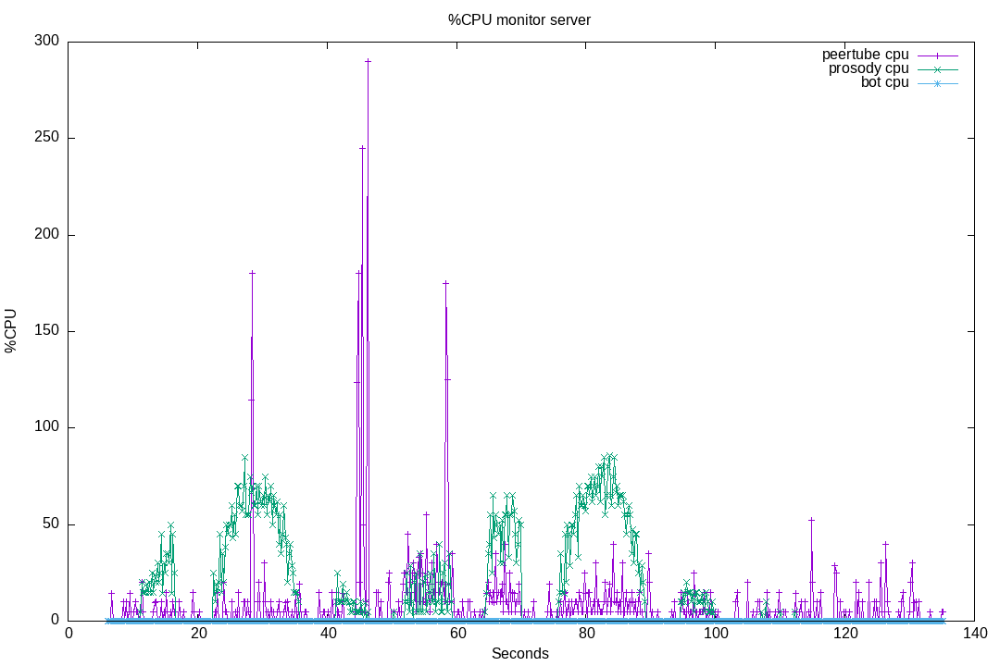

# 31-browser-and-c2s

Tests [30-websocket-vs-c2s](../30-websocket-vs-c2s/) failed to highlight the Prosody CPU load cause.

In this test, we will try another hypothesis.
We will first connect some bots (using c2s), and make them talk, then disconnect. As in [30-websocket-vs-c2s](../30-websocket-vs-c2s/).
But then, we will join with 10 browsers, and do the same tests.

The purpose is to see if ConverseJS does some operations that can explain the difference.
I have in mind the avatars retrievals (using vCards), that can grow exponentially with the number of users.

In other words, browsers using ConverseJS will retrieve all incoming users vCards. We will evaluate the additional CPU usage on the server.

# 01

Result for running this test suite [on livechat v8.0.4](./results/01/).

Plugin version: v8.0.4

See [Run output](./01.output.md).

Server CPU:

