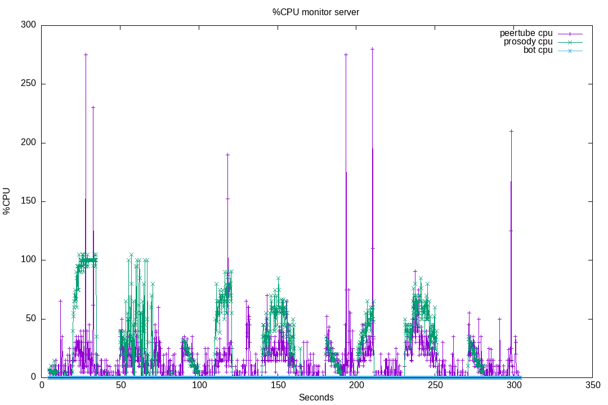
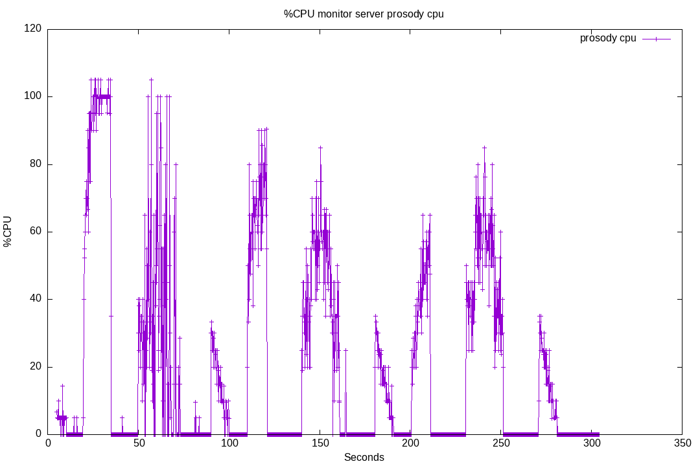

# 32-prosody-cpu

Still searching the source of [prososy performance issues](https://github.com/JohnXLivingston/peertube-plugin-livechat/issues/178).
This test will try to evaluate the CPU costs for:

* avatars/vcards loading
* message history (by default, 20 lasts messages are sent to each incoming user)
* message flooding

To achieve this, here is the scenario:

* first connect 2 bots, generate some messages (that will be requested by following bots, using MUC_MAM). At least 50 messages.
* then quit these 2 bots, and wait a little.
* connect 100 bots using websocket anonymous accounts:
  * emulating: disco, roster, vcards, carbons, mam
  * rate: ~10 bots per seconds
* wait a little, to be sure that Prosody has processed everything
* make the bots talk:
  * 1 message every 5 seconds each (20 messages per second in total)
  * during 20 seconds
* wait a little, to be sure that Prosody has processed everything
* disconnect all the bots
* wait
* repeat, but without vcards emulation
* wait
* repeat, but without mam emulation

## Run 01

Result for running this test suite [on livechat v8.0.4](./results/01/).

Plugin version: v8.0.4

See [Run output](./01.output.md).

Server CPU:

