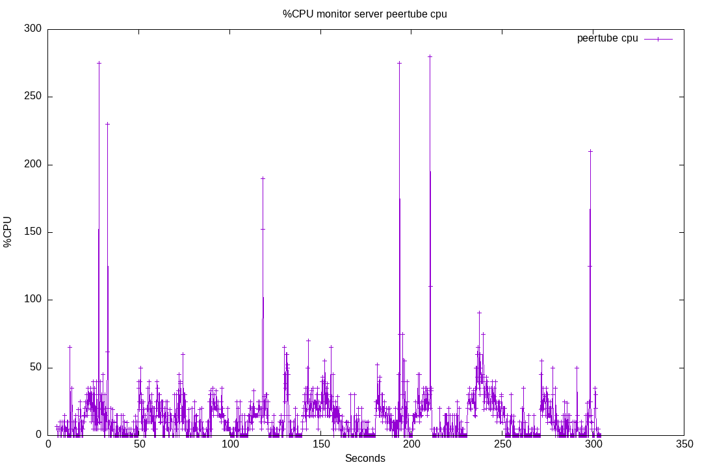
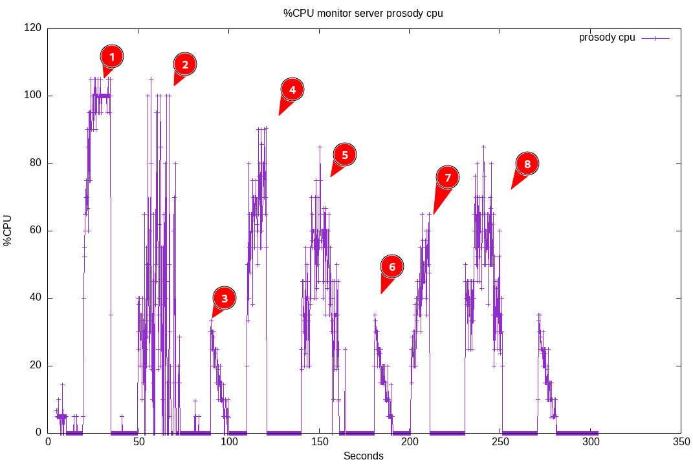

# 32-prosody-cpu

Still searching the source of [prososy performance issues](https://github.com/JohnXLivingston/peertube-plugin-livechat/issues/178).
This test will try to evaluate the CPU costs for:

* avatars/vcards
* message history (by default, 20 lasts messages are sent to each incoming user)
* message flooding

Note: avatars are part of a [vcard](https://xmpp.org/extensions/xep-0153.html).
The only use of vCards in the livechat plugin is for avatars.
So, in the present document, when i mention vcards, it is related to the avatar mechanism.

To achieve this, here is the scenario:

* first connect 2 bots, generate some messages (that will be requested by following bots, using MUC_MAM). At least 50 messages.
* then quit these 2 bots, and wait a little.
* connect 100 bots using websocket anonymous accounts:
  * emulating: disco, roster, vcards, carbons, mam
  * rate: ~10 bots per seconds
* wait a little, to be sure that Prosody has processed everything
* make the bots talk:
  * 1 message every 5 seconds each (20 messages per second in total)
  * during 20 seconds
* wait a little, to be sure that Prosody has processed everything
* disconnect all the bots
* wait
* repeat, but without vcards emulation
* wait
* repeat, but without mam emulation

## Run 01

Result for running this test suite [on livechat v8.0.4](./results/01/).

Plugin version: v8.0.4

See [Run output](./01.output.md).

Server CPU:

On the above graph, here are the key moments:

* T1: bots fully emulating ConverseJS are joining. Doing so, they will request: disco info, roster, enabling carbons, retrieve all user vcards, retrieve message history (max 50 messages, but limited to 20 by the server configuration)
* T2: bots are talking (20 messages per second in total)
* T3: bots are leaving
* T4: bots without vcards emulation are joining
* T5: bots are talking (20 messages per second in total)
* T6: bots are leaving
* T7: bots without vcards and mam emulation are joining
* T8: bots are talking (20 messages per second in total)
* T9: bots are leaving

### Run 01 Conclusion

#### Peertube CPU

First of all, concerning the [Peertube CPU usage](./results/01/monitor_server_peertube_cpu.png), there is no bottleneck here.
The load remains under 25%. This could probably be optimized by rewriting the Websocket proxy (see [issue #296](https://github.com/JohnXLivingston/peertube-plugin-livechat/issues/296)).

This could also be optimized by bypassing Peertube directly from nginx. I should add a new documentation section, called "Scalability / Server tuning", with some tips for admins to improve performance for instances with a lot of traffic. See [issue #297](https://github.com/JohnXLivingston/peertube-plugin-livechat/issues/297).

#### Prosody CPU

##### vCards/Avatars

As expected, at T1 the load quickly raise to 100%. We can see at T4 that without vcards emulation, the load does not reach 100%.
In conclusion, we can affirm that the vcards retrieval cost a lot of CPU.
The complexity is O(n²) (each users get all other users vcards).
With such complexity, i think there is no point to try to optimize Prosody code.
It will always reach some limit (if it is not with 100 users, it will be with 1000).
IMHO, the good way to fix this is by implement some lazy-loading and/or bypass the vcards to retrieve avatars with custom code (See [issue #106](https://github.com/JohnXLivingston/peertube-plugin-livechat/issues/106)).

##### Message Archive Management

Comparing T4 and T7 (with and without [Message Archive Management](https://xmpp.org/extensions/xep-0313.html)), we can see that ~15% of CPU seems to be dedicated to MAM (sending last messages to users that are joining).
Many people enjoys the fact that you can see previous messages when joining (unlike Twitch for example, where you can only see new messages).
I think it is worth the cost.
If there are still some issues in the future, maybe we could add a settings to completly disable this feature on the server, and document it (in a "Scalability / Tunning" section).
For now, i suggest to just keep it like it is.

Note: message archiving can already be disabled room by room. But the settings is not easy to find. UI/UX should be improved, and streamers should be able to set this by Peertube channel.

##### Message flooding

T5 and T8 are very similar.
T2 is quite different. This is due to the way the bots are coded. There was some lagging at T1, so bots taked longer to join, and some started to talk later.
So we can ignore T2, and focus on T5 and T8.

CPU load can raise to 60%, with 100 bots sending each 1 message every 5 seconds (20 messages / second).
This is not insignificant.
But, having continuously 20 messages / second is not readable by humans.
This should not happen in real live situation.
To limit this, there are already some plans:

* [Slow Mode](https://github.com/JohnXLivingston/peertube-plugin-livechat/issues/192)
* Some R&D with [mod_firewall](https://github.com/JohnXLivingston/peertube-plugin-livechat/issues/97)
* Limit chat to [registered users](https://github.com/JohnXLivingston/peertube-plugin-livechat/issues/233) or [channel followers](https://github.com/JohnXLivingston/peertube-plugin-livechat/issues/127)
* It is possible to use roles to only allow some users to talk (this should be [better documented](https://livingston.frama.io/peertube-plugin-livechat/documentation/user/streamers/moderation/))
