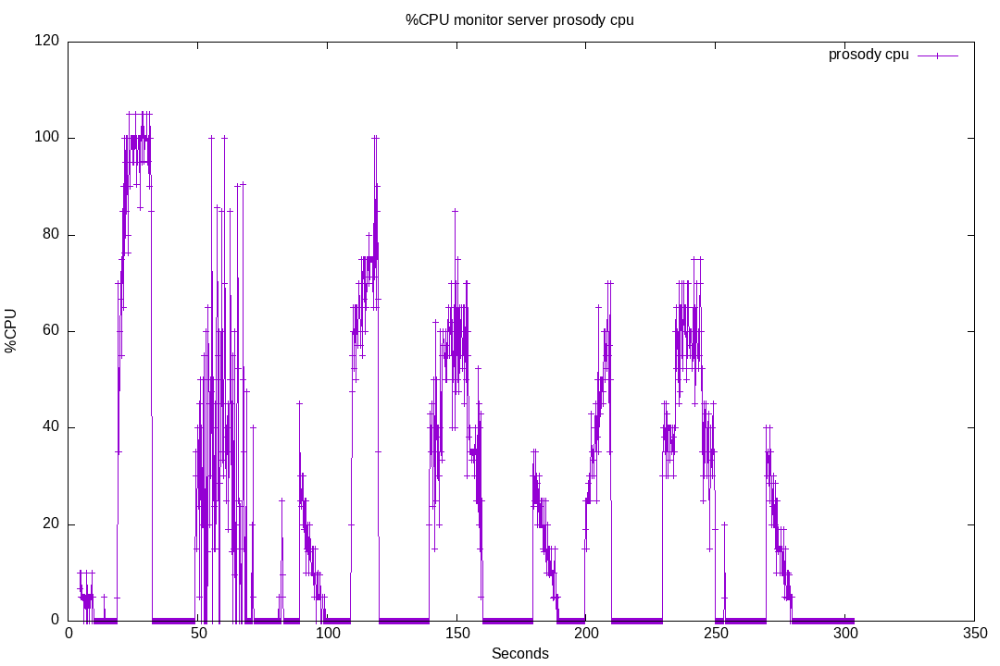
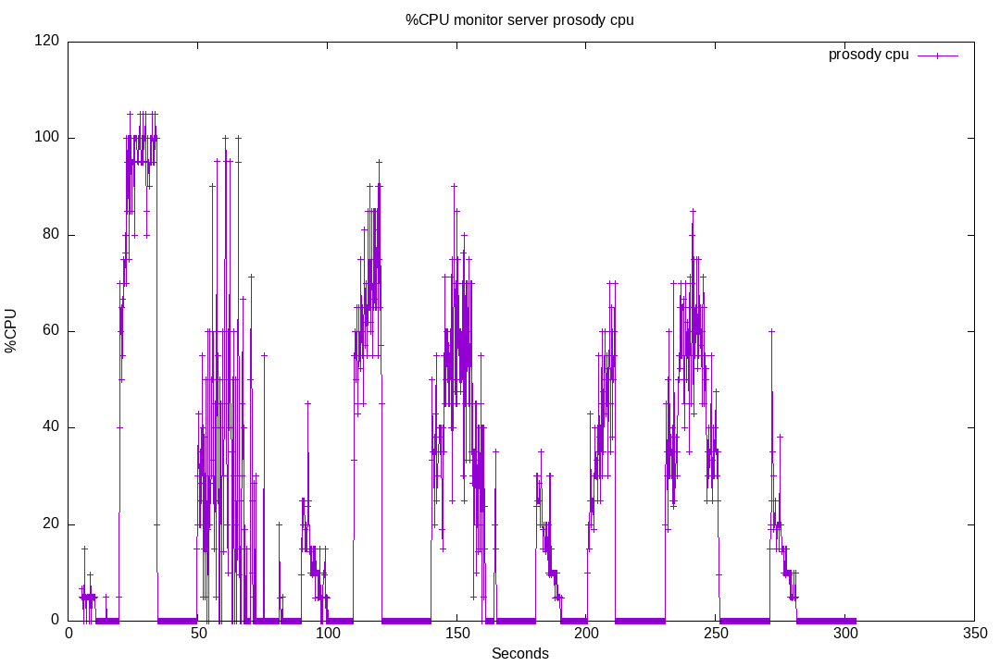
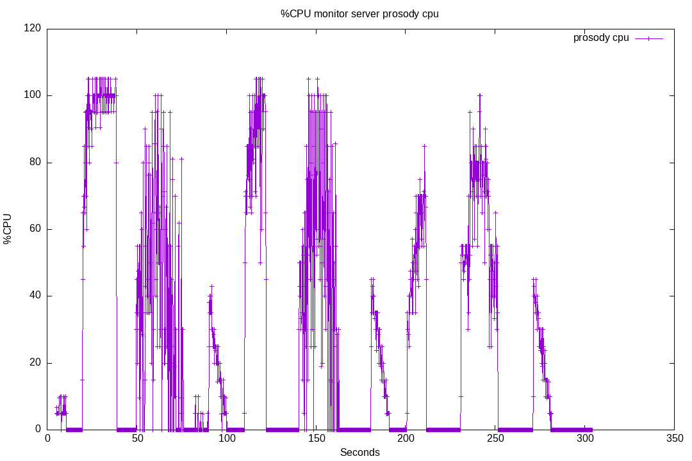
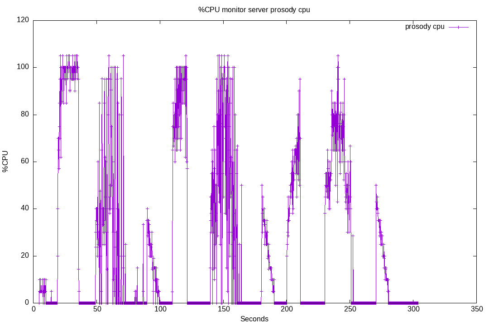
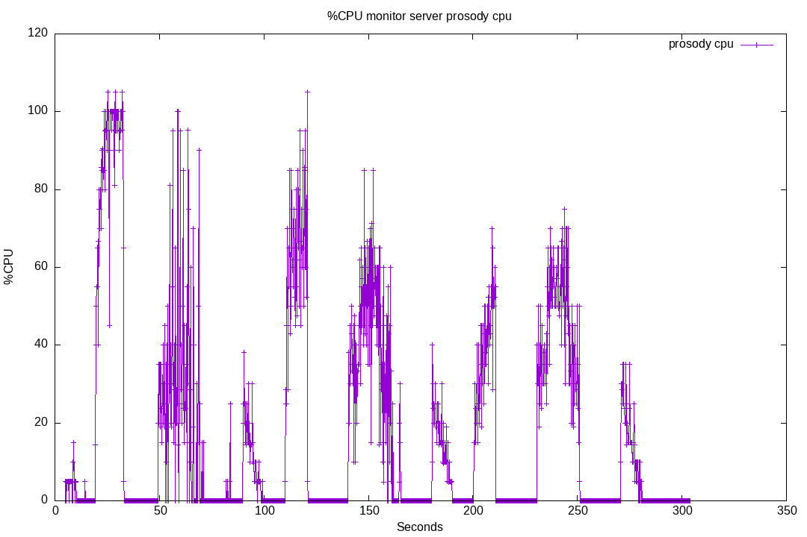
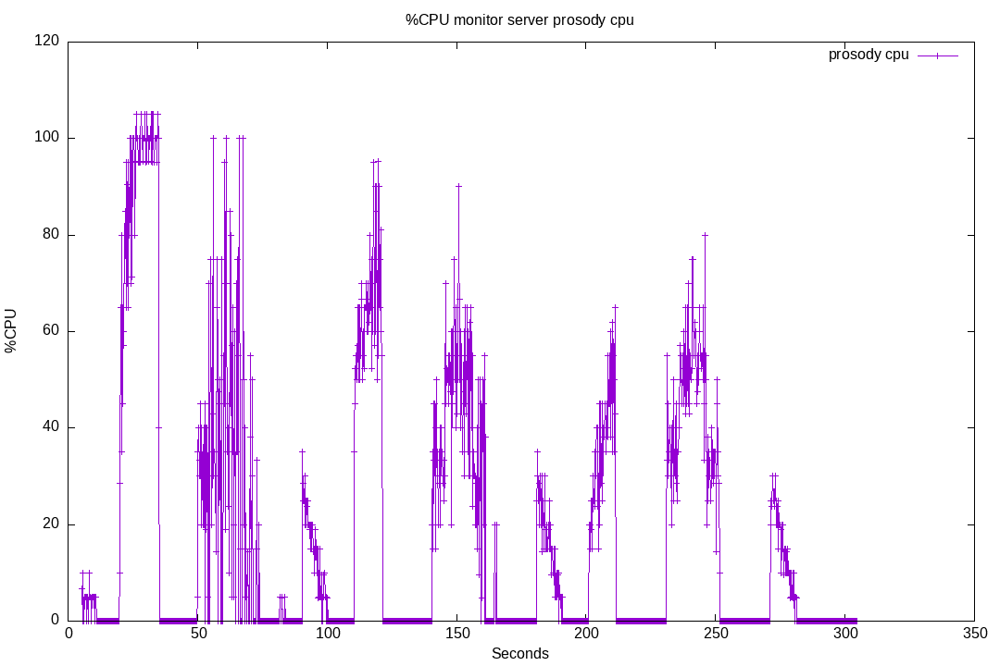
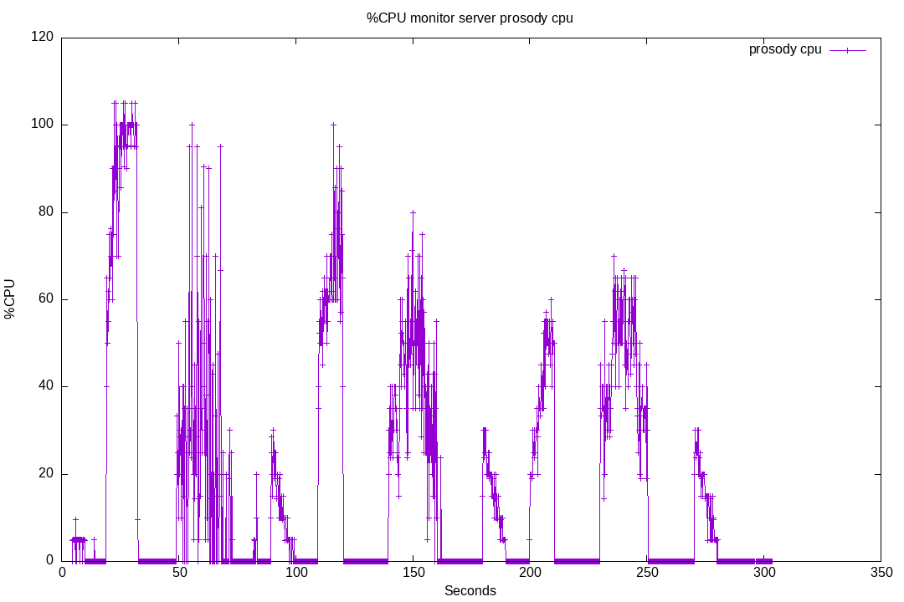

# 33-prosody-gc

On the Prosody official room, MattJ made me aware of the Lua Garbage Collection that [can be tweaked in Prosody](https://prosody.im/doc/advanced_gc).

Here we will try some tweaking, to see if it can make a difference.

The test scenario will be the same as [32-prosody-cpu](../32-prosody-cpu/), but we will try different GC tweaking.

Note: for each of the run we will use the `compute-average` to compute some CPU average:

* Prosody CPU load average over the full test period
* Prosody CPU load average for bot batch 1, 2 and 3

To get the full test period average:

```bash
npm run start -- compute-average --test '33-prosody-gc' --run-name '01'
```

To get for a given batch: search the first occurence of `wab_batch1` (or `wab_batch2` or `wab_batch3`) in the `XX.ouput.md` file, and note the time between parenthesis. This is the number of seconds after the test start at which the event occured.
Then search the last occurence of `wab_batch1`.

Then, compute the average using these values as `--after` and `--before` parameters:

```bash
npm run start -- compute-average --test '33-prosody-gc' --run-name '01' --after 19.073 --before 99.193
```

If you don't want to seek the timecode manually, you can do:

```bash
run=01; i=1; \
npm run start -- compute-average --test '33-prosody-gc' --run-name $run \
  --after $(grep wab_batch$i tests/33-prosody-gc/$run.output.md | head -n 1 | cut -d '(' -f 2 | cut -d 's' -f 1) \
  --before $(grep wab_batch$i tests/33-prosody-gc/$run.output.md | tail -n 1 | cut -d '(' -f 2 | cut -d 's' -f 1)
```

## Run 01

Result for running this test suite [on livechat v8.0.4](./results/01/).

Plugin version: v8.0.4

See [Run output](./01.output.md).

Server CPU:



* average Prosody CPU usage: 18.16%
* average Prosody CPU usage for batch 1: 24.81%
* average Prosody CPU usage for batch 2: 22.95%
* average Prosody CPU usage for batch 3: 19.70%

Note: default GC options are:

```lua
gc = {
  mode = "incremental";
  threshold = 105;
  speed = 250;
}
```

## Run 02

Result for running this test suite [on livechat v8.0.4](./results/02/).

Plugin version: v8.0.4 + following GC tweak in the prosody.cfg.lua file:

```lua
gc = {
  mode = "incremental";
  threshold = 200;
  speed = 150;
};
```

Here we changed threshold and speed, to see if there is any difference.
If so, we will need to tweak them one by one, to make any conclusion.

See [Run output](./02.output.md).

Server CPU:



* average Prosody CPU usage: 18.52%
* average Prosody CPU usage for batch 1: 26.75%
* average Prosody CPU usage for batch 2: 22.33%
* average Prosody CPU usage for batch 3: 19.50%

### Run 02 conclusion

|Defaults parameters| Threshold=200 speed=150|
|--|--|
||
|average Prosody CPU usage: 18.16%|average Prosody CPU usage: 18.52%|
|average Prosody CPU usage for batch 1: 24.81%|average Prosody CPU usage for batch 1: 26.75%|
|average Prosody CPU usage for batch 2: 22.95%|average Prosody CPU usage for batch 2: 22.33%|
|average Prosody CPU usage for batch 3: 19.70%|average Prosody CPU usage for batch 3: 19.50%|

No difference here.

Currently the livechat plugin is using Lua5.2, i should try to upgrade to Lua5.4.
MattJ told me that GC performance are way better in this version.

## Run 03

Result for running this test suite [on livechat v8.0.4](./results/03/).

Plugin version: v8.0.4 + using [Prosody 0.12.4 AppImage](https://github.com/JohnXLivingston/prosody-appimage/releases/tag/v0.12.4-1).
This version uses Lua5.4.

See [Run output](./03.output.md).

Server CPU:



* average Prosody CPU usage: 25.39%
* average Prosody CPU usage for batch 1: 37.80%
* average Prosody CPU usage for batch 2: 30.07%
* average Prosody CPU usage for batch 3: 26.05%

### Run 03 conclusion

|Prosody 0.12.3, Lua5.2, Debian Bullseye based| Prosody 0.12.4, Lua5.4, Debian Bookwork based|
|--|--|
||
|average Prosody CPU usage: 18.16%|average Prosody CPU usage: 25.39%|
|average Prosody CPU usage for batch 1: 24.81%|average Prosody CPU usage for batch 1: 37.80%|
|average Prosody CPU usage for batch 2: 22.95%|average Prosody CPU usage for batch 2: 30.07%|
|average Prosody CPU usage for batch 3: 19.70%|average Prosody CPU usage for batch 3: 26.05%|

Seems that performances are worst with Prosody 0.12.4.

Note: this was unexpected. Running again same tests (see run 03b).

## Run 03b

Result for running this test suite [on livechat v8.0.4](./results/03b/).

Plugin version: v8.0.4 + using [Prosody 0.12.4 AppImage](https://github.com/JohnXLivingston/prosody-appimage/releases/tag/v0.12.4-1).
This version uses Lua5.4.

See [Run output](./03b.output.md).

Server CPU:



* average Prosody CPU usage: 23.75%
* average Prosody CPU usage for batch 1: 31.88%
* average Prosody CPU usage for batch 2: 29.74%
* average Prosody CPU usage for batch 3: 26.37%

### Run 03b conclusion

|Prosody 0.12.3, Lua5.2, Debian Bullseye based| Prosody 0.12.4, Lua5.4, Debian Bookwork based, run 03| Prosody 0.12.4, Lua5.4, Debian Bookwork based, run 03b|
|--|--|--|
|||
|average Prosody CPU usage: 18.16%|average Prosody CPU usage: 25.39%|average Prosody CPU usage: 23.75%|
|average Prosody CPU usage for batch 1: 24.81%|average Prosody CPU usage for batch 1: 37.80%|average Prosody CPU usage for batch 1: 31.88%|
|average Prosody CPU usage for batch 2: 22.95%|average Prosody CPU usage for batch 2: 30.07%|average Prosody CPU usage for batch 2: 29.74%|
|average Prosody CPU usage for batch 3: 19.70%|average Prosody CPU usage for batch 3: 26.05%|average Prosody CPU usage for batch 3: 26.37%|

This confirm run 03 was correct. Can't understand all of run 04 and 05 results (see below).

## Run 04

Result for running this test suite [on livechat v8.0.4](./results/04/).

Plugin version: v8.0.4 + using [Prosody 0.12.4 AppImage](https://github.com/JohnXLivingston/prosody-appimage/releases/tag/v0.12.4-1) + following GC tweak in the prosody.cfg.lua file:

```lua
gc = {
  mode = "incremental";
  threshold = 200;
  speed = 150;
};
```

Here we changed threshold and speed, to see if there is any difference.
If so, we will need to tweak them one by one, to make any conclusion.

See [Run output](./04.output.md).

Server CPU:



* average Prosody CPU usage: 17.18%
* average Prosody CPU usage for batch 1: 23.86%
* average Prosody CPU usage for batch 2: 21.39%
* average Prosody CPU usage for batch 3: 18.43%

### Run 04 conclusion

|Prosody 0.12.3, Lua5.2, Debian Bullseye based| Prosody 0.12.4, Lua5.4, Debian Bookwork based| Prosody 0.12.4 + gc tweaking|
|--|--|--|
|||
|average Prosody CPU usage: 18.16%|average Prosody CPU usage: 25.39%|average Prosody CPU usage: 17.18%
|average Prosody CPU usage for batch 1: 24.81%|average Prosody CPU usage for batch 1: 37.80%|average Prosody CPU usage for batch 1: 23.86%
|average Prosody CPU usage for batch 2: 22.95%|average Prosody CPU usage for batch 2: 30.07%|average Prosody CPU usage for batch 2: 21.39%
|average Prosody CPU usage for batch 3: 19.70%|average Prosody CPU usage for batch 3: 26.05%|average Prosody CPU usage for batch 3: 18.43%

## Run 05

Result for running this test suite [on livechat v8.0.4](./results/05/).

Plugin version: v8.0.4 + using [Prosody 0.12.4 AppImage](https://github.com/JohnXLivingston/prosody-appimage/releases/tag/v0.12.4-1) + following GC tweak in the prosody.cfg.lua file:

```lua
gc = {
  mode = "generational";
};
```

Here we use the new generational GC algorythm.

See [Run output](./05.output.md).

Server CPU:



* average Prosody CPU usage: 18.14%
* average Prosody CPU usage for batch 1: 27.70%
* average Prosody CPU usage for batch 2: 21.57%
* average Prosody CPU usage for batch 3: 18.03%

### Run 05 conclusion

|Prosody 0.12.3, Lua5.2, Debian Bullseye based| Prosody 0.12.4, Lua5.4, Debian Bookwork based|Prosody 0.12.4 + gc tweaking (incremental)| Prosody 0.12.4 + gc tweaking (generational)|
|--|--|--|--|
||||
|average Prosody CPU usage: 18.16%|average Prosody CPU usage: 25.39%|average Prosody CPU usage: 17.18%|average Prosody CPU usage: 18.14%|
|average Prosody CPU usage for batch 1: 24.81%|average Prosody CPU usage for batch 1: 37.80%|average Prosody CPU usage for batch 1: 23.86%|average Prosody CPU usage for batch 1: 27.70%|
|average Prosody CPU usage for batch 2: 22.95%|average Prosody CPU usage for batch 2: 30.07%|average Prosody CPU usage for batch 2: 21.39%|average Prosody CPU usage for batch 2: 21.57%|
|average Prosody CPU usage for batch 3: 19.70%|average Prosody CPU usage for batch 3: 26.05%|average Prosody CPU usage for batch 3: 18.43%|average Prosody CPU usage for batch 3: 18.03%|

## Run 06

Result for running this test suite [on livechat v8.0.4](./results/06/).

Plugin version: v8.0.4 + using [Prosody 0.12.4 AppImage](https://github.com/JohnXLivingston/prosody-appimage/releases/tag/v0.12.4-1) + following GC tweak in the prosody.cfg.lua file:

```lua
gc = {
  mode = "generational";
  minor_threshold = 5;
  major_threshold = 50;
};
```

Here we use the new generational GC algorythm, with custom threshold.
These parameters are the one used for `https://yaxim.org/`, that made some tests (given by MattJ in the Prosody chatting room).

See [Run output](./06.output.md).

Server CPU:



* average Prosody CPU usage: 17.11%
* average Prosody CPU usage for batch 1: 23.86%
* average Prosody CPU usage for batch 2: 21.14%
* average Prosody CPU usage for batch 3: 18.43%

### Run 06 conclusion

|Prosody 0.12.3, Lua5.2, Debian Bullseye based|Prosody 0.12.4 + gc tweaking (generational)| Prosody 0.12.4 + gc tweaking (generational, thresholds)|
|--|--|--|
||||
|average Prosody CPU usage: 18.16%|average Prosody CPU usage: 18.14%|average Prosody CPU usage: 17.11%|
|average Prosody CPU usage for batch 1: 24.81%|average Prosody CPU usage for batch 1: 27.70%|average Prosody CPU usage for batch 1: 23.86%|
|average Prosody CPU usage for batch 2: 22.95%|average Prosody CPU usage for batch 2: 21.57%|average Prosody CPU usage for batch 2: 21.14%|
|average Prosody CPU usage for batch 3: 19.70%|average Prosody CPU usage for batch 3: 18.03%|average Prosody CPU usage for batch 3: 18.43%|

## Conclusion so far

There are some little differences between runs 01 to 06.
But nothing significant.

It is possible that the GC is not really called, as the Prosody RAM footprint is around 38Mo at the end of the tests.
Maybe we should do more agressive tests, that are during longer.

**Important note**: It seems that the defaults GC settings for Prosody 0.12.4+Lua5.4 are not very well optimized.
If we intend to use this version, we should also tweak the GC, for example for the parameters in run 06.
But these parameters are not easy to tweak, it really depends of the usage.
