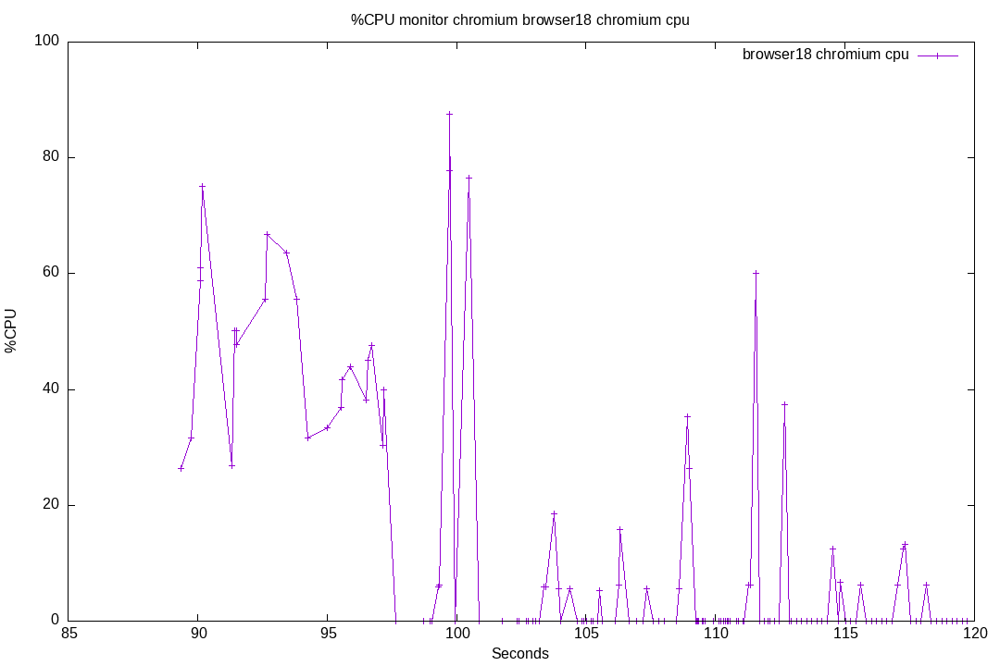
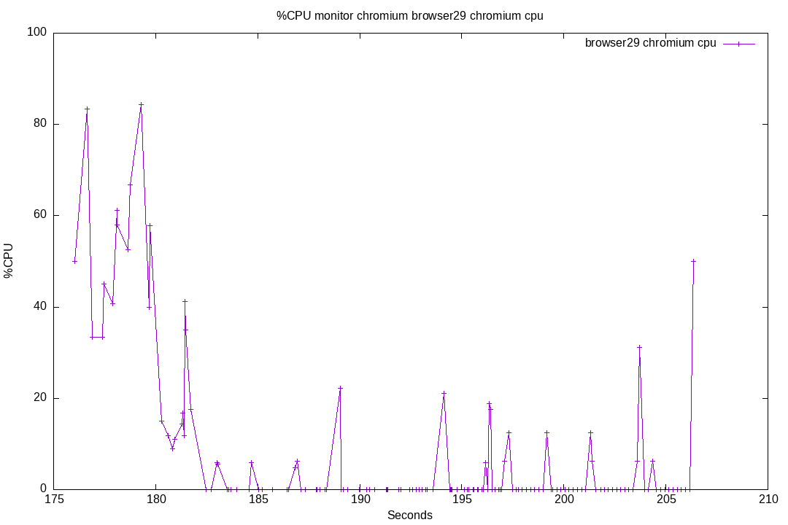

# 40-dont-load-unecessary-vards

## Context

As we have seen in previous tests ([32-prosody-cpu](../32-prosody-cpu/)), massive user joining can overload the Prosody process.
This test suite is here to evaluate a proposal to fix [issue #106](https://github.com/JohnXLivingston/peertube-plugin-livechat/issues/106).

The solution tested here is not the same as the one described in the issue #106.
Now that the plugin can handle federation, it could be difficult to load user's avatar by bypassing Prosody.

The solution proposed here consist to modify ConverseJS to avoid loading all vCards when the user joins the room.

The proposed patch is:

```patch
diff --git a/src/headless/plugins/vcard/index.js b/src/headless/plugins/vcard/index.js
index 067e7bb94..4199583f1 100644
--- a/src/headless/plugins/vcard/index.js
+++ b/src/headless/plugins/vcard/index.js
@@ -82,8 +82,19 @@ converse.plugins.add('converse-vcard', {
 
         api.listen.on('chatRoomInitialized', (m) => {
             setVCardOnModel(m)
-            m.occupants.forEach(setVCardOnOccupant);
-            m.listenTo(m.occupants, 'add', setVCardOnOccupant);
+            if (m.get('hidden_occupants') !== true) {
+                m.occupants.forEach(setVCardOnOccupant);
+            }
+            m.listenTo(m.occupants, 'add', (occupant) => {
+                if (m.get('hidden_occupants') !== true) {
+                    setVCardOnOccupant(occupant)
+                }
+            });
+            m.on('change:hidden_occupants', () => {
+                if (m.get('hidden_occupants') !== true) {
+                    m.occupants.forEach(setVCardOnOccupant);
+                }
+            })
             m.listenTo(m.occupants, 'change:image_hash', o => onOccupantAvatarChanged(o));
         });
```

This is just a first shot, an could be rewritten later on.
And maybe commited to ConverseJS upstream if maintainers are ok.

Here is what this patch does:

* when joining a room, only request all room occupants vCards if the occupant list is not hidden
* request all (missing) occupants vCards when the occupant list becomes visible
* when a user joins, only ask for its vCard if the participant list is visible

When a user sends a message, the vCard will be loaded if required (by the existing code).

Note: when the chat is displayed aside a video, the occupant list is hidden by default. It is only shown by default when the user opens the chat in a separate browser tab. So, the case we are trying to optimize here is the default case (chat besides the video).

The downside of this approach is that there is a little blinking effect when a user is posting his first message: first there is the default ConverseJS avatar, then it is replaced by the vCards when it is loaded:


We will see later on if we can a way to fix this. First we will evaluate the benefits of this approach.

There is another modification on the livechat plugin: I added a special `force_default_hide_muc_participants` query parameter, to hide or show the participant list, so we can set it to `0` or `1` in the test suite, depending of what we want to test.

## Test scenario

First, we will connect 200 anonymous bots. These bots won't load any avatar, neither emulate any ConverseJS behaviour. They are just here to have some avatars to load in further tests.

Waiting a few seconds, so everything is in place.

Only then, we will start monitoring Prosody CPU.
We will also monitor Chrome CPU, to see the difference.

Then, we will connect 2 chrome browsers (one at a time), to have accurate Chrome CPU usage measures.
One with the user list visible, the other not.

After that, two batches of 10 browser will joins.
The first batch will be with the user list visible, the second without.

Note: 5 browsers will be using Peertube accounts, 5 will be anonymous.

What we expect: see a Prosody load difference between the 2 batches.

## Key moments

* T1: a browser joins the chat, with participants list visible, then leaves
* T2: a browser joins the chat, with participants list hidden, then leaves
* T3: 10 browser joins, with participants list visible, then leave after 30 seconds
* T4: 10 browser joins, with participants list hidden, then leave after 30 seconds

## Run 01

Result for running [this test suite](./results/01/).

Plugin version: v8.0.4 + patch described in this document.

See [Run output](./01.output.md).

Prosody CPU usage:


Browsers CPU usage:


Please find bellow the detail for each browser.

Some notes:

* The scale is not the same for every chart.
* Browsers using Peertube users have an additionnal step: opening the Peertube login page, and submit the form.
* My laptop was limitating the performances for these browsers.
* in the table bellow, the first line is for browsers that were launched one by one (T1 and T2), following lines are for T3 and T4.

|Participants list visible (T1/T3)|Participants list hidden (T2/T4)|Note|
|--|--|--|
|||
|Single browser joining, anonymous user (T1 and T2)|
|||Peertube user|
|||Peertube user|
|||Peertube user|
|||Peertube user|
|||Peertube user|
|||Anonymous user|
|||Anonymous user|
|||Anonymous user|
|||Anonymous user|
|||Anonymous user|

### Run 01 Conclusion

#### Prosody CPU

As we can see, the CPU load is a little higher at T3 than T4.
So we can confirm that the proposed patch helps on the server side.

Here there is only 10 browsers joining (my laptop can't handle more). There are also 100 bots, but there are not loading vCards in the test. As we saw in previous tests, the vCard loading complexity is O(n²), so the gain will be far more important with more users joining.

#### Chrome CPU

When comparing `browser01` (T1) and `browser02` (T2), we can see lower CPU usage for `browser02`, as expected (please notice the y axis scale difference).
It is not the CPU max that is relevant, but the duration of the load. It last only 1 second for `browser02`, and 2 or 3 for `browser01`.

For `browser10` to `browser14` (T3) versus `browser20` to `browser24` (T4), the charts are harder to read.
Moreover, these tests are with Peertube users. So most of the CPU is for the login process (show Peertube login page, submit form).
We should ignore these browsers.

For `browser15` to `browser19` (T3) versus `browser25` to `browser29` (T4), results are more readable.
We can see improvements similar to the ones between `browser01` (T1) and `browser02` (T2).

Here again, we can confirm that the proposed patch helps (on the front-end side this time).

#### Conclusion

The patch helps for performances.

I'm not sure that this patch should be merged in ConverseJS upstream:

* because of the blinking effect.
* because vCards can have other use cases, for example changing the nickname of users. In the livechat plugin, this is not an issue, as nicknames are not stored in the vCards.

So, i have to:

* find how to include this patch in my building process
* optimize the code (`m.get('hidden_occupants')` could be replaced by a variable, to avoid calls to `get`)
* fix the blinking effect (maybe by removing the default avatar when the vCard is not loaded, i have just to check how i handle Peertube users without avatars)
* run tests again
