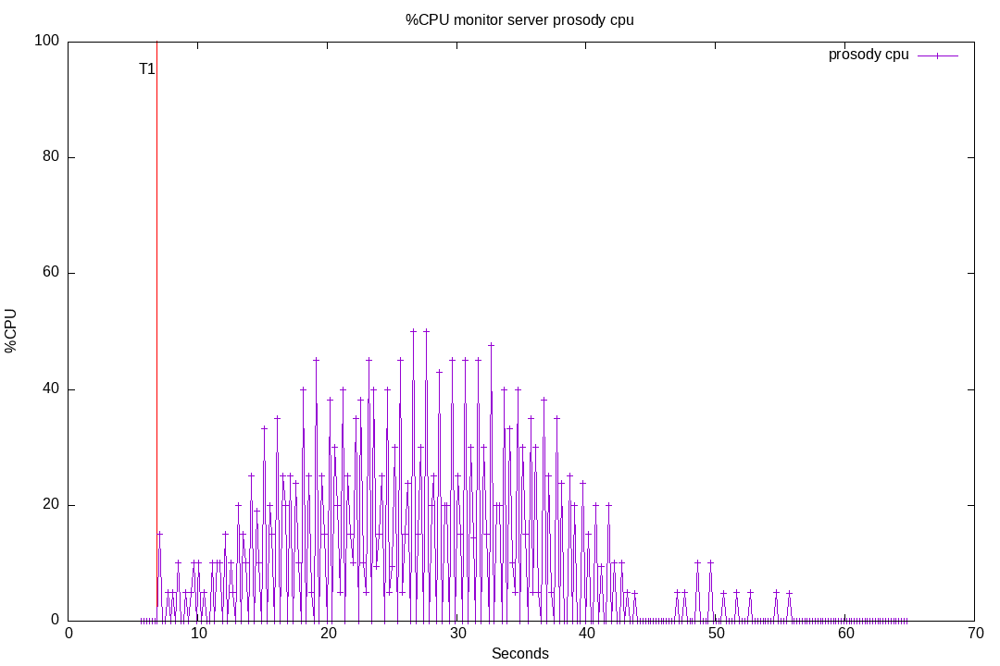
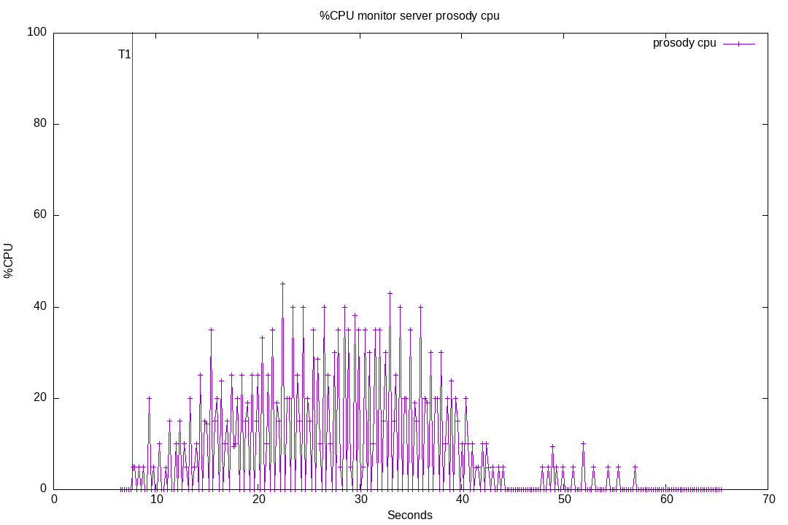
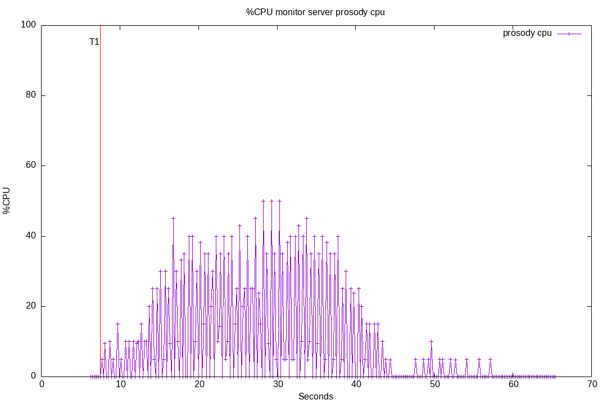
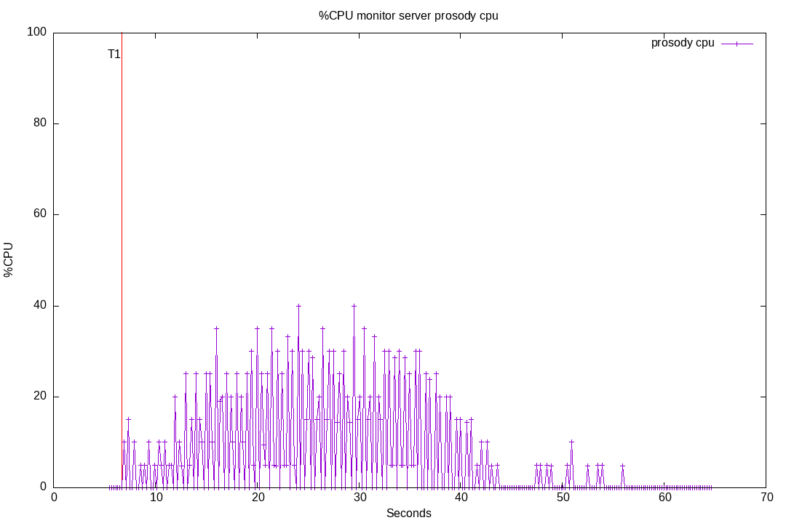

# 50-anonymous-carbons

Anonymous users can't open multiple tabs with the same account.
So the [message carbon](https://xmpp.org/extensions/xep-0280.html) is useless.
See [issue #295](https://github.com/JohnXLivingston/peertube-plugin-livechat/issues/295) for more information.

In the test, we will compare the server performances with and without [mod_carbons](https://prosody.im/doc/modules/mod_carbons) on the anonymous component.
To do this, we will just use multiple bots that are flooding, and comparing with and without carbon.
These bots will not emulate vCards, neither mam, to have readable data focusing on the difference concerning Carbon.

20 Bots starts joining at T1, 1 per second. They stay connected for 30 seconds. They starts speaking after 3 seconds, during 25 seconds, 1 message per second each.

## Run 01

Livechat version: 8.0.4 + commit [2b1e0fd3e99889fb11d9fb34d7b1bf0c16505202](https://github.com/JohnXLivingston/peertube-plugin-livechat/commits/2b1e0fd3e99889fb11d9fb34d7b1bf0c16505202).

Here bots are emulating message carbon.



## Run 02

Livechat version: 8.0.4 + commit [2b1e0fd3e99889fb11d9fb34d7b1bf0c16505202](https://github.com/JohnXLivingston/peertube-plugin-livechat/commits/2b1e0fd3e99889fb11d9fb34d7b1bf0c16505202) + disabling carbons server-side with following patch:

```git
diff --git a/server/lib/prosody/config/content.ts b/server/lib/prosody/config/content.ts
index b0660186c..5acc5ecf5 100644
--- a/server/lib/prosody/config/content.ts
+++ b/server/lib/prosody/config/content.ts
@@ -211,6 +211,9 @@ class ProsodyConfigContent {
     this.anon = new ProsodyConfigVirtualHost('anon.' + this.prosodyDomain)
     this.anon.set('authentication', 'anonymous')
     this.anon.set('modules_enabled', ['ping'])
+    this.anon.set('modules_disabled', [
+      'carbons' // carbon make no sense for anonymous users, they can't have multiple windows
+    ])
     if (autoBanIP) {
       this.anon.add('modules_enabled', 'muc_ban_ip')
     }
```

We also disable carbons emulation for bots (as they are not able to ready disco info to check if carbons is available).



## Run 02b

Same as 02, just testing again.

## Run 01b

Same as 01, just testing again.

## Conclusion

Calculating CPU average are calculated between T1 and the last bot output:

```bash
npm run start -- compute-average --test '50-anonymous-carbons' --run-name '01' --after 6.809  --before 56.498
monitor_server / prosody_cpu average: 9.67
monitor_server / prosody_cpu standard deviation: 13.61

npm run start -- compute-average --test '50-anonymous-carbons' --run-name '02' --after 7.626  --before 57.288
monitor_server / prosody_cpu average: 8.61
monitor_server / prosody_cpu standard deviation: 12.02

npm run start -- compute-average --test '50-anonymous-carbons' --run-name '01b' --after 7.425  --before 57.066
monitor_server / prosody_cpu average: 9.99
monitor_server / prosody_cpu standard deviation: 14.47

npm run start -- compute-average --test '50-anonymous-carbons' --run-name '02b' --after 6.666  --before 56.331
monitor_server / prosody_cpu average: 7.95
monitor_server / prosody_cpu standard deviation: 11.09
```

|Run 01|Run 02|
|--|--|
|||
|Average CPU: 9.67%|Average CPU: 8.61%|
|Standard deviation: 13.61|Standard deviation: 12.02|
|||
|Average CPU: 9.99%|Average CPU: 7.95%|
|Standard deviation: 14.47|Standard deviation: 11.09|

We can also compute CPU average when all bots are connected, and are talking.
So we can compare performance on the way Prosody handles messages with or without carbons (when we compare the CPU on the full period, there is also an overhead for the `iq` `set` messages, when the bots ask to enable the feature).

To do this, just use the timecode of following logs: `Bot wab 20 starts talking` and `Bot wab 1 stops talking`.

```bash
for run in '01' '01b' '02' '02b'; do \
  npm run start -- compute-average --test '50-anonymous-carbons' --run-name $run \
    --after $(grep 'Bot wab 20 starts talking' tests/50-anonymous-carbons/$run.output.md | cut -d '(' -f 2 | cut -d 's' -f 1) \
    --before $(grep 'Bot wab 1 stops talking' tests/50-anonymous-carbons/$run.output.md | cut -d '(' -f 2 | cut -d 's' -f 1)
done

Computing averages for test 50-anonymous-carbons, run 01
monitor_server / prosody_cpu average: 17.72
monitor_server / prosody_cpu standard deviation: 16.71

Computing averages for test 50-anonymous-carbons, run 01b
monitor_server / prosody_cpu average: 17.71
monitor_server / prosody_cpu standard deviation: 17.54

Computing averages for test 50-anonymous-carbons, run 02
monitor_server / prosody_cpu average: 15.27
monitor_server / prosody_cpu standard deviation: 15.41

Computing averages for test 50-anonymous-carbons, run 02b
monitor_server / prosody_cpu average: 13.89
monitor_server / prosody_cpu standard deviation: 13.54
```

||01x|02x|
|--|--|--|
|01 / 02 Average (deviation)|17.72% (16.71)|15.27% (15.41)|
|01b / 02b Average (deviation)|17.71% (17.54)|13.89% (13.54)|

Seems we have best performances by disabling Message Carbons. The difference is not big, but we didn't expect huge difference anyway.
